# American Modernism 现代主义

## Historical Background 历史背景

1. American's\*\* economic and technological development\*\* shocked the world.
2. At the beginning of the 20th century, there appeared a variety of **avant-grade**, **revolutionary** doctrines that exhaust the **traditional art vocabulary \*\* and require**completely new  terms \*\*:**Futurism, Expressionism, postimpressionism, dadaism, Cubism, imagism and surrealism** 写俩得了
   1. 20世纪初 出现了很多先锋派的，革命性的教义，这些教义耗尽了传统的艺术类词库，需要创造出很多新词，未来主义、表现主义、后压迫主义、达达主义、立体主义、想象主义和超现实主义
3. Modernism refuses 19th century traditions .but **Before WWI,** **realism and naturalism remained its vitality**. The **gentle tradition and romanticism** still dominated the nation.
   1. 现代主义拒绝19世纪文学。但一战前，现实主义和自然主义仍有活力，文雅的传统和浪漫主义仍主宰这个国家
4. With the growth of **population**, the increase of **wealth and educatio**n,  and **the technological development in printing and publishing, the** **profitable mass literature market** expanded.  随着人口增加，财富增长，教育水平提高，印刷和出版技术的发展，大众文学市场发展。
5. In Early 20thC, "**little magazines**" brought numerous **avant-garde** writers to \*\* attract a limited but sophisticated audience\*\* with **modernist sympathies and advanced  understanding.** 20世纪初，很多先锋派作家写的小杂志吸引了一小批有限但是成熟的观众，这些人有着现代主义这的情怀和更高的理解能力。（代表作家：庞德，ts艾略特）
6. “Jazz Age“ from 1920s to 1930s  brought\*\* unprecedented levels of prosperity to America\*\*.1920s-1930s的"Jazz Age"给美国的前所未有的繁荣&#x20;
7. &#x20;**Writers after WWI** called themselves a"**Lost Generation**", **devoid of faith and alienated from a civilization**.  一战后的作家称自己“迷茫的一代，他们缺乏信仰，远离文明 （代表作家：海明威 菲茨杰拉德 福克纳）
8. The **1920s American literature** achieved **a new diversity** and **reached its greatest heights**. Various masterpieces of **poem, fiction and drama were published**.  **.** The**"Harlem Renaissance"** indicated **the emergence of black writers.**&#x20;
   1. 1920年代的美国文学更加丰富，达到自身最高水平。很多诗歌，小说，戏剧巨著发表。“哈莱姆文艺复兴”说明着黑人作家的崛起
9. **The Great Depression** broke **public complacency **and made works of **political and social criticism**. After WWII ,  **a new generation of American authors** appeared, named the "**Beat Generation**" with **crime, immorality**, writing in the **skeptical, ironic style** of the** realists and naturalists.** 经济大萧条打碎了人们的自满，让很多作品充满了对政治和社会的批判。在二战后，新一代的美国作家出现了，被称作“垮掉的一代"，他们犯罪，道德败坏；他们继承了现实主义和自然主义作家的怀疑讽刺的style
10. In short stories,**Faulkner** dislocates the \*\*narrative time. \*\*It show the **cultural dislocation** and using the **juxtaposition and multi narrators** . In poems,Eliot and pond use \*\*images and allusion \*\*in place of thoughts. 小说领域 福克纳移位叙事时间 以展现了文化移位 运用了并置 和 多叙述手法 艾略特和庞德用意象和引用表达思想

## Ezra Pond 埃兹拉 庞德

1. 成就
   1. one of the most influential poets in 20thC
   2. **father** of **Modern American Poetry** 现代美国诗歌之父
   3. He is the\*\* leader of Imaginsm\*\*. 意向主义的领导者  His style is\*\* clear, economical and concrete\*\*. 明晰，经济，集中
   4. He translated **so many Chinese poems** (Li Bai), **Confucius words**; he is called\*\* "inventor" of Chinese poetry.**, making great contribution to** Eastern and western poetry.\*\*他翻译很多中国诗(李白)，孔子的话. 他被叫做中国诗的发明者. 他对东西方是个传播贡献巨大。
   5. He said west was a world of\*\* chaos, fragments and barbarism\*\* in 20thC. He tried to **revive the lost principles from the culture of past**.  他20世纪是混乱，破碎，野蛮的世界。他尝试从过去的文化中复活失去的秩序.
   6. He has the influence to **modernist writers after WWII**. 他对二战后的现代主义作家影响深刻。
2. His Style
   1. He was influenced by **classicism**, works of the\*\* Italian and English Renaissance\*\*, **French symbolism, Chinese culture and Japanese Haiku.** 被古典主义，意大利和英国文艺复兴，法国象征主义和中国文化，日本诽句影响
   2. Imagism 的部分定义打出来 并说他擅长写\*\*one image poem \*\*日本诽句
      1. Imagism:&#x20;
         1. a movement\*\* UK and US around 1910 as a reaction to traditional English poetry  \*\*/1910在英国和美国 作为传统英国诗歌的反应/
         2. They expresses the sense of **fragmentation and dislocation** 表现破碎和移位
         3. &#x20;Imagists holds that\*\* the most effective mean\*\* to express **momentary expression** is by\*\* one dominant image\*\* 表达瞬间话语的最有效的方式是一个意象
         4. **3 principles**: **direct** **treatment **of** subject;** **economy of expression**; As regarding **rhythm**, to compose in the sequence of the **musical phrase**, not in the sequence of a **metronome** 直接主观或客观地描绘“事物”、节约表达:至于诗歌的韵律，应按音乐的小节而不是按节拍器来组织
         5. The leader is\*\*  Ezra Pond and Amy Lowell\*\* 庞德 艾米罗维尔/ Pond's “**In a station of  the metro”** is a representative poem. 庞德的在地铁站是代表作品
   3. His work consists **"reconstructions" in modern English poems** 他的作品对现代英语的重造
   4. &#x20;His style is\*\* clear, economical and concrete\*\*. 明晰，经济，集中
3. In a station of Metro 在地铁站中

   as one of the leading poems of the Imagisism

   格式：

   in **Japanese Haiku** 用日本诽句 **14 words** 14个词 \*\*no single verb \*\*没有动词

   The word are distributed with\*\* 8 in the first line, and 6 in the second line\*\*, like **8-6 form of Italian sonnet**和意大利8-6格式相近

   Its containing only fourteen words **typifies典型** Imagism's focus on **economy of language, precision of imagery and experimenting with non-traditional verse forms** 节约用词，准确意象，使用不传统的form

   2意象：wet, black bough and petals&#x20;

   The plosive word '**Petals**" conjures ideas of **delicate, feminine beauty** which makes  **wet, black bough bleakness**. 爆破音的“花瓣”一词让人联想到精致、女性的美感，使湿润的黑色树枝变得凄凉。

   内容

   Pound  was struck by the **faces of a few pretty women and children hurrying out of the dim** in station, 被从巴黎地铁站黑暗处出来的妇女和儿童吸引. &#x20;

   The object to be treated is\*\* dim and damp faces\*\*. 描写对象是潮湿和幽暗环境下的面孔

   It is brought out by the **simple and beautiful image of flower petals** , which serves as the **most metaphor** for the "**faces in the crowd**." **express femine beauty, contrast with bough** 用简洁 美丽的花瓣表达出这种意象 花瓣暗喻人群的的面孔,表达了女性美，和黑树枝对比

   **Apparition** suggests\*\* fast modern life\*\* 幽灵象征着快速的现代生活
4. The Cantos 诗章&#x20;
   1. 毕生精力
   2. 117 poems
   3. 在里面阐述了孔子思想&#x20;
   4. 也阐述了多种学派 人类学 现代历史 Chinese ideogram 中国表意文字
   5. **Exultation and Personae** 狂喜和人物也是他的诗集
      (1) The Cantos has been called Pound's "**intellectual diary since 1915**" and contains a total of 117 poems. It is social history, an amalgam of **heterogencous cultures and languages**, a poet's attempt to impose, through art, order and meaning upon a chaotic and meaningless world. The world of The Cantos is indeed **cheerless and somber.**
      (2) A major thematic concern of the cantos is the **treatment usury **高利贷which, in Pound's eyes, like a beast with a hundred legs, blasts light, life, and love out of existence.
      (3) Pound sees in **Chinese history and the doctrine of Confucius**  wisdom with which is different** Western gloom and confusion**. Some of the cantos shines with the light of\*\* the Confucian ideal of harmony and order.\*\*
   (1)《诗章》被称为庞德“1915 年后的思想日记”，共 117 首。它是社会历史，是多种语言文化的混合凝练。诗人企图通过艺术赋予杂乱无章、毫无意义的世界以秩序和意义。《诗章》描写了一个沉闷阴郁的世界

   (2) 《诗章》的一个重要主题就是高利贷的思考。在庞德的眼中，高利贷就像多脚猛兽摧毁了光明、生活和爱。

   (3)庞德在中国历史和儒家思想中找到了力量和智慧的源泉，这与西方的阴郁与混乱是相对的。许多章节闪耀着和谐与秩序理想的光芒

## Robert Frost

1. Robert Frost —\*\* Poet Laureate,\*\* 4 times **Pulitzer** 桂冠诗人 4次普利策奖
   1. 作品：After Apple-picking, the Road Not Taken, Stopping by Woods on a snowy evening, Department, Design, The most of it 它的极限
   2. His style:&#x20;
      1. He uses **plain spoken English with traditional short forms** 口语+传统简洁的格式 refused to\*\* these new 20th poetic **theories 拒绝新的原则, but he tends to** old fashion to be new\*\*喜欢推陈出新
      2. &#x20;at the crossroads of\*\* 19thC American poetry and  20th C modernism\*\* 19世纪美国诗歌和20世纪现代主义的交汇
      3. His poem is **New England locals, identities and themes** 新英格兰的特征和主题 He pays attention to\*\* universal things\*\*, be called **a poet of philosophy** 关注日常事物，被称为哲学诗人 He also like to use New England's the **plain speech with short and conventional styles o**f **lyrics and narrative**喜欢用新英格兰的平铺直叙 和 短小传统的音律和叙事
      4. probes the\*\* mysteries of darkness and irrationality\*\* of  universe  探索宇宙的黑暗和不规则 and\*\* unaided people \*\*和人的孤立无援 Also, there are **abnormal people** in poem 他的诗里也有变态
      5. His poems can also be **horrifying**. He knew the **fragmentation of modern life**他的诗歌夜很可怕 他知道现代社会的支离破碎
      6. See nature as a storehouse of **analogy and symbols.** 自然是类比和象征
   3. The Road Not Taken
      1. **abaab**
         1. &#x20;traditional form
         2. &#x20;iambic tetrameter 四部抑扬格
      2. theme: a man faced with problem of **making choices**, very universal . 关于人的决择问题/ the **ultimate life is a circle** and the **roads are no difference** at all人生是个圆 路完全没有区别/ life has **too many limits** that can offer us\*\* few ways for options\*\*  人生限制太多，选择的路太少/ 这条路可能是当诗人，不寻常的路/ 但是他也会记得另外一条他没选择的路
      3. Frost tries to show the importance of choosing a correct way of life.有人也认为他证明了选择一条正确的路的重要性
      4. &#x20;Image： **road**- 2 roads symbolize **the choices of life**; the choice\*\* to choose a road less traveled\*\*.
   4. Stopping by wooding on a snowing evening&#x20;
      1. aaba bbcd ccdc dddd with **traditional form** **interlocking stanzas**一环接一环 讲究韵律之美
         1. &#x20;**imabic tetrameter**抑扬格四音步诗
         2. 语言Each stanza is a complete sentence. and each sentence follows the structure of colloquial English 每节都是一个完整的句子。每个句子都遵循口语英语的结构（
      2. &#x20;讲了one **stops a horse at night  in winter** to enjoy the winter view, and **then moves to continue the journey** 作者停下了马欣赏雪景，欣赏完了继续赶路
      3. theme: conflict between \*\*enjoyment and charm of nature \*\*and **responsibilities in society** 个人对自然的欣赏和自然的魅力和社会责任&#x20;
         1. Speaker stops by woods on a snowy evening,讲述着在雪夜停下
         2. The sense is so lovely that he wants to stay longer 景象很美 他想长驻
         3. finally he remembers that he still has a long way to go.最后意识到自己还有路要走
            1. The **speaker** has to \*\*finish his responsibility \*\*before his death 作者想在死前实现责任
            2. 诗歌里的before I sleep= before I die
      4. Image:"**village**" stands for the\*\* human world\*\*; "**woods**" for **nature**; "**horse**" for the\*\* animal world\*\* and "**promise**" for **duty**.
         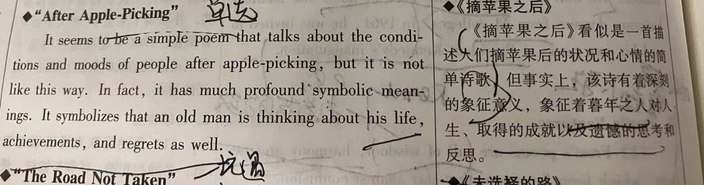
   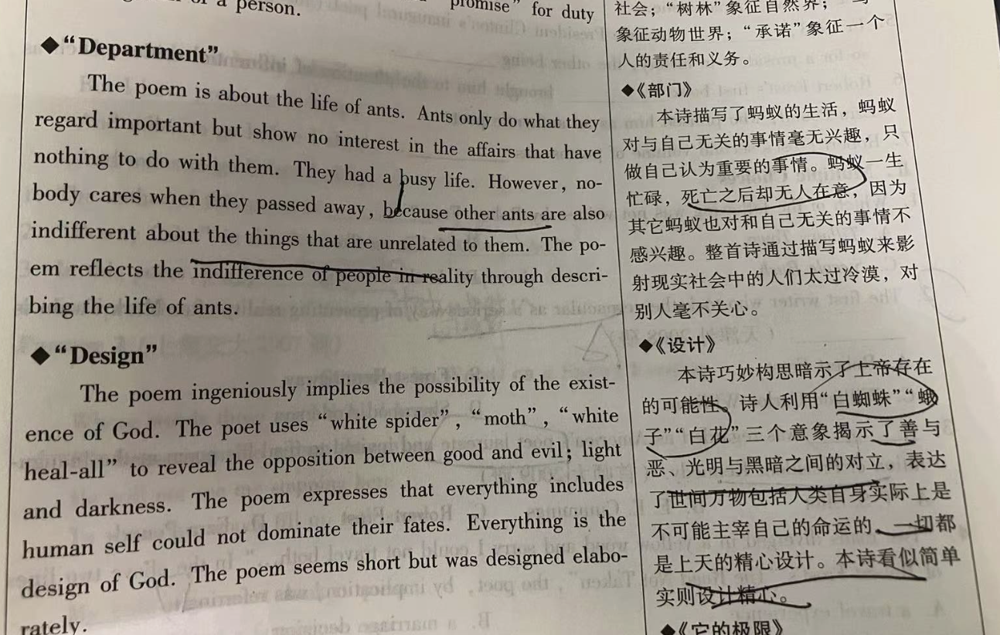

   部门——现代社会支离破碎

## T.S.Eliot

1. &#x20;1948 诺贝尔奖 1927加入英国国籍
   1. 作品：The Love Song of J. Alfred Prufrock，Preludes，Journey of the Magi，The Hollow Men
   2. His Literary Criticism 他的文学批评
      1. Basic theme 基本主题
         1. the **tradition and individual** talent 传统与个人才能之间的关系
         2. the relations between the **past**, **present**, and **future** 过去现在未来的关系
      2. Impersonal Theory / theory of impersonality and objectivity 非个人化理论
         1. Literary Criticism pays attention \*\*to poetry not poet \*\*文学批评要关注诗 而不是诗人
         2. work is an \*\*independent entity \*\*文学作品本身是独立的实体
         3. All these ideas lead to the emergence of the **New Criticism** 他的观点推动了文学新批评
      3. He reevaluate and popularize the **17th-century Metaphysical Poets** and\*\* the late19th century French Symbolism\*\* 重新评价了17世纪玄学派 和 19世纪法国象征主义，并让他们重获喜爱
      4. He absorbed the British 17th **metaphysical poem**s and French **symbolism** into **his technique and subject.** 吸收17世纪英国玄学派和19世纪法国象征主义到自己的主题
      5. he sees\*\* poem as an organic thing\*\*, whose **elements** are link to\*\* imagination and experience.\*\* 他把诗看作有机体，其元素和想象和经验有关
      6. He judged poems by\*\* fusion\*\* of\*\* intellect, feeling and experience\*\*, which promoted\*\* the inner analysis of poems\*\*. 他从智力，感觉和体验的融合评价诗歌，这种评价方式提升了诗歌的内在分析。
      7. \*\*His Objective Correlative \*\* is the only way he thinks of **expressing emotion**. 客观对应物理论是他认为表达情感的唯一方式&#x20;
   3. His style:&#x20;
      1. expose the\*\* futility of western culture\*\*,\*\* reveal disillusionment and frustration\*\* of people and quest f**or a spiritual regeneration**.艾略特的诗歌主要揭示西方文化的贫瘠与无用，表达人们的沮丧与绝望，追寻精神世界的重建
      2. Use\*\* symbolism, juxtaposition and complex literary allusion. \*\*运用象征主义 并置 和 复杂文学典故
      3. no\*\* fixed style and beat\*\* in his poems, and people can find **regularity in irregularity** and rhythm **in unfixed rhythm**.没有固定的格式和韵律，人们可以在在不固定的韵律中品出韵律。
   4. Contribution
      1. one of the most brave innovators of 20C in poems. 20世纪最勇敢的创新者
      2. He thinks poetry should \*\*represents the complexities of modern civilization \*\*in **language**  他觉得诗歌要通过语言表达现代文明的复杂, and the **complexities made poems difficult** 这种复杂让诗歌更加复杂
      3. his influence on **modern poetic diction** is big 他对诗歌措辞影响巨大
   5. The Love song of J.Alfred Prufrock J. 阿尔弗雷德. 普鲁布罗克的情歌
      1. Theme: J's fear to confess \*\*his love \*\*to the lady **on his way.** He wonders **how**, with **revealing his common life**. 他在思考怎么表白中揭露了他平凡的生活 The poem, depicts the impact of **ancient societal norms **that** led people empty lives** and lived under **others' opinions**说明古代的社会习惯让人们生活空虚，活在别人意见里。The theme is developed of **frustration and conflict.** 主题建立在沮丧和冲突中
      2. 内容
         1. &#x20;J.Alfred Prufrock is going **to propose marriage to a lady, but hesitates.** 求婚但犹豫
      3. &#x20;J.Alfred Prufrock, the symbolization of **tiredness, longing, decay, isolation, incapability and hesitation**, is the one of the most representative **intellects living in modern city.** 作为累，长情，堕落，孤独，无能和犹豫的象征，J能代表是20世纪的知识分子。
      4. 讽刺
         1. 题目：It's a ironically "**Love song**", but **without love**没有爱的情歌
         2. J.Alfred is a noble name, and Prufrock is a common name. It is **irony**.  名字是矛盾The biggest irony is he lives \*\*in vain \*\*but he cannot **change**. 最明显的矛盾是他生活徒劳无功，但是无法改变。
      5. 手法：
         1. **Dramatic monologue** 戏剧独白— mold him by his **thought  and  words**用思想和语言塑造他性格
         2. **the stream of consciousness 意识流**—use of symbols, fragmentation and juxtaposition  **象征，片段和并置**
         3. **using images** 运用意象— defamilarzation用典故陌生化 from **some phycial things**(city) to a vague **ocean images** to **show his distance to the world** 用意象陌生化，从一些物理的事物到模糊的，海洋景象，以此表现他和世界的距离
         4. &#x20;allusion 用典故—Bible, Hamlet...&#x20;
   6. The Waste Land荒原
      1. 5 parts in this work 在这个作品有五个部分
      2. 评价
         1. **epochal** epic 跨时代史诗
         2. reveals the **spiritual crisis i**n Europe after WWI揭露一战后精神危机
         3. manifesto of **Lost Generation** 迷茫的一代的宣言
         4. **establishes** Eliot's literary position 确立了艾洛特的地位
      3. 题记 epigraph
         1. The **epigraph** of the poem is taken from the\*\* Satyricon of Petronius, the Roman satirist of the first century\*\*. The title of the poem draws its significance from the **Fisher King legend.** 题记引用自风流韵事记。题目：鱼王传说
      4. 特点 feature
         1. **sexual failure** connotes **spiritual weakness** 性爱失败后的精神空虚
      5. 韵体

         With bold technical **innovations** in **versification and style,** the poem not only presents\*\* a panorama of physical disorder and spiritual desolation\*\* in the modern Western world, but also reflects the prevalent mood of disillusionment and despair of the whole post-war generation)该诗在韵律和文体上进行了大胆的创新。它不仅展现了现代西方物质世界混乱、精神世界荒凉的全貌，也反映了整个战后一代普遍的沮丧与绝望情绪。
      6. Through\*\* gaps, absence of connective tissues, and discordant juxtapositions\*\*, the poet intends the reader to see and feel the **fragmentary nature of life** 通过间隔、连接词的缺省及不和谐的缺省，诗人想要读者看到和感受生活的支离破碎
   7. Preludes 序曲
   8. The Hollow Man 空心人

## Edwin Arlington Robinson  爱德文 阿林顿 罗宾逊  山上的房子

1922，1925，1928  Pulitzer

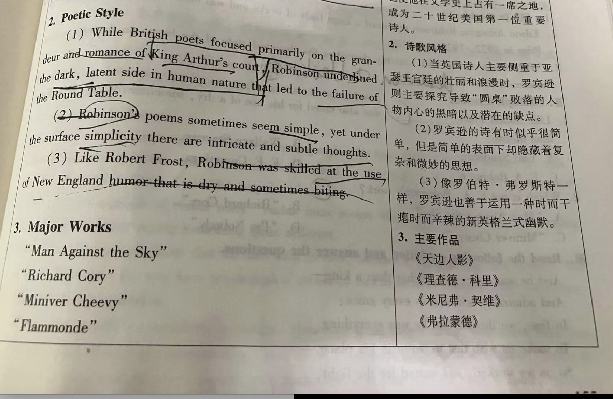

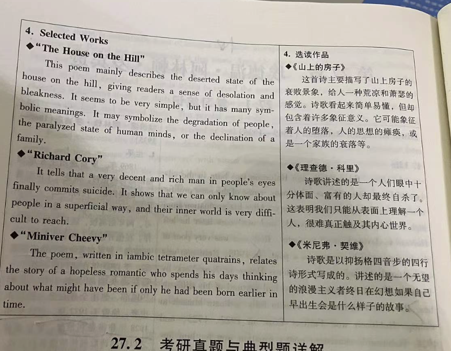

## Carl Sandburg 人民，是的 闪烁的深红

1940 普利策

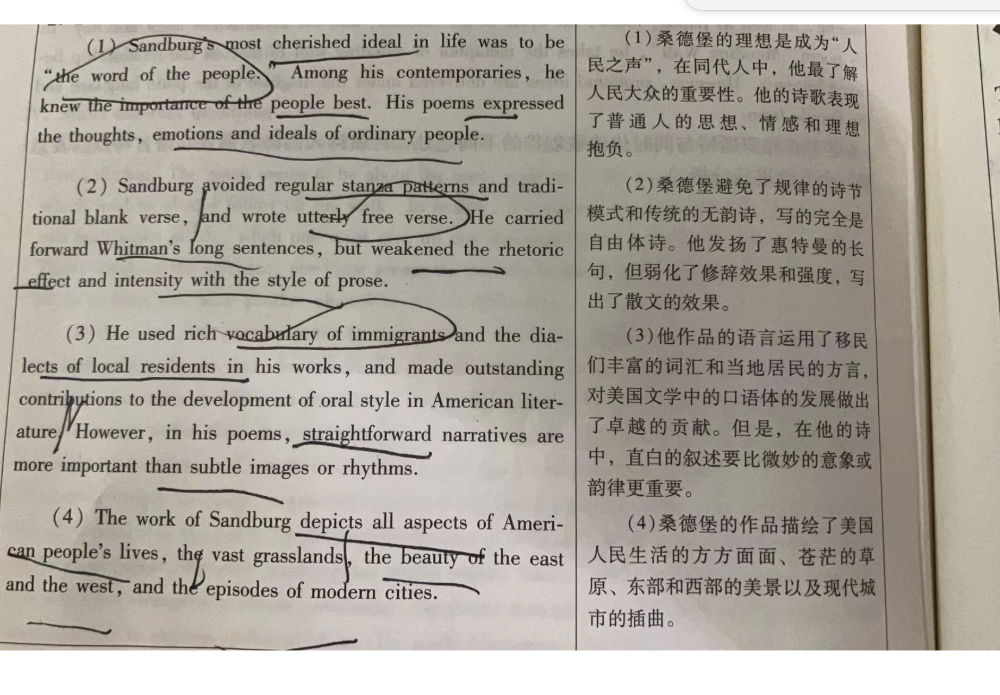

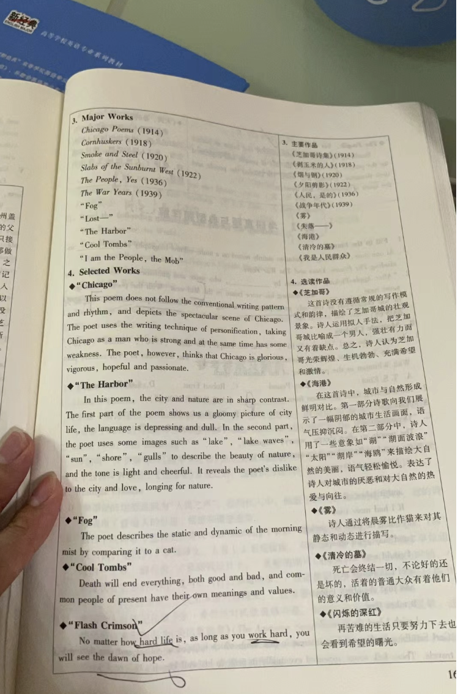

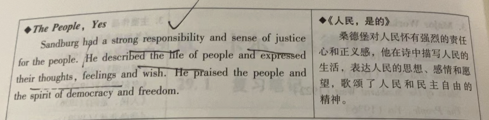

## Wallace Stevens 华莱士 史蒂文斯 毯子的故事

1次普利策

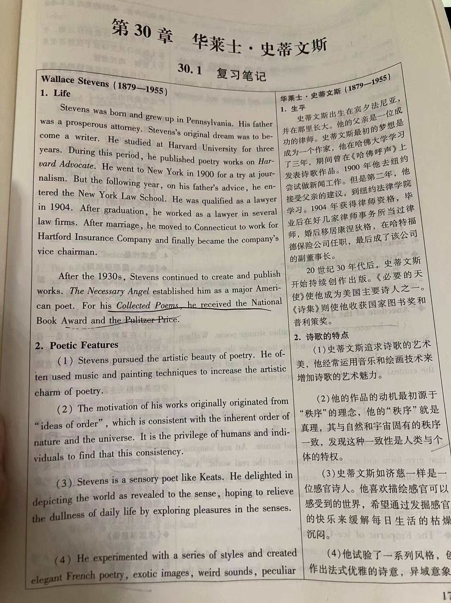

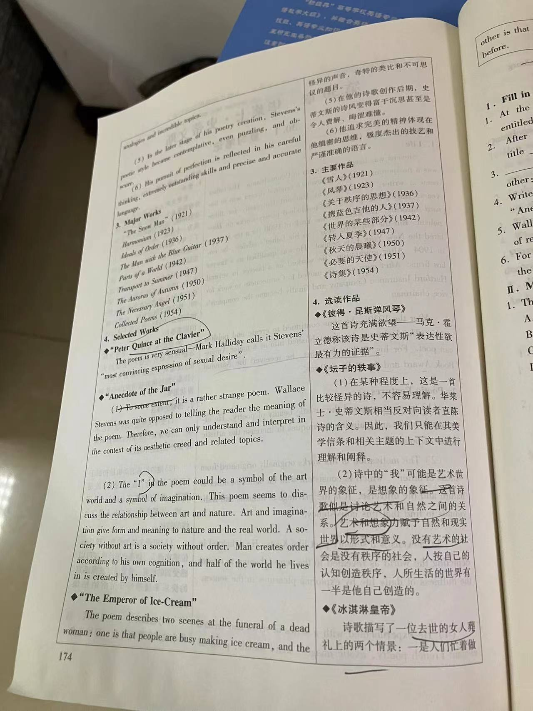

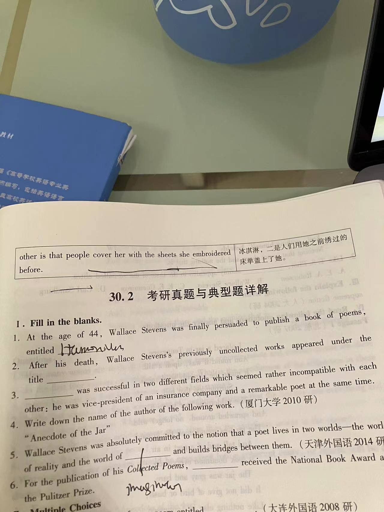

Harmonium 风琴 他的第一部诗集

## F.Scott Fitzgerald F. 斯科特.菲茨杰拉德

1. 作品： The Great Gatsby 了不起的盖茨比 The Side of Paradise (1920) 人间天堂 第一部作品 The Last Tycoon 最后一个大亨 （他最后一部作品） Tender is the Night 夜色温柔（一个美国精神病医生与美丽富有病人结合失败的故事 反映了怀旧情绪 悔恨心理 破灭的希望） The Beautiful and Damned 美丽与毁灭（一个年轻的有钱人 因为婚姻的不幸导致感情和精神崩溃）
2. His\*\* style，成就\*\*一起
   1. one of the most important writers in 1920s 1920年代最重要的作家之一
   2. One of the great **stylists** in American Literature 美国历史上一位伟大的文体学家
      1. He is **fluent in language, meticulous一丝不苟的 in observation  and original in diction and metaphors**.   文字流畅，观察细致，在措辞和暗喻上独创性。
      2. His  works are **simple and graceful** 作品简洁雅致 and manipulate the relationship **between general and specific**操控着整体和细节的关系
      3. He holds the **impressionistic** and **colorful** description 运用了印象主义和绘声绘色的描写
   3. He has a deep observation on society. He describes the **hollow** **worship of wealth**, and **unstoppable** **American Dream.** 他对社会有着细致的观察，他描述着空洞的拜金和永不停歇的美国梦
   4. He creates\*\* the word Jazz Age on Tales of Jazz Age **to symbolizes the 1920s America. His many works describe Jazz Age in every way, such as**The Great Gatsby \*\*. 他在他的作品《爵士时代的故事》中创造了新名词，Jazz Age来描述1920年代的美国，他的很多作品描写Jazz Age，比如盖茨比
      1. Jazz Age is also called **Dollar Decade**, **Golden 20s and Roaring 20s**, a time **excitement in life of youth**.  The time economy booms, and WWI makes **people in shock.  so people lived luxuriously** 也叫美元十年，黄金20s和狂野20s，一个年轻人生活的有激情的时段。这个时段经济发展，WWI让人们活在恐惧中，人们因此奢侈的活着。 (这段如果不专门考Jazz age 这个词不用写)
      2. Fitzgerald's works\*\* describe Jazz Age  in every way\*\*. Through the worlds of his **novels** is under the the **theme of moral waste**, **decadence and necessity of personal responsibility.** 菲茨杰拉德的作品以各种方式描述了爵士时代。通过他的小说世界，以道德浪费，颓废和个人责任的必要性为主题。
      3. **The Great Gatsby** criticizes the **American society by pursuing American Dream**《了不起的盖茨比》通过追求美国梦来批判美国社会
   5. &#x20;He use **scenic method** in his **chapters**, leaving the reader's&#x20;
      **imagination**.  在章节选择上，他运用场景方法，给读者留想象。
   6. He employs events **observed by a  "central consciousness "**to ensure the wholeness of** the work**. 事件围绕一个“中心意识“来保证作品的完整
3. The Great Gatsby&#x20;
   1. Theme主题: The **Decline** of the\*\* American Dream in the 1920s\*\* and  The **Hollowness** of the\*\* Upper Class \*\*1920年代美国梦的衰败和上流社会的空虚
   2. 手法
      1. He used\*\* limit narration\*\* to make his story **whole** and creats an **effect of mystery**. 他运用有限的叙述方式，让故事更统一，更有神秘感。
      2. He also uses symbolization 运用象征
         1. east egg—  the old nobles and moral decay of New York
         2. west egg— the new rich and have traditional values&#x20;
         3. 东卵—旧贵族，道德堕落；西卵，新贵族，有更多的传统value
   3. Fitzgerald **admires wealth and he criticizes more**. He tried to show the split of **emotion by wealth**. Tom and Daisy, they **symbolizes wealth**, they are **dehumanized and dehumanizing**. 菲茨杰拉德羡慕财富但是更多的批判财富，他尝试描述财富让情感的分离。汤姆和黛西，象征着财富，堕落着也引诱他人堕落。
   4. 人物
      1. Gatsby
         1. **His life experience** is **approximately** same to\*\* first few decades \*\*in 20th America. 他的人生经历和20世纪初期美国几乎无异
            1. that is, **modern people** live on **wasteland**, and **life** has lost\*\* its meaning\*\* 现代人生活在荒原上，人生失去意义
            2. His **personal life** has become **a fable** of American history. 他的个人生活是国家文化历史的语言
            3. Why he called **great？**
               1. He can make new **identity** for himself when he\*\* needs to be someone else.\*\* 当他需要成为别人时，他可以为自己创造新的身份。
                  1. He can do **whatever he can** to win Daisy with **determination** 当他为了赢得黛西 他的决心可以让他做一切
                  2. For Daisy's living manner, he worked hard for\*\* financial wealth\*\* , and studies **the manners and expressions** of higher class. 为了黛西的生活习惯，他努力赚钱，学习上流人的方式和谈吐。
               2. For his unworldly love for Daisy.为了和黛西超脱的爱
                  1. He takes the **blame** for Daisy when\*\* she commit a crime\*\*.他可以为黛西拦罪。
               3. **His life experience** is **approximately** same to\*\* first few decades \*\*in 20th America. 他的人生经历和20世纪初期美国几乎无异
               4. 总结：He is the last romantic hero最后的浪漫英雄, and his **energy and sense of commitment **take him in search of** his personal grail** 他的能量和他的忠诚带领他指引个人圣杯。
      2. Nick Carraway 尼克·卡罗威
         1. By the narration of Nick, a\*\* unified story structure\*\* is ensured. 尼克的叙述让故事的整体性得到保证
         2. \*\*His limit right \*\*to know the **incidents** determined he **has reservations about information**, which **makes the story mysterious.** 他的限制视角决定他对信息有所保留，让故事更加神秘

## Ernest Hemingway 欧几里特 海明威

1. 1954 诺贝尔文学奖 1953 普利策奖

   诺贝尔奖颁奖词

   mastery of \*\*the art of modern generation \*\*精通现代艺术的一代
2. His style\*\* (如果只问你海明威，你就说海明威创作了code hero，他们是grace under great pressure/海明威创造了Ice Berg Theory，认为好的作家无需展现所有细节，可以像读者省略一些东西/ 海明威是lost generation的代表，Lost generation是一战后那些参与作家对战争和美国的失望，他的the sun also rises 是观察社会的杰作)\*\*
   1. Hemingway's code hero 海明威式模范英雄：They are **protagonists** in his works, and they are **grace under great pressure**.  His code hero shows\*\* his view of life.\*\* **His world is meaningless**. He describes \*\*a man alone \*\*fights the **strong force for many times **, and finally **fails**, but Code hero has **courage with manhood and dignity under difficulties**.Their **bodies** may be **destroyed but spirit never**.  e.g., the**  old Cubain fisherman Santiago **in the** Old Man and the Sea** 模范英雄使他作品里的主角，他们在压力面前保持优雅。他的模范英雄展现了他对生活的态度。海明威的世界是混乱的，他描述了一个人独自与这个世界中强大的力量进行多次斗争，最终失败，但是他的模范英雄在面对困难时有尊严，大丈夫气概和勇气。他们的身体会被摧毁，但是精神绝对不会。比如，老人与海中的古巴老渔人圣地亚哥
   2. Ice Berg Theory 冰山理论（他的**哲学**）:  An **iceburg is 1/8 above water**.Hemingway thinks the **meaning on the text **is **small**, and others is **under the surface **.  If a writer** knows what he writes**, he can **omit things** but reader **have the feeling of the thing as the writer writes them**.A good writer doesn't need to** reveal all detail of a character**. 一个冰山有1/8在水上，  海明威认为在内容上可以明显表达出的意义是少的，其他的都在表面之外。如果一个作家了解他在写什么，他可以向读者省略一些东西，但读者觉得这个东西作者已经写了。 一个好的作家无需展现出角色的所有细节。
   3. Lost generation:
      1. proposed by Gertrude.格特鲁德
      2. It is\*\* post WWI generation\*\* in 1920s. Some American writers **participated in WWI**, and \*\*left abroad, center in Paris with disillusion \*\*after WWI. They \*\*tried new ideas \*\*and **fought against old ideas** then **replaced** them. They are **anti-war.**"Lost " means they are \*\*disillusioned with the world \*\*, **devoid of faith **and** spiritually alienated from the barren America**.   一战后的时代，1920s。一些美国作家参与过一战后住在巴黎，他们的中心在巴黎。他们对一战失望。他们尝试新idea，并且向旧idea 宣战，并取代他们。他们反战“lost“意思为他们对世界的幻灭，缺乏信仰，并且对世界失望。
      3. 代表：**海明威，庞德，菲茨杰拉德**/ 海明威的**the sun also rises** 和 菲茨杰拉德的盖茨比, **deeply observe to the world** 是杰作。&#x20;
   4. He promoted the **development of reportage.推动报告文学的发展His journalistic style** follows his theory "**less is more**", using word **economically**, simplify **sentence structure**, but have **many details** in **short sentence**. 他的新闻体文学遵循少即是多的原则，用词节约，结构简练但是可以在句子里看出丰富的细节
   5. &#x20;He **developed** the **colloquialism** from **Mark Twain**. 发展了马克吐温的口语体 The **oral words** made his characters **vivid**. 口语让他的角色栩栩如生。
3. A Farewell to arms 书上写的但是刘丽霞没讲
   1. &#x20;a **footnote** to\*\* The Sun Also Rises\*\*. Henry has been to the war, found it like a  **slaughterhouse**, with\*\* no glory\*\*. Henry fights **single hand**. He is the Hemingway hero,\*\* a man of action and of few words\*\*.  A Farewell to Arms  symbolizes \*\*Lost generation \*\*and brought international fame to Hemingway. 太阳照常升起的脚注，亨利参与了战争，发现他像一个屠宰场，根本没有荣耀。他独手作战，他是一个典型的海明威模范英雄，行动多，话语少。 这本小说代表了迷茫的一代，并给海明威带来国际荣誉。
   2. Symbolism of the title 题目arm和farewell的象征
      1. Henry say **goodbye to the war**, and **arm** symbolizes **weapons** Henry 向战争再见，胳膊（抢）象征着武器
      2. Henry say goodbye to\*\* his lover Catherine\*\*, who dies at **hospital**. The **Arm** symbolizes **Catherine**' s **arms**.像他的爱人凯瑟琳再见，胳膊象征着凯瑟琳的胳膊
   3. The sun also rises— 让海明威出名国际
      1. &#x20;theme: describes the "**lost generation" are impotent, tired, enjoying fishing and swimming** 迷茫的一代的无能，劳累，沉迷于游泳和垂钓之中

## John Steinbeck 约翰斯坦贝克 不重要

1. 1962 Nobel Prize, 1940 Pulitzer Prize
2. Literature style&#x20;
   1. 对劳工：He sympathized for the **migrant workers **and **lower-class people**, because of** his personal experience**. His writing reflected his **concern** with the **custom** of manual labor.因为他的人生经历，同情移民工人和下层人。他的作品反映了对下层人社会习俗的担忧
   2. 家乡：He caught the **language**, the **character**, the **legends**, and the **humor** of his home. 他捕捉到了他家乡的语言，角色，传奇和幽默
   3. 永恒理想中的互相冲突的道德准则：He was a **superb novelist** whose reforming **vision** led him to **contrast** the **conflicting moral codes **of people when searches p**ermanent ideals**. 他是个优秀的小说家，他革新的洞察力，使其对比了人们在寻求永恒理想中，互相冲突的道德准则。
3. The Grapes of Wrath 愤怒的葡萄

   写了Dust Bowl Region 写了沙尘暴地区的移民

   (1) The Grapes of Wrath is one of the major American novels. The title of the book comes from “**The Battle Hymn of the Republic**,” a war song of the Civil War, in which there are the lines, “Mine eyes have seen the glory of the coming of the Lord, / He is tramping out the vintage where the grapes of wrath are stored.”
   (2) 主题：This novel portrays the\*\* westward journey of the families like the Joads**乔德. What Steinbeck is saying is that when most people are **hungry and cold,** they will resort to **force**暴力 and**take what they need \*\*. The day of wrath is coming. In the souls of the people the grapes of wrath are filling and growing heavy. Something in the nature of a social revolution would be imminent.
   (3) Structurally, this novel consists of two blocks of materials, the westward trek of the Joads and the dispossessed Oklahomans, and the general picture of the Great Depression. The inserting chapters’ function as the social and historical background against which the characters move. Also, the novel’s structure is dictated by the Bible. There are obvious biblical influences in the novel.
   (4) This novel demonstrates that there is distinction which tells Steinbeck apart from other crisis writers of the 1930s. Amid the gloom and the defeatism which pervade the writing of the decade, Steinbeck manages to keep a refreshing faith in humanity, in the future when man will come to grips with his problems and come out all right.
   (1) 《愤怒的葡萄》是美国文学史上一部重要的小说。它的题目取自美国内战时期的《共和国战歌》中的几句“我的眼睛已看到了上帝到来的光环，/他在走遍储存愤怒葡萄的葡萄园。”
   (2) 这部小说描绘了乔德等家庭西迁的过程。斯坦贝克想要表达的是，当大多数的人们处于饥寒交迫的情况时，他们就会付诸暴力，取其所需。愤怒的日子正在到来，在人们的灵魂中愤怒的葡萄正在成长得越来越沉甸甸，倘不采取措施阻止，某种社会革命将会发生。
   (3) 在结构上，这部小说由两部分材料组成，乔德一家人和被迫迁移的俄克拉荷马人集体西迁的过程，以及大萧条的概貌。插入章节为人物活动提供了社会和历史背景。另外，小说的结构借鉴了圣经故事的构思轮廓。小说中有很多地方明显受到圣经的影响。
   (4) 该小说反映出了斯坦贝克与其他20世纪30年代反映经济危机的作家有不同之处。那个年代的作品中弥漫着沮丧与失败主义，但在这样的氛围之中，斯坦贝克仍然相信人性，相信未来人们能克服困难，情况会有所好转。

## William Faulkner&#x20;

1. 1949 诺贝尔奖&#x20;
   1. to retell the recurrent story of human dreams, bravery and defeat, to make a statement about the past and use that statement to talk about man’s lot in his world. 颁奖词
2. Sherwood Anderson 舍伍德 安德森 and James Joyces 詹姆斯乔伊斯 对他帮助
3. His work: A Rose for Emily
4. “little postage stamp of native soil 乡土的一张微型邮票
5. Southern Renaissance 南方文艺复兴 （算一个term吧）
   1. 1920s-1950s in America
   2. &#x20;it's the **revival of Southern literature**, and the works are **conflicts** between those who **support changes** and who **doubt changes**. 南方文学的复苏，作品关于接受改变和质疑改变的斗争
   3. In **late 1920s**, southern writers not only accepted the **inherited values of  southern traditions**, but also had a way to **deal with past**. 20世纪20年代年末，南方作家不仅接受了过去的南方价值观，也找到了一种方式处理过去的烂事
   4. 代表作家：福克纳，
6. His style:
   1. 新格式：He tried\*\* innovative experiments\*\* in\*\* forms\*\* to express his idea 用创新新格式表达他的观点 He constantly developed\*\* artistic expression techniques\*\* to **express his views**.不断发展艺术表达手法展现他的观点e.g.,He\*\* dislocates of narrative time\*\*: **juxtapose the past with present** 移位叙述时间：并置过去和现在
   2. 角色：He pays attention to **mold his characterization** to show **complexity **of a man. His characters have a lot of **independence**. 关注塑造人物形象，反应人物复杂。他的角色独立性强。 He doesn't **use author as main narrator.** He use**  fallible narrator and multiple narrator** to achieve **authorial transcendence**超脱 .  不把作者作为主叙述者。他用不可靠叙事者和多叙事者以实现作者的超脱。
   3. 奇怪：His work has many **inner** **monologues**, and **the stream of consciousness**. Words has no **capitalization**, and no **punctuation**. Sentences are **vague in meaning**. Long sentences **pile up** **strangely** and\*\* the use of pronouns \*\*also increases the **complexity** of article.  作品有很多内心独白和意识流，他用词不爱大写，没有标点。句子意思模糊。  长句子奇怪的叠在一起 代词的使用增加了文章的难度
   4. 语言：He uses **oral English, dialects and formal English**, covering  a variety of "**registers**". 口语，方言和正式英语并存。有很多“语域。
   5. **Yoknapatawpha**: His themes concerns\*\* tragic conflict between old and new\*\* **south**, and development of south. He creates a "**Yoknapatawpha**" and Jefferson Town in this county, an imagery place in Mississippi.( it' s based on his home , Oxford, and it's a symbol of traditional south,  from civil war to WWI), and he writes many **histories** of **southern noble men, poor man and black.**  他的主题关于老南方和新南方的悲剧碰撞，和南方的发展。他创造了一个 “约克那帕塔法城“,在密西西比河上幻想构建的地方(这个地方基于他家，约克那帕塔法城是传统南方的象征, 描述了自美国内战到二战的历史)，他 写了很多南方贵族，穷人和黑人的历史。
   6. symbolism and allusion 象征和用典
7. A Rose for Emily 献给艾米丽的玫瑰
   1. a gothic short story 一部哥特式小说
   2. Theme: **conflict** between **old and new values**. **Emily** symbolizes the **traditional old idea**, and **Homer** is **new**. She refuses to **the new **in order to** keep her social status**. Her death symbolizes the **fail** of **plantation and slave** is a **trend**. 旧value 和 新value的矛盾。艾米丽是旧value，而Homer是新的，艾米丽拒绝新value以保全自己的社会地位。她的死象征着种植园和蓄奴的失败是潮流
   3. After civil war, a noble woman, Emily, who is under control of his father, cannot love his man, Homer and kill him. 美国内战后，贵族小姐艾米丽，受他爹控制，无法和他爱的男人Homer恋爱，然后把他杀了。
   4. 手法：照着上面写
8. The Sound and the Fury 喧哗与骚动
   1. title
      1. 选自Shakespeare's **Macbeth** 莎士比亚 **麦克**白
   2. 主人公The Compsons 康普森的一家
      1. It is a story of deterioration from the past to the present. The past is idealized to form a striking contrast with the loveless present. There is in the book an acute feeling of nostalgia toward the happy past. Quentin's suicide offers an example of a complete negation of the present In a sense. Ouentin's value system may represent Faukner's own idea of an ideal way of life, that of an antebellum society,. Beniy's section dramatizes the theme of loss from the very beginning of the story. The triumph of rationalism over feeling and compassion is best illustrated in the sterile and loveless individual Jason.故事讲述了从过去到现在的堕落。过去被人为地理想化了，与现在的冷酷无情形成了强烈的对比。书中充满了强烈的怀旧之情。昆丁的自杀表现了对现在的完全否定。在某种意义上，昆丁的价值体系代表了福克纳本人关于理想生活方式一一即战前的社会一一的看法。班吉的部分从故事一开始就渲染了“失去”这一主题。在自私自利的杰生的身上，我们看到理性战胜了情感与同情之心。
9. Absalom. Absalom! 押沙龙 押沙龙
   1. associated with the Bible
   2. 是最复杂、深奥，最具史诗风格的一部作品。它讲述的是美国南方一个家族从 1860年到 1910 年左右所经历的激烈的分崩离析的故事，深刻地表现了人与人、人与自己内心的种种冲突，触及与人类境遇有关的诸多带普遍性的问题
   ## Sherwood Anderson 舍伍德 安德森

first of psychological writer 第一个美国心理作家

启发福克纳

Born in Ohio 商业转到文学&#x20;

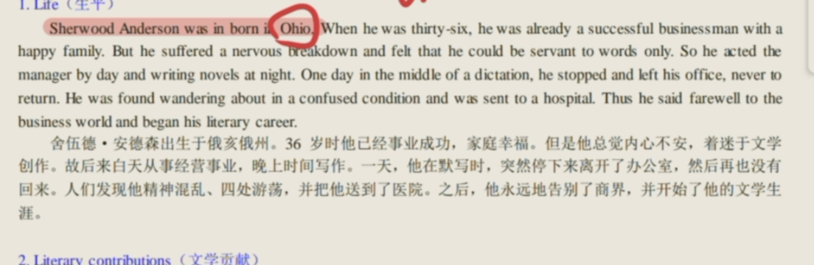

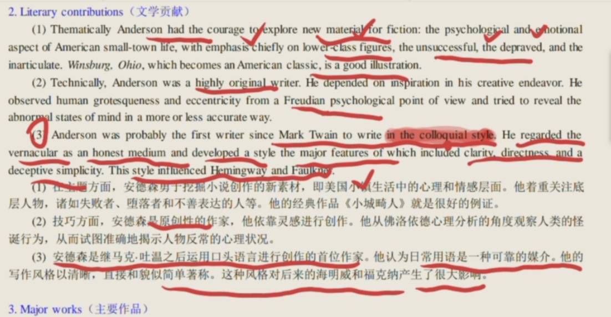

他的作品 Winesburg Ohio 小镇畸 jī 人

a collection of 23 interrelated stories of small-town life.小镇的23部小说 These stories sound morbid and grotesque, but underneath them runs a strong desire to communicate, and love and be loved. 这些故事听起来病态而怪诞，但在它们下面却蕴含着强烈的交流、**爱**和被爱的欲望。 It won the author a foremost position in contemporary American literature. 它为作者赢得了当代美国文学中最重要的地位。
