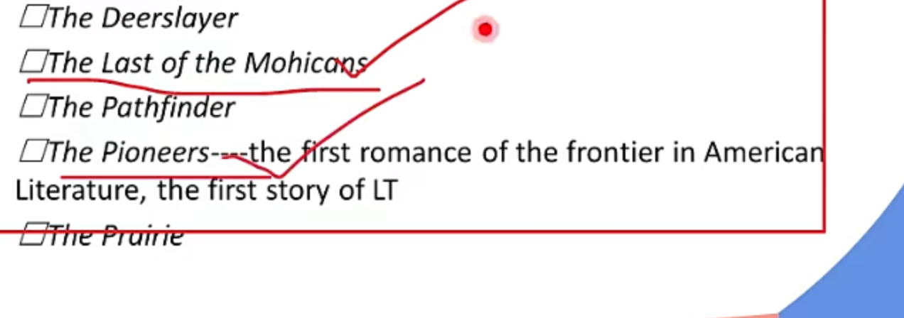
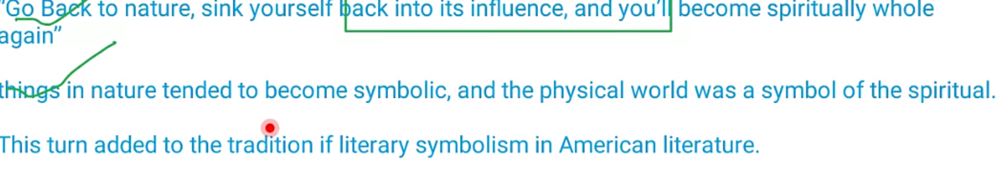
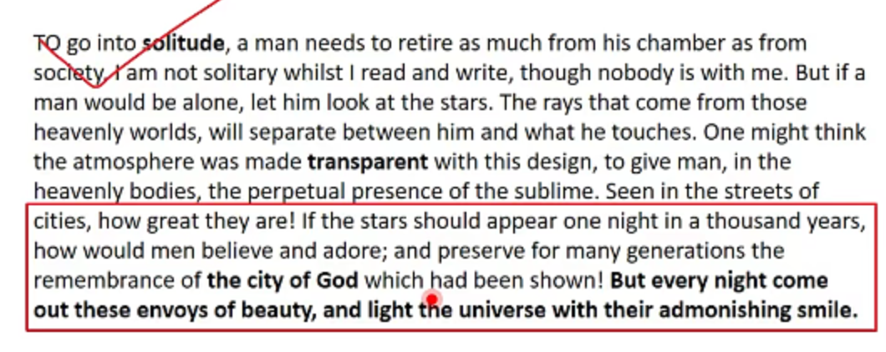
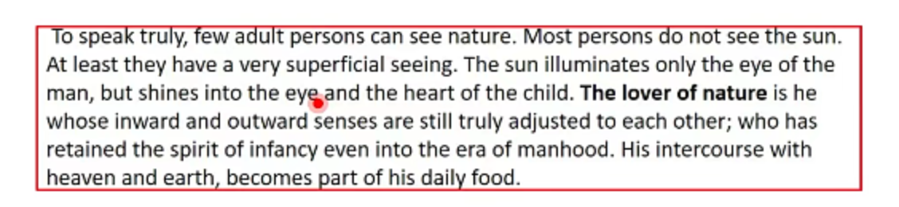
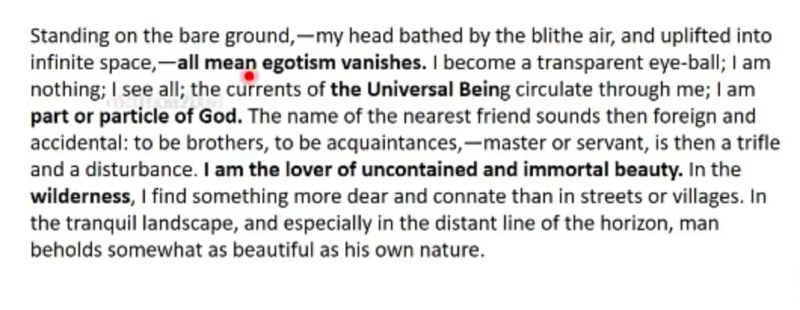
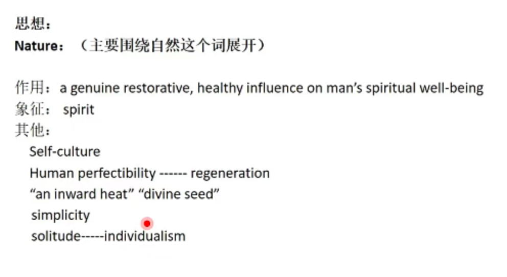
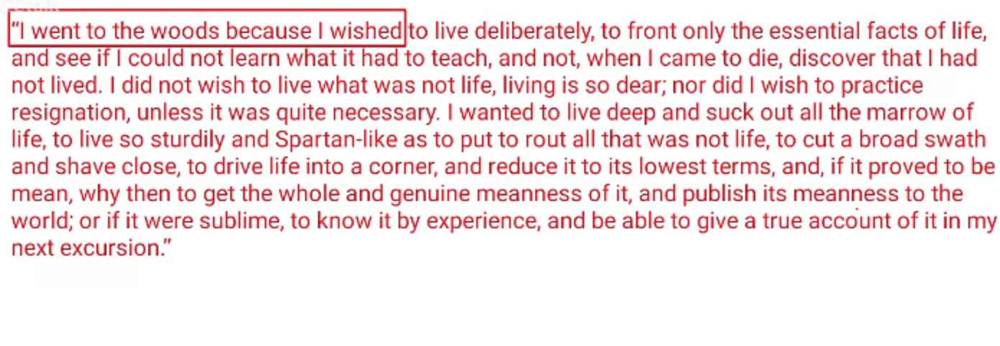

# American Romanticism 也叫 American Renaissance

# 时间

from the **end of 18thC **to** outbreak of civil war** 欧文（欧文的sketchbook的初版-惠特曼的death）

历史——内战、westward expression

经济——industrial transformation

政治——民主，平等

# 定义

a cultural and intellectual movement

# 特点

new experience, imitation to Europe（对欧洲的模仿）; independence and newness(有了民族意识) ;\*\* individualism and puritanism\*\* (Moralizing）个人主义和请教主义（强调说教）, Desire for an escape from  the society and return to nature, Growth of national consciousness: local color and local dialect 民族意识的觉醒, In sumTransformation转变的时期

# 分类

## 早期 欧文 库珀

## 鼎盛 超验主义 艾默生 索罗

## 延续 麦尔维尔 霍桑—— Dark Romanticism——态度的转变

## 很难归类 朗费罗 艾伦伯 艾米丽迪金森 惠特曼 布莱恩特

# 对比

都理性扬弃 感性赞扬 强调想象力和自然

新的东西 美国的特点

# Washington Irving- First American man of letters 美国第一个文人、First American writer gained international fame第一个得到国际（欧洲）声誉的美国人、美国文学之父（有争议、有人认为是马克吐温）、美国浪漫主义的开始、American GoldSmith&#x20;

1. 创作阶段
   1. English- imitation 模仿
   2. American- originality 原创
2. 风格
   1. **beautiful**, imitative, highly skillful
   2. avoid moralizing as much as possible 避免营造说教
   3. develop story's atmosphere 塑造故事氛围
   4. humor 幽默
   5. finished and polished and musical Language 语言
3. 作品
   1. The Sketch Book- **美国浪漫主义兴起 美国文学在欧洲的第一次亮相**
      1. a collection of short stories
   2. **Rip** Van Winkle南柯一梦- 十年一梦 一个人 - **Rip 表示主人公平静的生活和他保守的政治倾向**
      1. short story, **a simple and good-nature and hen-pecked man** 性格简单、 心态好、怕老婆的男人&#x20;
      2. **怕老婆 上山躲避老婆 睡觉 过了十年** **回村里**
      3. **保守的政治观点倾向、** 感觉革命比较激进
   3. The Legend of Sleepy Hollow睡谷传奇- 两队情敌的故事
      1. short story/ change (American Democracy)
      2. **Ichabod Crane** Yankee/ 城市中的投机者\*\* city-slicker\*\*
      3. **Brom Bones** 村子里长大的 **vigorous**&#x20;
      4. 他们俩的争斗、 最后后者吓唬前者、最后后者把前者吓跑了
4. 补充
   1. 他写的传记
      1. Life of Oliver Goldsmith 奥利弗·戈德史密斯的一生
      2. Life of George Washington
   2. 他的第一部作品
      1. 1809: A History of New York
   3. 他写的戏剧
      1. Charles the Second 两个人写的
   4. 他的声望主要体现在 tales of America 上
   5. 他的保守思想体现在 Rip Van Winkle

# James Fenimore Cooper- American Westward Movement 美国边疆作家

1. \*\*Created a myth \*\*about American nation创造了美国的神话
2. Leatherstocking Tales 皮袜子故事集
   1. a series of 5 novels; the process American **quest the ideal community**美国人追寻理想社区的过程

      
   2. Natty Bumppo 纳蒂·班波 （皮袜子故事集的主角）
      1. \*\*warrior, frontier and ideal \*\*American
      2. civilization vs, wildness 试图寻找自然和社会的平衡
      3. 别名 Hawkeye, Leatherstocking, The Pathfinder, the trapper,Deerslayer, Hawkeye
      4. 思想： idea of brotherhood of\*\* man\*\* and of \*\*nature \*\*and freedom 人类和自然地平衡
      5. 文笔啰嗦&#x20;
   3. 补充
      1. The Spy— a rousing tale about espionage against British during The war of Independence 间谍——一个关于独立战争期间针对英国的间谍活动的激动人心的故事 爱国主义书
      2. 海上传奇故事 The Pilot 反映了一位美国独立战争期间的海军战士

# Transcendentalism 1836-1860 （梭罗和爱默生都答）

1. **summit** of American Romanticism 美国浪漫主义的高潮
2. 定义：**literature, philosophical and cultural** movement that flourish in \*\*New England \*\*from **1836 to 1860** 文学 政治 文化的
3. "Whatever belongs to the class oriented intuitive thought" 属于直觉主义者的主义
4. 理论来源： Romantic literature of Europe/ Idealism of German and French/ Puritanism/ Oriental Philosophy
5. 性质：**loose group** 松散的团体
6. 他们反对 **Materialistic-oriented life** 反对以物质为导向的生活
7. 组织形式 **The Transcendentalist club** (informal club), 创办杂志**The Dial** 日晷- **make their voiced heared**
8. 主要理论
   1. oversoul 超灵 精神领域 世界 （艾默生还出过同名的文章）
      1. 地位：he placed **spirit** as **the most important thing** in the **world** 世界最主要到事情
      2. 能力：**All-pervading** power for **goodness,** **omnipotent and omnipresent** 全善 无处不在
      3. **in nature and society** and **constitute the chef element o**f universe 自然和社会中并存，是宇宙最主要的组成部分
      4. 全新的看法：A new way of **looking at the world**
      5. 批判：**oppose Newton‘s concept of universe** and the **materialism in America**. 反对牛顿的宇宙观(思想)/ 和美国的物质主义（个人）
      6. **又称：eyeball, grand mind**
   2. Individualism 社会
      1. 地位：individual is **the most important element** of **society** 社会最重要的元素
      2. Regeneration:As the Regeneration of society could only come about through the regeneration of individual his perfection, his self-culture, and self-improvement, and not the frenzied effort to get rich, should become the first concern of his life.由于社会的再生只能通过个人的再生来实现，他的完美，他的自我文化和自我完善，而不是疯狂地努力致富，应该成为他一生中的首要关注点。
      3. 最理想的人：The ideal type of man was the **self-reliant individual**. 自立的人the **individual soul communed with the oversoul and was therefore divine.** 人的灵魂中有oversoul,&#x20;
      4. 看人：It presented a new way of looking at man. 新的方式去看人
      5. 批判：It was a reaction against the **Calvinist concept** and the process of **dehumanization**非人化 that came in the wake of developing **capitalism**. 对清教主义 加尔文主义的反驳 反对资本主义后的非人化
      6. By trying to reassert the importance of the individual, they emphasized the significance of men **regaining their lost personality.** 帮族人们得到失去的personality
   3. Nature 上帝
      1. 地位：a fresh perception of nature as a symbol of **spirit of god** 自然作为**上帝**的灵魂 象征 **god's presence** 象征上帝的存在
      2. 与超灵的关系：**garment** of **oversoul** 超灵的衣服
      3. 对人类的好处：thas a health/ restorative influence on human's mind 健康
      4. 总结 thing in nature are more symbolic and  the \*\*physical world  \*\*was **a symbol of spiritual** 物质世界是精神世界的symbol/ add symbolism on American literature 是美国文学象征主义的先驱
         
9. 作品 艾默生论自然、 索罗 瓦尔登湖

# Ralph Waldo Emerson

1. **spokesman** of transcendentalism
2. **The Dial** 日晷 杂志
3. may be a **pantheist** 泛神论者 （一草一木都有神性）
4. Emerson believes \*in the concept of \***Transcendentalism**. It is **oversoul** with everyone's **particular being is contained and made one with all other.**
5. 思想根源
   1. Reject Calvinist tenet 打破了加尔文主义的信条
   2. Embrace liberal Unitarianism 拥抱了自由的上帝一神论
6. 作品：
   1. Nature
      1. The **Bible** of New England
      2.
      3. 又称**The Universal Being; the purest, moral influence**
      **选段： 分析一段话-先paraphrase 再与主题联系**

      如果星星一千年出现一次 我们就会珍惜她 但是他们每天都会出现 就不会在乎 这个世界中有很多美好的东西，在大自然中 但是你忽略了

      

      成年人不及孩子，成年人拿世俗的眼光看待自然 但是孩子用的是纯真的眼光看待自然 **child 不是 children**

      

      我的身体中具有神性 oversoul的问题
   2. The American Scholar
      1. American's **Declaration of Intellectual** 美国知识分子的独立宣言
      2. American scholars needs to use \*\*American theme and thought \*\*rather than Europe讲美国主题 美国思想&#x20;
      3. Embodied a new nation's **desire** and **struggle** to **assert** its **own identity** in its period 体现了一个新国家在其时期表达自己身份的愿望和斗争
   3. Self-reliance&#x20;
      1. 讲述了virtue

# Henry David Thoreau

1. Friend of Emerson
2. Active Transcendentalist
3. 死后成名
4. A prophet of individualism in American literature 美国个人主义的先驱
5. 作品
   1. Walden 出世和入世的问题 他的精神、物质日记
      1. record his **reflection of his solitary**
      2. a manual for\*\* self-reliance\*\*
      3. simple living and\*\* self-efficiency\*\*
      4. 梭罗的自然观——自然对人类的好处——自然对人类的提高
         1. 通过自然的洗涤之后 我们能成为怎样的人
            
            艾默生和梭罗的区别：**艾默生注重于说教、 梭罗I和动词更多 是一个日记**，关于自己的思考

我想去森林里过一下独立的生活 不是成为自然中求生的人 而这种独立会带到人类社会中

# 霍桑Nathaniel Hawthorne 思想有深度

1. a **dark** American Romantic novelist 黑暗的浪漫主义小说家 三观偏保守
2. famous for use of **symbol** 擅长用symbol
3. pioneer of **psychoanalytic** novel 心理分析小说的先锋
4. 美国浪漫主义时期最伟大的作家
5. Salem witchcraft trails of 1692**塞勒姆驱巫案件**
   1. 迫害了女巫
   2. 霍桑的家族是去除女巫的领导地位
   3. 霍桑觉得会反噬到他
   4. 他把他的名字Hawthorne里多打了了w- 原来叫**Hathorne**
6. 观点：

   **Black Version**消极思想/ 对于恶的看法:&#x20;
   1. He was **haunted by his sense of sin and evil** in life他一生被罪恶笼罩
   2. He believed that sin or evil can be \*\*passed from generation to generation and sin will get punishment \*\*人性的恶会隔代相传（他改名字）
   3. **Evil** seems to be man's **birthmark**人生来为恶&#x20;
   4. He discussed sin and evil in almost\*\* all of his work\*\*作品中充满了恶
   5. Evil has function of **education**恶可以教育人 **《红字》- 白兰 8年更改**
      His rejection and acceptance of\*\* Emerson's thought\*\*霍桑与超验主义的关系:&#x20;
   1.His creation was closely related to the philosophical thoughts in in time—**transcendentalism**; 他们同时代

   2\. He was negative, and he believed that evil exist in everywhere and everybody; but they both accepted that **human can change and grow up** 相对于艾默生，霍桑是消极的，恶存在人的内心深处/ 但是他们都同意人会成长，进步

   3\. he doubted that **we can understand the nature** and denied the progress of \*\*science and technology \*\*and the ability of human to **conquer the nature.** 怀疑我们是否真正的可以理解自然（管带你更加复杂）、 也反对科技，人类可以战胜自然

   4\. **他们都用symbol**，但是艾默生相信自然，霍桑怀疑

   5.他们的一些理论起点一样——清教主义

   写作手法：**Romance**: Romance was the predestined form of American narrative\*\* 传奇\*\* 用**传奇的手法让小说更深刻**

   把白兰的孩子写的特别神——在她的身上寄托霍桑的想法——让文章更有深度
7. 作品特点

   Much of Hawthorne's work is set in **colonial New Englan**d, and many of his short stories have been read as **moral allegories** influenced by his **Puritan background**.  殖民英格兰\收到请教主义的影响

   His works have **educational and moral** function. 教育和道德的功能

   The use of **symbol** in his writing to\*\* express different ambiguous meanings.\*\* 用单一的东西 表示多种 不同的性质— **Ambiguity**

   Fixed Female characters: the **blond and effete**金发的白人 \*\*(allure 诱惑功能)**; the **dark-haired and sensual Oriental type**性感的东方美女**（正面）\*\*

   The tension between **the head and the heart（头脑和心灵，即情感和理智）:** **Negative viewpoint** of intellectuals (for criticizing reason 他们喜欢追求真理，最后失去他们真爱的东西) 他对知识分子（理性主义者）呈消极态度

   He is good at exploring of the **inner world of human beings** 探索人类内心世界

   对颜色的运用 人物的动作描写
8. The Scarlet Letter 红字
   1. A: **central symbol**; it shows the **growth in character** and \*\*change of community she leave \*\*主角的成长和她所生活的社群的改变
      1. For Hester
         1. &#x20;adultery通奸 罪恶的象征（on her bosom）
         2. able: then when Hester became gradually accepted by the community through h**er honesty and hard work**, the meaning of letter A slowly changes into "Able" because of **Hester's charitable work and her intelligence in the community.**
         3. Angel: at the end of the novel, she continued to try her best to **help the poor and the sick** although she was actually trapped in poverty too. Gradually, people begin to regard Hester as an industrious\*\* kindhearted and able woman. \*\*They saw A in the sky.Therefore, the symbol has evolved to represent the high virtues Hester ----"angel "
      2. A for Alone / Alienation
         1. 与主流社会隔开
         2. 精神孤独：刚开始通奸 没人和她交流/ 但是最后她精神世界提高了人们没法和她交流
      3. Arthur
         1. Arthur Dimmesdale 证明了亲生的儿子是谁 —a bridge of love between \*\*Hester and Dimmesdale \*\*暗示了他们爱情的桥梁
      4. For Dimmesdale
         1. A is a piercing reminder of **his concealed sin** 说明他也是通奸罪
         2. represent his **agony and ambition** 侧面证明他的虚伪和志向和痛苦 对宗教极端的热情
      5. For Chillingworth
         1. Avenge 代表了他的复仇
      6. the Scaffold 刑台 （出现了三次 每一次是所有主角都出现 ）
         1. 第一次审讯Hester
         2. 第二次Hester在深夜偷偷忏悔
         3. 第三次Dimmesdale 坦白
         4. symbol- **redemption judgement and transition** **of characters** 忏悔 公正和 主人公的改变
      7. A代表American
         vii. Hester 从 监狱里出来的时候
      8. 有一束玫瑰丛 rosebush&#x20;
      9. 象征着Hester内心中的passion 激情
   2. 人物分析：
      1. Hester Prynne
         1. ideal woman; symbol of\*\* strength and independence\*\* 象征着力量和独立的女性
         2. her growth is woman's growth 她的成长也就是女性群体的成长
         3. 形象：她的姿态优雅 带着圣光 因为她年轻的身体压抑不住激情导致她犯罪 她的美貌和她的神性 她的罪是为了她的神性努力
      2. Roger Chillingworth
         1. a revenger, an intellectual, rational
         2. his name means chilly, he is cold-hearted 他冷血&#x20;
         3. he name has worth but His life is unworthy 但是他的一生是不值当的&#x20;
         4. 他的成长就是把遗产留给了女儿
      3. Arthur Dimmsedale
         1. hypocrisy
         2. a sinner and adulterer
         3. 名字：dim-黑暗 、 dale- 光照不到的地方 两山之间的小溪谷 内心中深藏罪恶
   3. 主题
      1. puritanism 对宗教的审判
      2. The growth of a woman 女性成长
      3. love and avenge 对女儿的爱、和Chillingworth的复仇
      4. Desire and religious passion欲望和宗教的纠缠&#x20;
      5. evil and sin 罪恶的教育作用
9. Young Goodman Brown 好相逢布朗
   1. \*\*round character \*\*—故事中有成长的任务
   2. 妻子叫Faith 他发现妻子特别纯洁 只要妻子不堕落我就不堕落 参人们都参加加了魔鬼的集会 最后他发现了天飘着妻子的粉丝带（魔鬼的象征） 但是最后他发现妻子也堕落了 最后他的世界观崩塌了
   3. Symbol
      1. Goodman- 象征着好人
      2. Brown- 黑色 和 白色 中间的颜色 他不是绝对意义上的好人或坏人，代表着普通的教徒&#x20;
         1. 证明正常人的宗教信仰很脆弱 容易崩塌
         2. 它有着关键的成长
      3. Faith-信仰
         1. 清教徒坚贞的信仰，Faith是这个世界上最后一个好人 代表着宗教的虚伪性
         2. Faith represents the stability of the home and the domestic sphere in the Puritan worldview. Faith, as her name suggests, appears to be the most pure-hearted person in the story and serves as a stand-in of sorts for all religious feeling. Goodman Brown clings to her when he questions the goodness of the people around him, assuring himself that if Faith remains godly, then his own faith is worth fighting temptation to maintain.
      4. Pink Ribbons
         1. Faith‘s corrupt
         2. According to Bible, **red represents evil** while white **represents holiness**. And the color of ribbons is pink-**between red and white**. So the pink ribbons represent two sides of \*\*Faith-purity and kindness as a wife \*\*and **evil as one who joined in such a ritual, but also represent Brown's religious belief.** 粉色在白色和红色之间 白色象征着忠贞 红色象征着邪恶 所以Faith既有着作为妻子忠贞的一面也有着堕落的一面
      5. 故事背景
         1. 傍晚
         2. 白天代表着正义 夜晚代表着堕落 傍晚代表着脆弱和堕落 容易收到诱惑 最后到了晚上 证明世界就是邪恶 漫漫长夜
   4. 主题

      How the **Puritans' strict moral code** and overemphasis on the **sinfulness of humankind** foster undue\*\* suspicion and distrust\*\*. 清教的严苛的道德观的呈现 人与人之间的猜忌

      The **realization** that **evil** can **infect people who seem upright**. 人的两面性 邪恶也可以影响一个正直的人

      One man's virtue is another man's sin, and vice versa.一个人的美德是另外一个人的罪恶

      人信仰的脆弱

9\. 补充：

19世纪**浪漫主义时期最伟大的小说家**

Scarlet Letter A

The House of the Seven Gables 描写了一个品钦家族（Pyncheon）的祖先谋财害命遭到报应的事，反映了霍桑的**上一辈的罪行遗传到下一辈的思想**

麦尔维尔评价他 **The largest brain with the largest heart**

Dr. Heidegger's Experiment 黑格德医生的实验是一篇短篇小说

# Herman Melville 麦尔维尔 霍桑的好朋友

1. 死后成名 活的时候不出名 产生了自我怀疑 然后放弃写作 默默无闻的死掉
2. Representative of the American Renaissance period
3. Moby-Dick
   1. 鲸鱼的名字
   2. Ishmael 上船了 Ahab一心报仇 年轻的时刻被鱼咬坏了 最后只有Ishmael活着了
   3. To **Ahab** 雅哈, the whale is his **enemy**, either an **evil** creature itself仇人（**因为他被白鲸咬过**） or **the agent of an evil force** that **controls the universe, or perhaps both** 邪恶的分身
   4. To **Ishmael**依诗薇儿 旁观者 the whale is an **astonishing震惊于白净的强大 force**, an **immense power**, which defies rational explanation due to a sense of mystery it carries. It is **beautiful but malignan美丽切残忍t** at the same time. It also represents the **tremendous organic vitality of the universe**代表自然的力量, for it has a life force that surges onward irresistibly, **impervious to desires or wills of men**.但是人类无法将其左右
   5. To readers, a symbol of the **physical limits**人类认知的边界 that **life imposes on men**. It may also be regarded **as symbol of nature**, or an instrument of **God' s vengeance upon evil man.** 自然当中的真理  上帝的显现
   6. 对艾默生乐观的自然精神的反思——再麦尔维尔的故事中 白鲸是残忍地
   7. Pequod&#x20;
      - 裴廓德号（经典小说《白鲸记》中一艘捕鲸船的名字）
      - 象征人类对终极真理的探索
   8. 主题
      1. Search For truth 对真理的搜索
         1. Human pursuit of truth and the meaning of existenence
      2. Conflict between good and evil 善于恶 的交锋
      3. Conflict between man and nature 人与自然的交锋
      4. Individualism&#x20;
         1. 对艾默生进行反驳&#x20;
         2. 艾默生认为人要self-reliance&#x20;
         3. 但是Ahab 因为自己及其独立 最后死掉了
4. 补充
   1. Clarel 克拉瑞尔 是他最出名的诗歌 晚年的时候爱写诗歌
   2. Confidence-man《骗子》是他的作品
   3. Tashtego, Daggoo 和 Queequeg 是 莫比迪克里的三个水手卖弄
   4. **Man who lived with Cannibals - Typee泰比**
      1. 麦尔维尔年轻时做过捕鲸水手  之前在南太平洋群岛波利尼西亚被俘虏
      2. 后来他将这段经历改成 小说Typee
