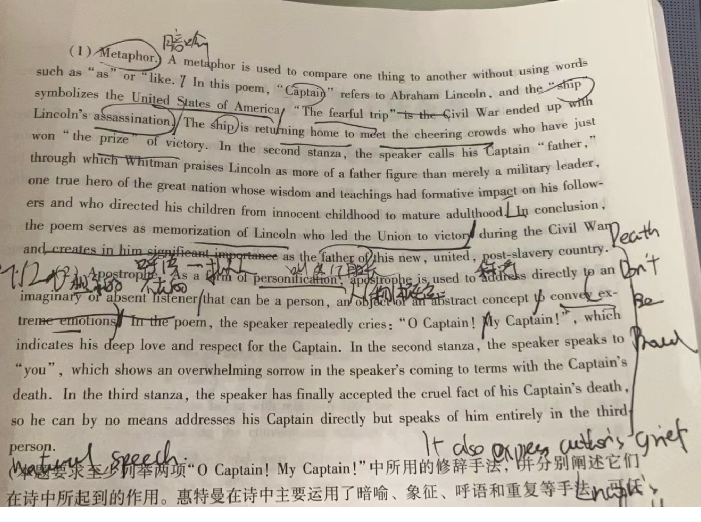

# Realism 现实主义；（25- 时间背景+女性,现实+文学特征+作者）

# Historical Background

1. 政治
   1. Civil war: **North** won the war, and the \*\*plantation of south \*\*had declined.独立战争结束 南方衰败
2. 经济
   1. Industrialization: the industrial era, by **steel and steam**, came into being 蒸汽和钢铁主导的工业时代来临&#x20;
   2. Labor: \*\*urban factories \*\*gained momentum with **rural labor came to cities**农村劳动力涌入城市，城市得到发展
   3. **Glided Age镀金时代**: 马克吐温的一部work。Although the \*\*population increased and urban developed \*\*very fast, the **gulf** between rich and poor **expands**, which is a **big contras**t to the national prosperity. It's what Mark Twain called **Glided Age**. 人口增加 城市发展 但是贫富差距加大，这和国家的繁荣对比很大 这也就是马克吐温所说的镀金时代 An age of **excess and extremes, of decline and progress, of poverty and  wealth, of gloom and hope**. 一个过剩与极端，衰败与进步，贫穷与富裕，阴暗和希望的时代。
3. 投票权：**Lower-class people **need more **voting right**, which led a shift from** traditional political alliances** to **bossism of big cities**.下层人民要求的更多的投票权导致从传统的政治联盟到大城市统治的转变 \*\*Political patronage and graft \*\*were at next level政治庇护和贪污到了下一个等级
4. 铁路：**New railroad**新铁路 and **trans-Altantic communication infrastructure**跨大西洋交通线 **liberated** Americans **from isolation把美国从孤单中解放,**  giving **birth** to **flourishing commercial expansion**繁荣了商业, promoted \*\*Westward Expansion促进了西进运动 \*\*and **interregional flow** of **population**. 国家内部人口的流动

# Literary Characteristics

1. Women: became the\*\* nation's dominant's culture \*\*女性成为了文化的主导
   1. **An increasing number of women journalism** went into public.女性杂志涌现
   2. Emily Dickson; Stowe- **Uncle Tom's Cabin**汤姆叔叔的小屋
2. 城市：American **romanticism** had ended, and **New York replaced Boston** as cultural center. 浪漫主义结束了，纽约代替波士顿成为了文化中心。
3. **middle- class** writers created realism
4. Realism
   1. 起源：**originated** in **France**, which depicted the **truth and ordinary life** 起源于法国，描写原始的生活和真理
   2. 反对：It is a reaction against **romanticism and sentimentalism**
   3. 喜欢写什么They favored **rounded characters with subtle humanity **over **idealized characters and events.** 喜欢写微妙性格的圆型人物，而不是理想的人物和事件 They like to write the r**eal American life**, believing **ordinary things** were **same** as **magnificent** things for **artistic description**喜欢写真实的美国生活，平常的事物和伟大的事物一样适合艺术描写
   4. 代表作家
      1. 下 马克吐温
      2. 中 William Dean Howells
      3. 上 Henry James
5. Local color
   1. 时间came into being in 1860s - 1870s in America
   2. 喜欢写什么devoted to write the unique\*\* customs, manners, folks and other qualities \*\*of **particular regional community.** 写一些民族地区群体的习惯 风俗 小说 和其它品质
   3. 特点 Its style relied heavily on **words, phrases and slangs**in **particular region.** 某个区域的词汇 短语 俚语
      1. They tended to **idealize**, but never forgot **truth description** 尝试理想化 也会写真实的
      2. **humorous short story**
   4. Bret Harte 布莱特 哈特- the \*\*first local color writer \*\*gained **international fame** in 1860s 第一个得到国际名誉的
      1. Mark Twain- **most famous- Adventures of Huckleberry Finn**
      2. Stowe
6. Naturalism
   1. the end of 19th century
   2. 简单介绍：the \*\*conflicted workings of universe and social disorder \*\*sorted out as **naturalism**, which is a \*\*new and harsher \*\*realism 宇宙的矛盾性运转和社会的无秩序，又新又严厉的现实主义
   3. 观点：
      1. The world is amoral 世界是无道德的
      2. 达尔文：They accepted the more **negative&#x20;
         implications of Darwin's theory** and used it to explain&#x20;
         the **behavior** of those **characters** who&#x20;
         were conceived as **complex combinations of&#x20;
         inherited attributes**, their habits **limited by social&#x20;
         and economic forces**.  接受了达尔文理论更消极的暗示，用其解释其作品中人物的行为是遗传属性的组合，他们受到社会和经济的力量制约
      3. 人物：Lower- class who are determined by **environment and heredity** 被环境和遗传决定的下层人物
      4. 文字：The writers' tone is **less serious and sympathetic**, but **more ironic and pessimistic**不再严肃同情，但是讽刺悲观It's a **gloomy** **philosophical approach** to **reality** 对现实的黑暗哲学描写
      5. 两个主义：pessimism and determinism
   4. 作家：Jack London, Theodore Dreiser, Stephen Drane

## Walt Whitman沃尔特 惠特曼 生平+草叶集+title的成就（2行左右）-文学特征 free verse+节奏感+语言- 影响+出名的作品加文学特征- 他是浪漫主义最出名的作家,free verse，地位

1. 评价
   1. a great innovator 一个伟大的创新者
   2. &#x20;lasting influence on American modern poetry with his **innovation of diction and versification**, his frankness about ***sex***, his\*\* common topic \*\*and his **critic** to  \*\*American democratic \*\*措辞和诗文的创新，对性的坦诚，平凡的话题和对民主的职责影响不朽
   3. **Leaves of Grass** is the **America's first genuine epic** 草叶集，美国历史第一部真正的史诗
2. 写作风格
   1. 最主要的free verse- a poetry without\*\* a fixed beat **or **regular rhyme scheme**, without traditional** iambic pentameter\*\* 没有固定的节奏和韵律，打破五步抑扬格
   2. 音韵**musicality**: rhythmical, the **musicality** of his poem is attributed to **parallelism and phonetic recurrence** at the **beginning of lines**有着节奏感，其音韵干来源于诗句之首的排比和语音重复
   3. 语言 **simple and crude**简单粗矿, like to use **oral** **language** 喜欢用口语 \*\* rarely-used word\*\*s appear in his poem有力量，有色彩，很少用的词汇经常出现他的诗中
   4. 人
      1. combine the **democratic man with rugged man** 民主的人和粗狂的人结合
      2. The poet is a **hero, a savior and prophet** in his eyes, leading **communities** with\*\* truth\*\* 在他眼里，诗人通过真理，作为英雄，救世主和限制的身份领导整个团体
3. Song of Myself
   1. 主旨
      1. Extol: He extols the\*\* equality and democracy, individual dignity and humanity\*\*赞扬民主 平等，个人尊严和人性
      2. World: It describe a world **without hierarchy and with equality**一个没有阶级的平等社会
   2. 诗歌中的象征
      1. you - **en-mass**
      2. I - not the **poet** nor **any particular person**. 不是诗人也不是特殊人
         1. By combining the \*\*1st person and second person **perspective, Whitman can free himself in his expressions, in communicating the** ideal of individualism and achieving the effect of patriotism. \*\*第一人称和第二人称的结合，惠特曼通过语言解放自己，交流个人主义和爱国主义理想
      3. **2 Principle belief** 两个关键理论
         1. the theory of **universality** and belief in **singularity and equality** 普遍理论和奇怪和平等理论
4. O Captain! My Captain!
   1. 纪念president **Abraham Lincoln** after\*\* assassination in 1865\*\*
   2. 修辞
      1. Metaphor
      2. Apostrophe
         1. A form of **personification**一种拟人
         2. address **directly**直接强调 to an **imaginary** in absent **listener**一种幻想中的听者 that can be a **person**, an **object** or an \*\*abstract concept \*\*to **convey strong emotion** 是一个人，一个物体，一个抽象的概念 来传递强大的感情
            
5. Free verse
   1. 时间Originated in **19thC France**
   2. 解释 Free verse means the **rhymed or unrhymed poetry** composed without **conventional rules of meter.** 有没有韵律的诗歌，缺少传统格律
   3. 目的Their **purpose** was to\*\* free \*\*themselves from the restrictions of formal \*\*metrical patterns \*\*and to **recreate** instead the \*\*free rhythms of natural speech. \*\*目的 从传统的格律解放，在自然中重新创造rhythm
   4. (4) Walt Whitman's Leaves of Grass is, the most notable example. 草叶集

## Emily Dickson 艾米丽 狄金森

1. 成就
   1. 意象派的先驱 precursor of imagism
2. 主题
   1. 基于based on her life 基于她的人生
   2. 多角度 宗教 爱 成功失败1centered on her **doubt and thinking of religion, pain of love, success and failure** 对宗教的怀疑和思考，爱情的痛苦，成功和失败
   3. 死亡角度Most of her poem is about the\*\* immortality and mortality**主题：死亡，永生**Death leads to immortality\*\*死亡引领永生
   4. 自然角度Nature is gracious and cruel 自然残忍也慈祥
   5. 道德角度主题In ethical view, beauty, truth and goodness is one 真理 美丽 善良一体
   6. 自由和人类责任 She emphasizes **free will **and** human responsibility** 强调自由意志和人类责任
3. 写作风格
   1. 词:her poem is **direct and simple, using plain words .** 她的诗直接简单，用一些平凡的词汇&#x20;
   2. 音韵：she uses **subtle break of rhythm**. Most of her poems borrow  **Christian hymns**—**two lines 4 beat and 2 lines 3 beat**. 她的韵律有着微妙的停顿。很多她的诗姐用了基督教赞歌—两行四拍和两行三拍
   3. 其他特点：she was known for the use for **punctuation**s, rhyme and spelling scheme 因符号和押韵知名, especally for the use of "**dash**" and \*\*captalization \*\*for **stress** 比如用破折号，和大写字母作为强调 There 's **no title** in her poem. 她的诗歌里没有题目
   4. 写作手法：heavily influenced by the **Metaphysical poets** of 17th England （受17世纪英国玄学派诗人影响）,  her work had many  **images and metaphors**. She is **the precursor先驱 of imagist poetry**.  她的诗歌里有很多意向和暗喻，她是意象派诗人的先驱 影响到了 Ezra Pond
4. Because I Could Not Stop for Death—
   1. theme
      1. death and immortality **by metaphor of a carriage on the journey**借助马车 来说明死亡和永恒
   2. 内容
      1. She compared **life as a journey** and **death** is **kind**. It is just like \*\*a friend \*\*and take you to the **eternity**. In this poem,**death** has **cheated her** and **deserted** her in **eternity**, but this is **her impression of death** and  **the essence of life**, which leads **readers** to **imagination**.  她将人生比作旅程，死亡很温柔。他只是一个朋友，并带你到永生。在这首诗中，死亡欺骗了她，并把她遗弃在永生中，但这是她对死亡的印象和人生的本质，这带readers到imagination中。
      2. 第一stanza给了**the reason of death stop for me**——because I \*\*can not stop for death \*\*and death is **kind**.
      3. 我无法**stop for death（停下来等待死亡**） 的原因是因为狄金森在本诗中把人生比作**journey**,只有**stop journey**后才能**停下来等待死亡**。因此，对于一个生命，**stop不是the way of death, 但是journey是**
      4. death‘s carriage hold **“I” , death and immortality**. 死亡的马车承载着我，死亡和永生
      5. 在诗句的第三stanza中，**school symbolizes childhood, grain代表着adulthood，setting sun代表elder** **house 象征坟墓**
      6. 在第五stanza中的“**House**”, which\*\* is like a roof,\*\* symbolizes **grave and death**.
      7. A Swelling of Ground - 坟墓
      8. 第六stanza的“**a century is shorter than a day**”的意思是death is **not the end of the journey,** but a **pause**, according to **Chiristianity**, there is\*\* eternity and immorality.\*\* 所以，a century is shorter than a day 死亡并不是人生的终点，但是是一个暂停。根据基督教，死亡后有永恒。所以一个世纪比一天短
5. A Bird Came Down the Walk—
   1. an **observation** when the poet **saw a bird on the road**, and tried to\*\* fed some crumb\*\* to it, but it was **fear** and **flew away**. 作者观察到一只鸟在路上，想喂他一些面包屑，但是鸟太害怕飞走了
   2. She explores **human connection with nature, visualized nature.** 她探索了人类和自然的联系，让自然更形象。**Nature’s beauty and complicated, human connection with nature, and self-consciousness** are the major themes of this poem. 自然的美丽和复杂，人类和自然的联系和自我意识是这首诗的主题。Normally, nature provides comfort for creatures. However, the bird is **fear**, that is, **being caught in mind**. 通常自然微生物提供栖息，但是这里的鸟害怕了，恐惧被抓走。The last **interaction** between writer and bird is **suspenseful**.最后作者与鸟的交流留有悬念
   3. bird: **cruel**(**ate the fellow, raw**吃了生的同伴), **polite**(**let the beetle pass**让小虫pass), **cautious（警觉人类的面包屑）, beautiful**(飞起来很美) (a bird as well as a human)鸟是残忍的，礼貌的，警觉的，美丽的 (这些特点和人类一样) //symbolize the relation\*\* between human and nature\*\*

## Harriet Beecher Stowe 哈丽雅特 比彻 斯托

1. 她是local colorism
2. 他认为 a society rests on slavery cant long survive
3. Uncle Tom's Cabin汤姆叔叔的小屋
   1. best-selling novel in 19thC
   2. theme: **evil of slavery and immorality**
   3. 作用：push the abolishment 推动了废奴事业、
   4. style
      1. sentimental style&#x20;
      2. like 19th sentimental and domestic novels
   5. 主角 Tom, Eliza (his best friend)
   6. 激怒了南方人 也遭到了支持奴隶事业的人的批判

## Mark Twain&#x20;

1. 评价：
   1. "the true father of our national literature”我们真正的民族文学之父; — 海明威
   2. "the father of American literature.” 福克纳(Faulkner)评价，美国文学之父
   3. a giant of American Literature 美国文学的巨人
   4. a great humorist
   5. Hemingway called all modern literature comes from one book by **Mark Twain** called **‘Huckleberry Finn,’**
2. 名字:&#x20;
   1. Clemens 克莱门斯;&#x20;
   2. Mark Twain, his penname, means 12 feet 12英尺
3. His style （他和之前作家的对比，他的style，他的语言，他的写作经历）
   1. representative of local color
   2. before him, writers are more influenced by **Europe**, but his **thinking and style** are in **America**.在他之前的作家受欧洲影响深，但是他的思考和style都是很美国的
   3. **Local color**
   4. His\*\* colloquial style of prose \*\*is the origin of **colloqulism** (vernacular) , and many **writers are influenced**, such as **Hemingway**. 他的口语踢散文诗美国口语体文学的起源，很多作家都被他影响，比如海明威
4. The Adventure of Tom Sawyer
   1. He writes a\*\* boyhood life\*\* along the Mississippi River. Though Twain **satirizes** **adulthood, religion, and school education**, **he did not touch larger issues** . 他写了一个住在密西西比河沿岸的男孩，他批判了成年人，宗教和学校教育，但是他没有触及更大的问题
5. Adventures of Huckleberry Finn (**第一人称视角，unreliable presenter**) **海明威：All modern American literature comes from Huckleberry Finn** 现代美国文学开始于哈克贝利菲恩
   1. Theme:
      1. **Freedom:** **Escape from society (最主要的theme**): Huck wanted to escape from **civilization** and Jim wanted to escape from **slavery**. Huck想逃离文明，Jim想摆脱奴隶制
      2. **Society versus conscience**: Jim followed his **conscience** and doing right, but Huck struggled in **society and nature**, finally follow his heart. Finally, **Huck** knows **the color of skin** cant determine **one's value**. Jim遵循自己的良心，做正确的事，但是Huck在社会和自然中挣扎，最后遵循内心，最后Huck知道肤色无法决定一个人的品质。
      3. **Greed and vice**:  **Huck's Father/ Duke and King** (文章中的角色), symbolizes **curelty** and **cold**
   2. **Chap 31**:Huck's **psychological dilemma** about **slavery** to **write or not to write**; **social principles** lead him to **write**; but his own conscience does not; from the perspective of child to show social problem 关于是否写信告发吉姆，这个chap主要写了Huck内心的困境，最后的良心没让他写
   3. 马克吐温对待奴隶的态度: **his treatment of Jim** in Huck Finn and other writings clearly show he is \*\*an anti-slavery \*\*.  他是反奴隶者
   4. His realistic aspect这部小说现实主义一面: Twain used **South's Reconstruction**, \*\*American Dream \*\*and **Westward Expansion** to **shape this story**. Although **romanticised the South**, Twain still **satirized** some of Southern life that is **ridiculous**. 他用南方建设，美国梦和西进运动来塑造这个小说。虽然将南方浪漫化，但是马克吐温还是讽刺了南方生活搞笑的一面。
   5. 哈克贝利菲恩作为主角的好处和这篇文章的写作风格:&#x20;
      1. &#x20;**Huck** is a **common people** as a main character. —the **most original voice** in American literature— the voice of **honesty** and **common people**, **transcending the time universally.** 作为主角，哈克贝利是一个平民，这是美国文学最原始的声音——诚恳的人民之声，超越了时间
      2. **Episodic style provides a realistic
         way** of showing his **subject**, showing adventures **as a boy describes** .\*\* 剧集的\*\*风格提供了展现他主题真实的方式，像一个男孩叙述一样展现了冒险故事。

## O Henry

1. 美国现代短篇小说之父 美国生活幽默的百科全是
2. style 观察 语言 修辞 巧合 结尾 俚语 对比
   1. He has a\*\* detailed observation\*\*, and his works have **unique style**. 他观察仔细，作品风格独树一帜。
   2. His story is **short **and he uses** clear humorous language** and **rhetorical devices**. 他的小说短小，他经常用清晰，幽默的语言和修辞方法
   3. His story has \*\*ironical coincidence \*\*and the ending is **surprising**.。他的小说有着讽刺的巧合，并且他的小说结尾很出人意料。
   4. His stories have **many slang and oral expressions**, giving \*\*local color \*\*to his story. 故事中有很多俚语和口语化表达，让他的小说更有本地特色。
   5. it has a **profound contrast **, mainly about** many poor New Yorkers**. He **sympathized their lives**. 他的作品有着对比，主要是关注那些穷困的纽约人，他同情他们的命运。
   6. his work are similar to **Guy de Maupassant**和莫泊桑类似, but his works are more **humorous**更幽默
3. the cop and the anthem
   1. The story is his **general theme**. It reflects the **hard life of the lower class** through presenting Soapy’s twisted psychology. He critizes the **officals **, which **confuses the right and the wrong**, and critizes **strict rules of the charitable institutions**, and the **capitalist society** that** oppresses common people**. 这部小说是他的一般主题。他通过索反转的心理，反映了下层人士的困难生活。他批判了官员，他们颠倒是非黑白，批判了慈善机构严苛的规矩和资本主义社会对人民的压迫。
   2. Characteristics:\*\* ironical coindience, black humor language, contrast and surpring ending.\*\* 这部小说的特点，讽刺的巧合，黑色幽默语言，对比和出人意料的结局。
4. The Gift of the Magi麦琪的礼物
   1. a moving story 感动的故事
   2. young people\*\* sell their best possessions\*\* for each other's Christmas gift 为了他人的圣诞节礼物卖掉了自己最好的财产
5. The Four Million 四百万 他的小说集
   1. all people of New York City is\*\* worth writing abou\*\*t, not only **the higher class**不仅仅是上层社会 所有的纽约人都值得写

## Henry James 亨利詹姆斯

1. 和William Dean Howells 是好友
2. Achievement
   1. representative of psychorealism
   2. a **prolific** writer 多产作家
   3. a pioneer to **use modernism and stream of consciousness**现代主义和意识流的先锋
      1. **Stream of consciousness** 意识流
         1. Stream of Consciousness is a **method of storytelling** 讲故事的方法
         2. in which the author tells the story through the **freely flowing thoughts**自由流动的思想 and **associations of one of the characters**.或人物联想
         3. &#x20;It is used to depict the **mental and emotional reactions of characters to external events,**外部世界的心理和情感反应rather than **the events themselves.** 而不是事件本身。
         4. James Joyce 詹姆斯乔伊斯 Virginia Woolf维吉尼亚沃尔夫  Henry James 亨利詹姆斯 福克纳
   4. Avoid the **omniscient**of novel, and writers **should "showing" not "telling"** 避免了全知视角，作家应该展示而不是叙述
   5. turn novel from **journalism and romantic narration** to **analyze individuals facing to society** 把小说的从新闻体和传奇转变成分析个人面对社会的分析
   6. **Psychological Perception is the highest form of experience**&#x20;
3. his style （他的语言，对艺术的理解，他创作阶段，心里现实主义，他的叙事角度）
   1. 写upper class
   2. His style reflects the transition from **Victorian Realism to modern times**从维多利亚时期现实主义到现代主义过渡
   3. his works are **hard to understand;** his language is highly\*\* refined，rich and accurate\*\*. 他的作品难以读懂，语言精美数量多准确。i'k
   4. art is **related to life** and the **aim for novel is representing life** 艺术与生活相关，小说是为了表现生活
   5. a pioneer to **use modernism and stream of consciousness**现代主义和意识流的先锋
   6. Avoid the **omniscient**of novel, and writers **should "showing" not "telling"** 避免了全知视角，作家应该展示而不是叙述
   7. turn novel from **journalism and romantic narration** to **analyze individuals facing to society** 把小说的从新闻体和传奇转变成分析个人面对社会的分析
   8. 3 stages of his work
      1. first period—**international themes**: the confrontation between two different cultures: two different groups of people representing two different values. 2种文化的碰撞：两股人代表着两股不同的价值观 America is **naive **and Europe is **mature**. 美国更幼稚，欧洲已经成熟**Marriage and love** are used as the point of the confrontation. 婚姻和爱是碰撞的点 For Americans, it's the process to be\*\* mature\*\*.对美国人来说，这是走向成熟的过程。
      2. second period—**subtle** studies of **interpersonal relationships,** and **deep exploration of charaacters** 对人际关系的微妙研究和深挖人物性格
      3. 3rd period— novella 中篇小说 最成熟的时段
   9. Psychological realism 心理现实主义:&#x20;

      It is a **realistic writing** that is \*\*into the characters' thoughts and motivations \*\*deeply.Henry James is considered **the founder of Psychological Realism**. His novel **The Ambassadors** is a **masterpiece** of Psychological Realism. **Psychological Perception is the highest form of experience** 深入描写主人公思想和动机的现实主义写作。亨利詹姆斯是现实主义之父，他的《使节》是心里现实主义的杰作。心理感受是感受的最高形式。
   10. limit point of view 叙事角度:  He avoided **author's omniscience** as much as possible and made **characters reveal themselves** with **minimal intervention**. In **The portrait of a Lady**, the writer takes \*\*Isabel ’s perspective \*\*to look at the world.  他尽可能避免使用作者的全知视角，让任务在最小的干预下展现自我。在一个女人的自画像中，他用伊莎贝尔的视角看世界。
4. The portait of a lady:&#x20;

   It is the\*\* finest example of James' early works\*\*. 他早期最好的作品

   The novel tells about an American girl,\*\* Isabel Archer\*\*, who arrived in Europe and wanted to live a **free and noble life**, but was **hurt** by **Madame Merle and Gilbert Osmond**. Isabel's dream was **broken** and **she did not aware of that**. 一个美国女孩**伊莎贝尔阿切尔**想去欧洲过自由高贵的生活，最后进入欧洲人**莫尔太太和吉尔伯特奥斯蒙**的圈套中，她的梦破碎但是她并没有意识到这些。
   1. 主题：international themes 国际主题
   2. the anxieties of the modern world 对现代社会的焦虑
   3. **social rituals, isolation, and love** **without response** 社会礼仪，孤立和不被回应的爱

## Jack London 杰克伦敦

1. 作品：The Call of the Wild, The sea wolf, Martin Eden
2. His style:
   1. representative of **natutralism**
   2. He believed in **socialism**, **Nietzsche's "superman"** and **Social Darwinist theories**, and **modified them from his own experences.** 他信仰社会主义，尼采的超人理论和社会达尔文主义，并将它们与自己的经历 改造。
   3. He has little concern for\*\* style, refinement and characterization\*\* 他很少关注作品的风格，精炼和刻画
   4. His tales are\*\* exciting, energetic and cruel.\*\* 作品有趣，有力量但是也很残忍
   5. His tale has the spirit of **American west adventure**. 他的小说中有着美国西部的冒险精神 His most popular is the s**truggle between strong and weak** that **Volience tests humen character.** 他的最受欢迎的是关于强与弱间的竞争，暴力可以验证人类的性格。 T**he law of survival and the will to power**,  are competing in his novel. 生存法则和权力意志在他的小说里斗争。
3. The Call of the Wild
   1. **Nietzsche's "superman" ideal **and** social Darwinist theories**
   2. &#x20;criticize the\*\* human-centredness\*\*
   3. nature vs. nurture
   4. &#x20;a dog called Buck came back to nature
   5. The core of animal life is harsh competition and survival of the strongest.
4. The Sea Wolf
   1. The Sea Wolf is Jack London's powerful and gripping saga of Humphrey Van Weyden, captured by a seal-hunting ship and now an unwilling sailor under its dreaded captain, Wolf Larsen. The men who sailed with Larsen were treacherous outcasts, but the captain himself was the legendary Sea Wolf-a violent brute of a man.
      《海狼》是杰克•伦敦非常有力、扣人心弦的小说，主人公汉弗莱被一艘捕鲸船抓住，被迫成为可怕的船长沃尔夫•拉森手下的一名水手。和拉森一块儿航行的都是一些阴险狡诈的流浪汉，但是，拉森自己就是传说中的海狼—一个狂暴残忍的人
5. Martin Eden ( a man from illusions to disillusion) 马丁 伊登 也可以说是他的自传
   1. Eden is a sailor, who saved a young man, and the young man introduces him to his family. And inspired by love, he decides to make his way in the world and become the man's sister, Morse. He reads a lot and finally he becomes a very successful writer. His popularity grows to such an extent that people vie with each other to be introduced to him, but neither fame nor wealth can change his apathetic outlook on life. Finally, he is wholly disillusioned with everything in life, and feeling an insistent urge to escape from this world, sails on a line to the South Seas. Unable to bear any longer the aching weariness of an aimless life, Martin Eden commits suicide. 一个水手救了一个富家少爷，被富家少爷邀请后他看上了她的妹妹。他读了很多书，最后成为了一个作家。 但是他对生活感到了冷淡绝望，人们为他不断争斗，最后自杀了
   2. Theme: social class

      Eden has a **working class** background, after loving Morse，he decided to **self-education**, As his education progresses, Eden finds himself\*\* distanced from working class\*\*. Finally, when Eden finds that his education has far surpassed that of the capitalism and\*\* he finds himself more isolated than ever\*\*. Eden 有着工人阶级背景，在爱上Morse后，他自学成才，他发现自己与工人阶级越来越远。最后，他发现自己的教育与资本主义需求也越来越远，他越来越孤独

## Theodore Dreiser 西奥多 德莱塞

1. Literary Status 文学地位
   1. Controversial figure 有争议的角色
      1. Traditionally, he is **amoral**, **a poor thinker, dangerous political radical**. 不道德 思想贫瘠 政治激进
      2. His style is dull, and his story is weak 风格沉闷 故事无聊
      3. he likes to write the **real life of immoral characters**写不道德角色的真实生活 esp, improper sex 不正当性行为
   2. 洗白了 As time passes, however, Dreiser has been recognized as a\*\* well-known critic\*\* of **American value**s and as a powerful novelist.对美国社会批评的小说家
2. His style
   1. 反对社会达尔文主义 但是他的作品有一定的联系
   2. His language and sentences is **awkward**, but his story is **solid and convincable.** 他的语言和句子很笨拙，但是他的故事很有说服力
   3. He has a\*\* profound observation \*\*to **real society, real lives  and real people** at his time, making his works more **believable**. 他对当时真实社会和人物有着深刻的观察，让他的作品更可信。
   4. He is good at using \*\*the journalistic method of reiteration \*\*to **give deep impressions** to readers.他擅长用新闻体的重复方式，给读者留下深刻印象。
   5. His characters are under control of the \*\*natural forces **especially \*\* environment, heredity** and **chance and** they cannot \*\*assist their will \*\*他的角色受自然力量控制，尤其是环境和遗传和机会因素, 使他们无法实现理想。
3. Sister Carrie (故事情节，iii-v是主题，最后是这篇文章里的一个事物的象征和佳丽妹妹的人物形象，ii不用背)
   1. a country girl came to **Chicago** for \*\*American Dream \*\*一个女孩去芝加哥追求美国梦
   2. （On the train, She met a salesman, Drouet and became his mistress. Afterwards, she became infatuated with Drouet's friend Hurstwood. But she wasn't satisfied with their marriage, so she left him and became an actress.\*\* She improved her life but found money and fame could not give her happiness.\*\*）在火车上遇到一个推销员，和他产生情人关系。后来又遇到了推销员的朋友，又和这个朋友结婚，但是她并不满意他们的婚姻，最后离婚成为烟云。她改善了自己的生活，但是发现金钱并没发给他带来快乐
   3. it symbolizes\*\* the disillusion of American Dream\*\* 美国梦的幻灭
   4. He **criticizes** the **materialism** in America, and **sex** is a way to **climb up social class**. 他批判了美国的物质主义，性是提升社会阶级的方式
   5. It presents the author's **naturalistic idea (man was controlled by environment, heredity and chance) **that Carrie earns a good life in **random circumstance** and she was **controlled by the natural forces**, making** life without purpose** and **impotent of man.** 他代表着坐着的自然主义观点（人被环境，遗传和机会控制）。佳丽也仅在随机的环境中的到了好的生活，她的人生被自然力量控制，这让她的人生没有了目的，让自身没有了能力。
   6. The  \*\*rocking chair \*\*in this novel, symbolizes **uncertainity of life**. 小说最后的那把摇椅象征着人生不确定。
   7. Carrie:  A "**New Woman**",  has **carrer and economic development**, and \*\*their sex \*\*rather than **conventional** **marriage**. 新女性，职业和经济自由，相对于传统婚姻，可以有独立的的性选择。
