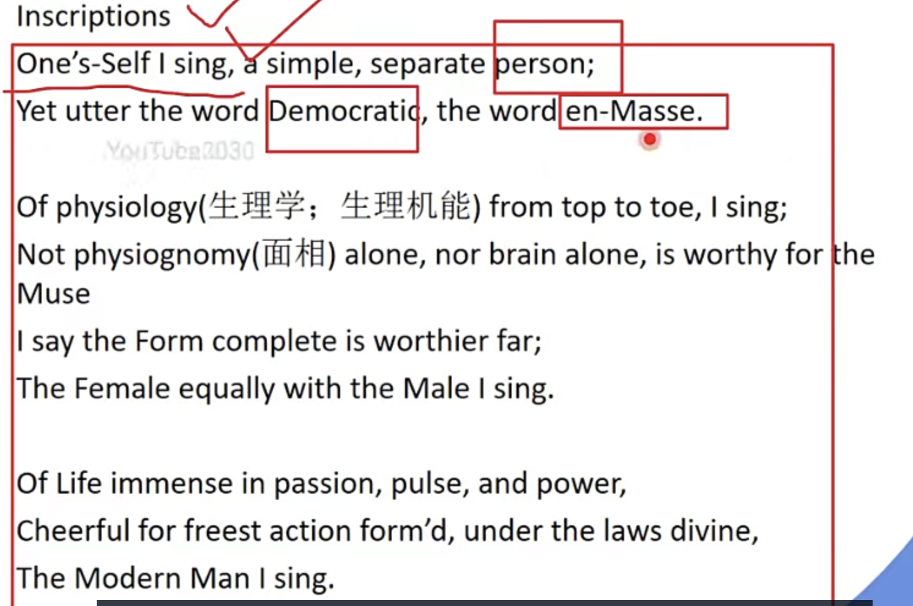
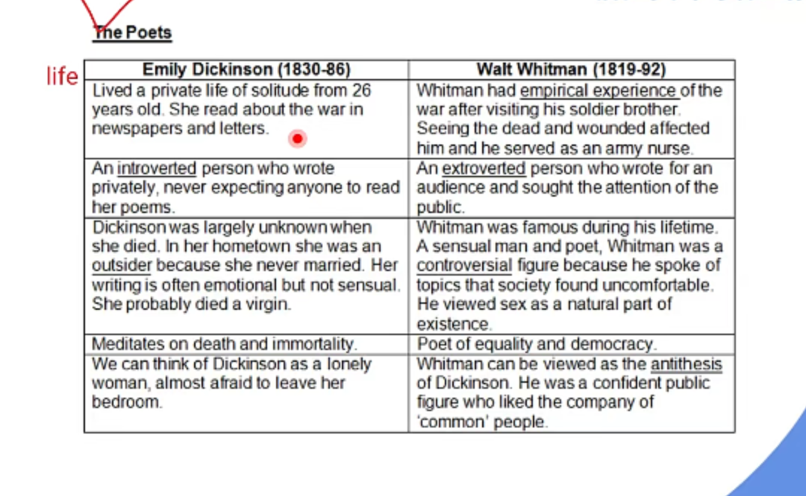

# 浪漫主义的延续

1. Walt Whitman （写浪漫主义和现实主义都行 是两者的过度）
   1. Leaves of Grass; Song of Myself
   2. 草叶集一共修订了五次 出了**六版**
   3. 语言风格
      1. Whitman's poetic style is marked, first of all, by the use of the poetic "**I**." 用我 Whitman becomes all those people in his poems and yet still remains "**Wait Whitman"** 甚至是本名, hence**a discovery of the self in the other with such an identification**找到美国独特的文学身份. In such a manner, Whitman invites his readers to participate in the process of **sympathetic identification** 拉进读者的距离
      2. Whitman is also radically innovative in terms of the form of his poetry. He adopted **"free verse,"** 没有格 没有律 that is, poetry without**a fixed beat or regular rhyme scheme**, A **looser and more open-ended syntactical structure** is frequently favored. 接近口语的Lines and sentences of different lengths are left lying side by side just as things are, undisturbed and separate. There are few compound sentences to draw objects and experiences into a system of hierarchy. Whitman was the first American to use free verse extensively. **By means of "free verse," Whitman turned the poem into an open field, an area of vital possibility where the reader can allow his own imagination to play.**

         iii. Whitman is\*\* conversational and casual\*\*, 写作口语化in the fluid, expansive, and unstructured style of talking. However, there is a strong sense of the poems being **rhythmical**. The reader can feel the rhythm of Whitman's thought and cadences of his feeling. \*\*Parallelism and phonetic recurrence排比 重复 at the beginning of the lines \*\*also contribute to the **musicality** of his poems. 富有音乐性

         iii. Whitman's language: Whitman's is relatively simple and even rather crude. 直抒胸臆
      3. Most of the pictures he painted\*\* with words are honest\*\*, undistorted images of different aspects of America of the day. The particularity about these images is that they are unconventional in the way they break down the social division based on religion, gender, class, and race. One of the most often-used methods in Whitman's poems is to make colors and images fleet past the mind's eye of the reader. 意象是直接真实的
      4. Another characteristic in **Whitman's language is his strong tendency use oral**  words

         Whitman's vocabulary is amazing. He would use powertul, colorful well as rarely-used words, words of foreign origin and sometimes even wrong words. 语言很多 会的词汇很多

         句子很长
   4. 作品内容

      His poetry is filled with optimistic expectation and enthusiasm about **new things and new epoch**. 对“新”的期待

      Whitman believed that poetry could **play a vital part in the process of creating a new nation.** 建国有着重要作用It could enable Americans to **celebrate their release from the Old World and the colonial rule.** 诗歌让人们意识到我们已经与旧世界剥离了And it could also **help them understand their new status and to define themselves in the new world of possibilities**.要重新定义自己的地位 Hence,\*\* the abundance of themes\*\* in his poetry voices freshness. 从丰富的主题传达美国人的声音 诗歌对社会正向的作用

      He shows concern for the Common\*\* people **and the **burgeoning life of cities**. 关注民众和贵族To Whitman, the fast growth of industry and wealth in cities indicated a lively future of the nation**关注财富积累 \*\*, despite the crowded, noisy, and squalid conditions and the slackness in morality.

      He advocates the realization of the individual value. Most of the poems in Leaves of Grass sing of the "**en- masse**' and the **self** as well. 两个概念：**关注en-masse 和 self（个人中的一个样本在集体中出现） 关注群众和个人**——美国的历史是美国人的历史——但是两者并不分离开

      Pursuit of **love and happiness** is approved of repeatedly and affectionately in his lines. 爱与幸福的追求**Sexual love**, a rather taboo topic of the time, is displayed candidly as something adorable. 写“性” The individual person and his desires must be respected.

      Some of Whitman's poems are **politically committed**. 涉及了一些政治问题和政治思想（民主自由平等）Before and during the **Civil War**内战, Whitman expressed much mourning for the sufferings of the young lives in the battlefield and showed a determination to carry on the fighting dauntlessly until the final victory, as in poems like "Cavalry Crossing a Ford." Later, he wrote down a great many poems to air his sorrow over the **death of Lincoln** 林肯的死亡, and one of the famous is "When Lilacs Last in the Dooryard Bloom'd."

      承认内战的正当性 赞美美国人对其的追求/ 但是他也会反思战争中残忍地问题

      对伟人死亡的伤感哀悼 对民主的理念的支持
   5. Leaves of Grass
      1. 草：象征着群众和人民的活力 表达他的民主和自由的精神
      2. Song of Myself
         1. 2 principle belief: \*\*universality from his people and things从诗歌中的人和事物说明 and singularity \*\* （self as a **powerful and sensitive instrument for receiving and expressing**. He moves from himself to you to others to all humanity all together about him. 自我是一种强大而敏感的接收和表达工具。他从他自己到你，从别人到全人类，都围绕着他。）
         2. celebrate
      3. Inscriptions/ One's-self I sing

         
         1. 民主和en-masse
         2. 肉体和心灵
         3. 灵魂和肉体的完整是值得缪斯来写的
         4. 也会考虑男女问题里的
         5. 生命在神圣的法律下的自由 为生命而欢呼 歌唱***现代人***（惠特曼理想中美国人的形象)
   6. 为什么惠特曼用free-verse

      解释（Free verse的特点）：Free verse. the poetry is composed without a fixed or regular rhyme. American poetWalt Whitman is the theprecursor to use free verse.&#x20;

      惠特曼的思想核心：
      1. Free vers**e allows the poet to deliver poetry from the restrictions of formal metrical patterns** and to re-createinstead the free rhythms of natural speech. 创作更多的形式
      2. Whitman wrote lines of **varying length and cadence,** usually not rhymed. **the emotional content or meaning of the work**was expressed through its rhythm **.自由** 表达的可能性更简单 表达更多主题
      3. As a revolutionized American poet, Whitman always challenge the conventions of the day. 对诗歌传统的反叛，选择新的形式对文学传统的反叛 用革命的方式
         As a admirer of Emerson. Wittman responded to Emerson's call for a meter-m aking argument": he rejectedtraditions of poetic scansi on and elected diction, improving the form of free verse. while adopting a wide-ranging vocabulary opening new possibilities for poetic
2. Emily Dickinson （她的作品是死后出版的 风格是个性化的 偏浪漫主义多一些 过渡性人物）
   1. 分类：
      1. Her **religious** poems 宗教诗
         1. 即使信任上帝 但是我也有质疑
      2. Her poem about \*\*death and immortality \*\*关于死亡和不朽的诗句
         1. 对基督教死亡的怀疑
      3. Love poem&#x20;
         1. 爱情诗
         2. 爱情带来的痛苦和困惑、关于“性”的东西（象征）
      4. Her nature poem
         1. 对大自然的赞美和欣赏
         2. 对自然的怀疑：自然中恐怖和冷漠的力量——可能会伤害到人
   2. 诗歌特点
      1. 没title 用第一句话
      2. Stress pattern: dashes 表现音韵，强调，节奏感/ Capital letter 表现对词语的强调,
      3. 4-line 4行诗、abab押韵，基督教唱诗班,free verse
      4. **A master of imagery**, 用意向群表现一个诗歌中的核心
      5. Her poem is\*\* brevity, directness and plainness\*\* 直接、短 形式irregular
      6. short
      7. 偏个人personal的东西
   3. Because I could not stop for Death
      1. Death: 拟人 死神 personalnifiction&#x20;
         1. 死神是 **a gentleman who took me with his carriage** 为我驾着马车的绅士
      2. 死亡和永生可以互相替换
      3. 第一节 写了死神邀请我进入死亡之路 温柔的&#x20;
      4. 学校的象征——小时候、 丰收田野——中年，落日——老年
      5. 死亡的时候 感觉到冷——露珠让我冷
      6. House and ground 坟墓和墓碑
      7. 表面上讲的旅程，但是后来有一个转变，想说：**死亡并不是很美好**
   4. I'm Nobody! Who are you?
      1. 成为somebody参与公共场合 ——像 六月里的青蛙一样
      2. 六月青蛙是聒噪的象征
      3. 她**对孤独状态的欣赏** 和 喜爱
3. 狄金森和惠特曼的区别

   

   **人生：** 狄金森朋友少 生活孤独/ 惠特曼是一生经历丰富的人物

   **性格：** 狄金森 内向/ 惠特曼 读者群体大 外向

   **关于个人评价：** 狄金森 对时事是outsider/ 惠特曼 对他的诗歌评价复杂

   **诗歌主题**：创作时间长 创作内容丰富 狄金森：关于宗教（死亡）的主题/惠特曼 （民主的问题）

   音韵：两个人特别喜欢使用free verse，狄金森使用破折号/ 大写字母表示stress；惠特曼没有明确的标志 但惠特曼喜欢使用recurence

   句子：狄金森喜欢用quatrain ABAB 句子通常比较短 直奔主题/  惠特曼诗歌句子非常长 没有固定的形式

   意象：狄金森喜欢用imagery 意向群，惠特曼的诗句中有多个主题 （Inscription 民主、男女平等等问题）

   所以他们是那个时代的两极
4. Edgar Allan Poe 特点太过独特&#x20;
   1. A short story writer, poet, critic, and an **editor**编辑 得罪了不少人
   2. Pioneer of Science fiction **科幻小说**的先驱
      1. 早起英国 雪莱妻子 **弗莱克斯坦** 玛丽 舞台剧 欧洲第一部科幻小说
      2. 1984
      3. 科学里的美丽新世界
         1. 反乌托邦小说；科技进步给人们的危害
   3. Father of the **Detective Story** 侦探小说之父
   4. Master of **macabre** 恐怖小说大师
      1. 他的小说分为 **Tales of mystery and the macabre** 神秘恐怖故事 和\*\* Tales of ratiocination\*\* 推理小说
   5. Forerunner of \*\*psychoanalytic criticism \*\*and **symbolism** 精神分析批评和象征主义的先驱
   6. American First Critic 美国第一个文学批评家
   7. 作品
      1. To Helen
         1. 运用古希腊的美女Helen，来描述她小时候的美女
         2. 发布在他1831年诗集**Edgar A. Poe in New York**
      2. The Raven 乌鸦——也是**他在1845.1发布的诗集**
      3. Annabel Lee
         1. 借用美女的形象对亡妻的悼念
      4. The Bells 英语语言成功**使用拟声词写诗的案例**
      5. 他的第一部短篇小说集
         1. **Tales of the Grotesque and Arabesque** 怪异故事集
         2. 他的小说也有**Grotesque的元素**
      6. The Fall of the House of Usher 厄舍古屋的倒塌
      7. The Poetic Principle 理论
      8. The Philosophy of Composition 理论
   8. 理论 （短篇小说 short story）
      1. 长度：Brevity, short enough to finish at one sitting to acquire  简洁， 一口气能读完
      2. 开头：attractive first sentence- The first sentence ought to help to \*\*bring out a single effect \*\*of the story 第一句奠定了文章的行文基调 and the desire of reader激起读者的阅读兴趣. 厄舍古屋倒塌的前四行
      3. 结尾：Abruptness: Leaving a sense of finality 突然结尾，不要留下悬念，直接结束
      4. 文风：**Concise**, devoid of tedious sentence (no word should be used which does not contribute to the story) 文风简练，不要用冗长的句子，不要用与故事无关的句子
   9. 理论 （诗歌：古典+浪漫的结合）
      1. 简洁- poem should be **short and concise**, readable **at one sitting** 一口气读完
      2. 基调- thus **melancholy** is the most legitimate of all poetic tones 忧伤是诗歌最主要分基调
      3. 主题- The\*\* death of a beautiful woman is \*\*, the **most poetic topic in the world** 一个女人的死是最有诗意的主题
      4. 美学- the aim of poem is **beauty**, produce a feeling often **beauty in readership** 美，给读者创造美的感受 （他的思想已经超越时代）
      5. 说教- opposed to didactic 反对说教 and call for\*\* pure poetry\*\* 写纯洁的诗歌
      6. 格式化- stress the\*\* beat of poetry\*\*, especially\*\* the beautiful and neat rhyme 尤其是韵律\*\* 全都得压
5. 布莱恩特 致水鸟
6. 朗费罗 把但丁的神曲翻译成引文 写长篇叙事诗（Long narrative poem）国民作家
   1. 人生礼赞
   2. 海华沙之歌
