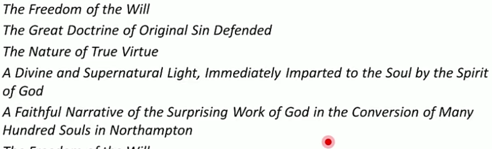
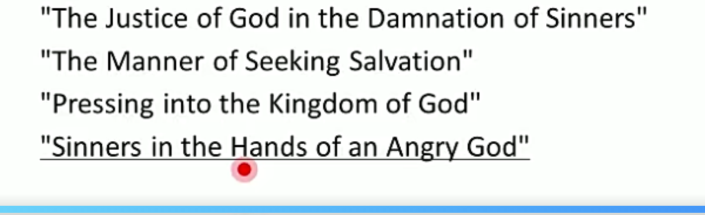

# 独立战争

1. Thomas Paine 潘恩
   1. Common Sense 常识 1776 小册子
      1. 人民想要推翻邪恶政府 就要推翻 这是一个常识
         1. Government, even in its best state is a necessary evil; in its worst state an intolerable one  即便是再民主的政府 也是一个evil/ 如果他很差的话就是 intolerable
         2. 科普了自由平等的观念，为什么我们要独立
         3. 和Common Sense 并列的是 Rights of Man、 The Age of Reason 人权轮 理性时代
   2. The American Crisis
      1. **Pamphlets**, the darkest moment of the revolution
      2. 在美国独立战争最黑暗的时刻 发的小册子
      3. There are the times that try men's souls
      4. **如果说比如胜利的果实要来了之类的话就是美国危机里的 不是常识里的** 现实性更强
   3. The Rights of Man/ The Age of Reason 在法国写的
2. Philip Freneau 菲利普·弗雷诺 (第一个写美国东西的诗人)
   1. nationalism/ revolutionary poet 爱国主义诗人 革命诗人
   2. 早期美国文学主要写美国东西的（之前的写的都是欧洲的东西和美国的对比）
   3. The Indian Burying Ground印第安人的墓地 / The Wild Honey Suckle 隐忍冬花（主要写的是美国的景色、 对美国大好河山的赞美）
3. Charles Brockden Brown 查尔斯·布罗克登·布朗
   1. **Wieland- 美国的第一部小说**&#x20;
      1. 对欧洲的模仿&#x20;
4. 启蒙作家 Enlightenment
   1. American Puritanism is  a two faced transition of religious idealism and level-headed common sense.
   2. Jonathan Edwards 爱德华兹 (不重要)
      1. Preacher/ theologian
      2. The country's first modern American and last medieval man 第一个现代美国人、最后一个中世纪者 （现代思想、 中世纪教义）
      3. Calvinist ideas, enjoy the sweetness of convention/ regeneration of man 人要干点事
      4. \*\*Great Awakening \*\*宗教大觉醒运动
         1. a number of periods of religious revival in American history 18th-20th
         2. 清教复古
      5. Locke and Newton约翰洛克和牛顿的思想
      6. 神学作品

         
      7. sermons 布道词
         
   3. Benjamin Franklin **(the first American/ the First American who achieved American Dream/Epitome of Enlightenment)**
      1. **Jack of all trades**(富兰克林、笛福): Inventor/ newspaper editor
      2. 宾夕法尼亚大学前身的校长
      3. \*\*Junto Club \*\*（探讨国家的improvement）
      4. 人生轨迹：**poor, obscure**- rich, **representative of American Dream** (第一个实现美国梦的人)
      5. 美国**国父之一**、 美国Enlightenment时期的代表人物
      6. 作品：**The Autobiography 自传**
         1. 内容：The realization of the American Dream 美国梦的实现
         2. 文学贡献： the first of its kind in literature第一本这类的书
         3. 精神/主题：
            1. Puritanism- self-examination and self improvement 自我要求、自我提高/ 作品中提到了列举**13 virtues**来证明他的思想
            2. Enlightenment- order, and moderation 体现了规则的强调和尊敬和谦逊的思想\ a man try to be of value to mankind 人类要对全人类有帮助
            3. American Dream: **self- reliance/ individualism/ hard work** **and wise management** 诚实劳动 经营管理
         4. 文风：**simplicity directness and concision**
      7. Poor Richard's Almanac 穷查理年鉴 **不重要**
         1. 名人谚语名人名言
         2. extensive use of \*\*wordplay \*\*and some of witty phrases coined in the work
      8. the General Magazine 第一部殖民地杂志
   4. Thomas Jefferson
      1. 第三任总统
      2. principal author of the **Declaration of Independence/** 13 colonies/ the Second Continental Congress meeting 第二次大陆会议
      3. 作品：Declaration of Independence/ Notes on the State of Virginia
   5. Crevecoeur 法国人 a French-American
      1. Letters From an American Farmer 一位来自美国农夫的信
         1. 第一次向美国以外的人介绍了这个国家 to outside world
         2. Americans: **self-sufficient. self-reliant and self-made**
         3. 也指出了materialism的问题
