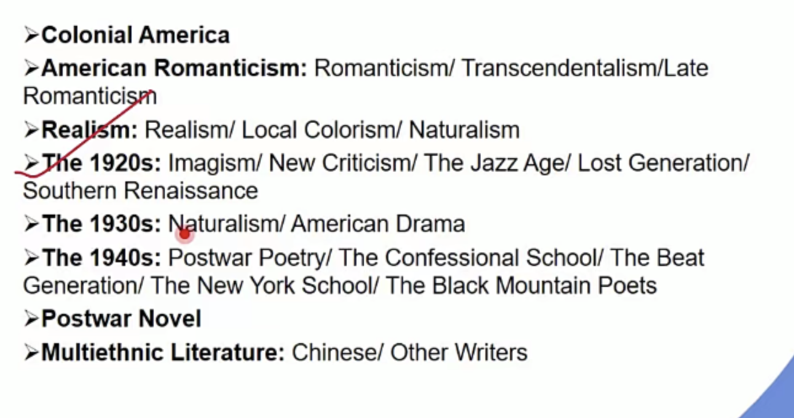

# 美国文学

起步较晚，早起有模仿成分，发展时期和英国同步，有时间差，前松后紧：早期少，后期多

名词解释标序号 一点一分&#x20;

考选段作品的第一句话

最后一题25分 400字小作文

[The colonial period 1607-1765](<The colonial period 1607-1765/The colonial period 1607-1765.md> "The colonial period 1607-1765")

[独立战争](独立战争/独立战争.md "独立战争")

[术语](术语/术语.md "术语")

[American Romanticism 也叫 American Renaissance](<American Romanticism 也叫 Americ/American Romanticism 也叫 American Renaissance.md> "American Romanticism 也叫 American Renaissance")

[浪漫主义的延续](浪漫主义的延续/浪漫主义的延续.md "浪漫主义的延续")

[Realism](Realism/Realism.md "Realism")

[The literature of Colonial America 1607-1765](<The literature of Colonial Ame/The literature of Colonial America 1607-1765.md> "The literature of Colonial America 1607-1765")

[The Age of Reason and Revolution 理性和革命时期的文学 ](<The Age of Reason and Revoluti/The Age of Reason and Revolution 理性和革命时期的文学-.md> "The Age of Reason and Revolution 理性和革命时期的文学 ")

[Romanticism 也叫 American Renaissance (end of 18thC- civil war, the publication of Irving's The Sketch Book to Whitman's Leaves of Grass)](<Romanticism 也叫 American Renais/Romanticism 也叫 American Renaissance (end of 18thC-.md> "Romanticism 也叫 American Renaissance (end of 18thC- civil war, the publication of Irving's The Sketch Book to Whitman's Leaves of Grass)")

[Realism 现实主义；（25- 时间背景+女性,现实+文学特征+作者）](<Realism 现实主义；（25- 时间背景+女性-现实+文/Realism 现实主义；（25- 时间背景+女性-现实+文学特征+作者）.md> "Realism 现实主义；（25- 时间背景+女性,现实+文学特征+作者）")

[American Modernism 现代主义](<American Modernism 现代主义/American Modernism 现代主义.md> "American Modernism 现代主义")

[作家title](作家title/作家title.md "作家title")
