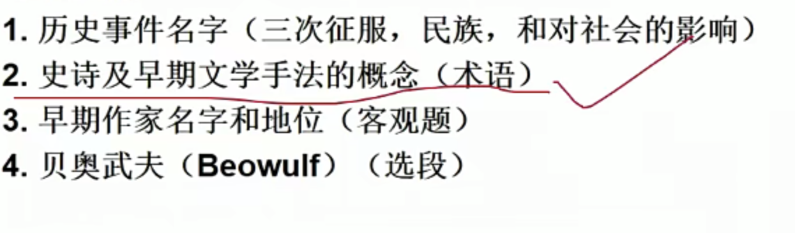
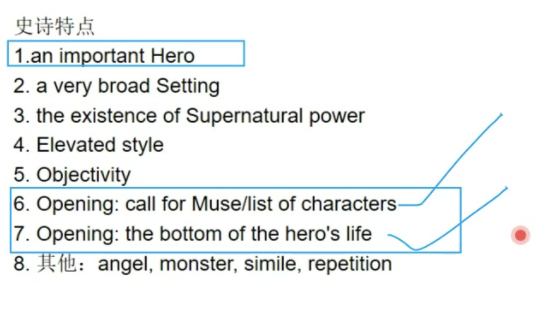

# &#x20;1 Early English Literature and Middle Ages

## &#x20;(449-1066-1400)&#x20;

**Celt(Britons条顿人都可以，凯尔特人是条顿人的一支) as the early settlers since 700 BC** 第一支原住民—

**Roman Conquest(55BC-410AD)**:  by **Julius Caesar,** invasion successively by Romans (**Christian**/roads/towns（所有叫castle的城市，和London都是罗马留下的）/**Roman civilization** was introduced into UK), 后retreat; 当时英国并不是完全基督教国家 **完全基督教化 6/7/5世纪 6/7都合理**

- **449-1066 The Anglo-Saxon Period**

**The English Conquest/ Anglo-Saxon Conquest(5thC)**: Anglo-Saxons, and Jutes,\*\* In 829\*\*，a united kingdom under the name of ***England***, also known as **the land of Angles**, came into being .

Effect: **Old English**名词解释可能考;\*\* tribal society to feudalism\*\*社会结构的转变：部落社会（威望，亲缘关系）到封建社会（serf农奴, landed people, king）&#x20;

&#x20;Germanic/ Teutonic tribes as well as the Dansih people (Scandinavian Vikings since 8th century)维京人入侵-贝尔武夫

- **1066-1400 The Anglo-Norman Period** (**Hastings之战 1066-英国历史转折点，中世纪开始，封建制度的全面建立，法国确立统治** )

1. Norman Conquest **(1066)** : the military conguest of England by William,duke of Normandy primarily effected by his decisive victory at the Battle of Hastings (October 14,1066) and resulting ultimately in profound political, administrative, and social changes in the British Isles. **Normandy William**
2. Consequences: establishment of feudualism, French language (在一个时间段上层说法语 下层说古英语), middle ages

- **文学共性**

1. form: oral form 口语文学— no writer for some works **没有确定作者**
2. writers: **minstrel**/gleeman 游吟诗人 （重要的 宗教人抄的；不重要的 后期作者做的）
3. Language: Old English is the major
4. Religion: **Pagan异教基督教出来之前的教** and **Christian 基督教 古英语的诗歌分类为异教和基督教类**
5. Poetry: alliteration and metaphor

- **主要作家作品**

**Caedmon**, **Paraphrase**, **"sing me the creation"**, the **Father of English Song**, **1st Religious poet of English, the** \*\*1st Known Poet \*\*in English Literary History 英国最早的宗教诗人之一&#x20;

**Cynewulf塞涅乌夫, Christ**

**Venerable Bede**彼得, Historia Ecclesiastica Gentis Anglorum, (**The Ecclesiatical History of the English People**英吉利人教会史), **Father of English History** 英国历史之父,&#x20;

**King Alfred the Great of Wessex**阿尔弗雷德大帝,\*\* Anglo-Saxon Chronicle盎格鲁撒克逊编年史\*\*，改良了英语语言, **West Saxon Dialect** 用了撒克逊的语言, **Father of English Prose** 英国散文之父

- **Beowulf**

1. 地位  **national** epic/**national** hero; the **1st major English poem**; the **only great work **of this period唯一一个; the** beginning of English literature**开始;&#x20;
2. **6th composed-10th written**(宗教人士抄下来，并有解释，所以既有pagan with Christian); **mouth to mouth**; takes place in **Scandinavia**
3. 结构： fights with sea-monster **Grendel**没有杀死-fights with **Grendel's mother**与他的母亲决斗-多年后，成为国王 kills the fiery dragon, and **he died**
4. alliteration **:先说定义，再说特点，再说例子****head rhyme/initial rhyme**/ **多出于早期英语之中** 举例：**kindest to kinsmen in 贝奥武夫**
5. Kenning: a poetic compound, made up **of 2 or more nouns **standin**g for another noun** **2个或以上的名词形成一个复合词**and a firgurative language is applied to\*\* add beauty to original object\*\*s, typical  of **much classical poertry** in **Old English** 举例：**the whale road 的意思是 the rough sea/ swan's road意思是the smooth sea/** **bone-house的意思是body/** **Bear 和 wolf 的意思-Beowolf**
6. &#x20;Understatement低调陈述: a figure of speech employed **by writers or speakers intentionally**故意地 make a situtation seem\*\* less important than it really is\*\*. 描述的没有实际那么重要/ give an impression of **reserve** and at times an **ironcal humor**, which is a characteristic of british literature, esp. **in old english, beowolf.** 举例：**need not praise** for\*\* a right to condemn\*\* 语调减轻
7. **Epic : a long narrative poem长的叙事诗/ on a serious subject严肃的主题/  in a grand and elevated style庄重且优美的语言 /recounting the deeds** **on an important hero**说 流传 orally 举例：\*\* Beowulf, Paradise lost by John Milton\*\*, **Homer Iliad/ Odyssay** 奥德赛 伊利亚特, **The Divine Comedy, Dante** 神曲 (把史诗的内容归纳一下)

**6/7 对作品的开头 有一个人物小传/ （呼唤muse，赋予灵感，因为古人认为人不能写诗）/ 故事情节的开篇 是在英雄的低潮时期写（esp. 荷马史诗/Milton 失乐园）**

**angel,monster,simile, repetition 有angel，monster，用simile和repetition**

**为什么贝奥武夫不符合史诗的特点？ 因为欧洲是文化的中心，贝奥武夫是蛮族的作品，参考目标是荷马史诗和罗马史诗**

3 masterpieces of European epics ：La Chanson de Roland（《罗兰之歌》），Nibelungen song（《尼伯龙根歌》，**Beowulf**;

\*\*well known \*\*works: Iliad, Odyssey and The Aeneid 埃涅阿斯记
