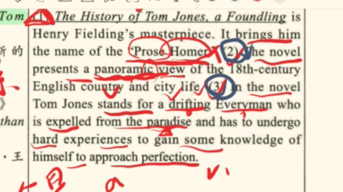

# The Age of Enlightenment 18thC-19thC

1. 启蒙运动文学的三个阶段
   1. The early period of the Enlightenment lasted from the “Glorious Revolution” to the end of the 1730s. This period was characterized by the neo-classicism in poetry. Alexander Pope was the representative poet. Meanwhile a new prose literature appeared in the essays of and in the first realistic fiction of Daniel Defoe and Jonathan Swift.
   2. The second period, the mature period of the Enlightenment, was from 1740s to 1750s. The more important works that appeared during this period were chiefly the novels of Samuel Richardson, Henry Fielding and Tobias Smollett. The last two writers make rather fierce attacks on the existing social conditions.
   3. The last period of the Enlightenment, covered the last decades of the 18th century. It was characterized by the appearance of new literary tendencies of sentimentalism and Pre-Romanticism, both of them served as protests to the social injustices of the day. Sentimentalism found its representative writers in the field of poetry, such as Edward Young and Thomas Gray; in the field of novels, Laurence Sterne and Oliver Goldsmith. Pre-Romanticism found its expression chiefly in poetry, represented by William Blake and Robert Burns. The chief realistic dramatist of the century Richard B. Sheridan wrote his plays in this period
   4. 1.启蒙运动早期从“光荣革命”持续到1730年代末。这一时期的特点是诗歌中的新古典主义。亚历山大·蒲柏是其代表诗人。与此同时，丹尼尔·笛福和乔纳森·斯威夫特的散文和第一部现实主义小说中出现了一种新的散文文学。 2、第二个时期，启蒙运动的成熟期，是1740年代到1750年代。这一时期出现的较重要的作品主要是塞缪尔·理查森、亨利·菲尔丁和托比亚斯·斯莫利特的小说。后两位作家对现有的社会状况进行了相当激烈的攻击。 3.启蒙运动的最后时期，涵盖18世纪的最后几十年。它的特点是出现了感伤主义和前浪漫主义的新文学倾向，它们都是对当时社会不公正的抗议。感伤主义在诗歌领域找到了代表作家，如爱德华·杨（Edward Young）和托马斯·格雷（Thomas Gray）；在小说领域，劳伦斯·斯特恩和奥利弗·戈德史密斯。前浪漫主义主要表现在诗歌中，以威廉·布莱克和罗伯特·伯恩斯为代表。本世纪首席现实主义剧作家理乍得·B·谢里登在这一时期创作了他的戏剧
2. Historical Background
   1. 政治
      1. **After Glorious Revolution in 1688**, Britain became a\*\* constitutional monarchy\*\* with power transferred from **king to Parliament and cabin** 1688年光荣革命后，英国实现了君主立宪制权力，从国王向议会和内阁转移
      2. The literature of this period was **influenced** by the power struggle **between Whig and Tory** 时间段的文学受到了 辉格党和托利党权力竞争的影响
   2. 经济
      1. Industrial Revolution **transformed the socioeconomic structure** of Britain, 工业革命改变了英国的社会政治经济结构
         1. aggravating the gap\*\* between rich and poor\*\*加剧了贫富差距
   3. 社会
      1. Many **new public cafes and private clubs** enriched the public life 新咖啡馆和私人俱乐部丰富了公众生活
   4. 文化 启蒙运动
      1. 性质和思想：
         1. As a **progressive intellectual movemen**t, Enlightenment in 18thC believes\*\* good natures of human nature \*\*with \*\*opposition to feudal \*\* 作为进步的智慧的运动，十八世纪的启蒙革命，相信人性本善，反对封建It celebrated **reason or rationality, equality and science**.崇尚理性 平等 科学
      2. 国家&#x20;
         1. It started from\*\* France\*\*, and swept\*\* the western Europe\*\* It is not **revolutionary** in **Britain** 起源法国 席卷欧洲 在英国没有革命性
      3. 目的
         1. Its purpose was to \*\*enlighten the  world **with** modern philosophical and artistic ideas.\*\*用现代的哲学和艺术观点 启蒙全世界
      4. 教育&#x20;
         1. It advocated **universal education**. **Literature** at the time is very **popular education method to public** 宣传普遍教育 文学在在当时是一种很流行的教育公众的方式
3. Literature characteristics 文学特征
   1. 报刊**Discussing the current affairs in cafe** is a fashion in enlightenment age, which gives birth to **journals**. 在咖啡馆讨论时事成为一种潮流 这促进了报刊的诞生
      1. Journals provides\*\* information and commentry\*\* 报刊提供信息和评论
      2. e.g.,\*\* Addision and Steele's "The Spectator"\*\* 爱迪生 斯蒂尔 旁观者
   2. **新古典主义**Enligtnenment also gives birth to **Neoclassicism**,  which emphasized t**he reason and fixed rules for each literary genre** 启蒙运动诞生了新古典主义，它强调理性和每个文学流派的规矩
      1. It originated in both **classical and contemporary French literature** 来源自古典文学和当代法国文学
      2. 内容 attitudes toward **art and human existnce** including **order, logic, accurency and restraint** 代表对人类存在和艺术的态度，包括秩序，逻辑，准确度和限制
         1. **Drama **must be written **in couplet**, with three unities of **time, place and action** 戏剧要遵循偶句，做到时间地点动作的同一, united form 结构的同一 and describe certain** group image rather than one** 表达群体意象而不是个人
         2. \*\*Poetry \*\*can be divided into lyric, epic, **didactic poetry, allegorical poetry and dramatic poetry** 分为抒情诗，史诗，说教诗，寓言诗，和戏剧诗&#x20;
            1. Each one has \*\*certain principles \*\*每一个都有相应的规矩
         3. **Prose **should be** precision, directness and flexibility** 散文要准确 直接 灵活
      3. representatives&#x20;
         1. Pope and Samuel Johnson 蒲柏和萨缪尔约翰逊
   3. The English **novel came into beingin 18thC** 英国小说在18世纪诞生
      1. including realistic novels 现实小说
         1. Defoe, Henry Fielding and Swift 迪福 亨利菲尔丁 斯威夫特
      2. sentimental novels 感伤小说
         1. 某些启蒙运动者对社会现实的不满
         2. 2 meanings
            1. \*\*Overindulged \*\*by **emotions** 沉溺于情感, especially \*\*a conscious effort \*\*to **stimulate one's emotion to enjoy it** 尤其是有意识的举动刺激人们的情感 进而享受其中
            2. A **positive view** of\*\* innate goodness\*\* of **human nature** 人性天生是善良的的积极观点
         3. Laurence Sterne 斯特恩 A Sentimental Journey 感伤的旅行
         4. Oliver Goldsmith  哥德堡史密斯  The Vicar of Wakefield 维克菲尔德牧师传
      3. Gothic novels
         1. 别名 \*\*Gothic Romance 哥特式浪漫 \*\*
         2. 定义 A\*\* terrible and suspensive\*\* story \*\* in a gloomy castle or monastery\*\*在阴暗的城堡或修道院中制造恐怖和悬念的故事&#x20;
         3. It captured\*\* the new emotional climate of Romanticism\*\* 它抓住了浪漫主义的新情感氛围
         4. became popular\*\* in Britain between 1790s and 1820s\*\* with **Ann Radcliffe's The Mysteries of Udolpho** 1790 年代至 1820 年代之间，安·拉德克利夫的《乌道夫之谜》在英国流行起来
         5. \*\*Mary Shelley's Frankenstein \*\*玛丽·雪莱的《弗兰肯斯坦》 presents the **gothic zeal** 标志着一股哥特式狂热
         6. In America,\*\* Allen Poe and Faulkner\*\* are representatives  爱伦坡 福克纳
      4. Psychological novels 心理小说
         1. Richardson 理查德森
   4. In the latter half of 18thC,\*\* pre-romanticism\*\* emerged and replaced **Neoclassicism**. 18世纪后半期 前浪漫主义出现 替代了新古典主义
      1. also called\*\* Romantic Revival\*\* 也叫浪漫主义复兴
      2. 内容It fights **against the Enlightenment**, **advocates passion and emotion** and **revives** **the interest medieval literature** 反对启蒙运动 呼吁激情和情感 复兴对中世纪文学的兴趣
      3. 题材 In England, it represents in \*\*poetry \*\*以诗歌为代表
      4. William Blake and robert burns 威廉布莱克 罗伯特彭斯
   5. \*\*Drama \*\*was not as important as novel at that time 那时候戏剧没有小说流行

4\. Picaresque Novel 流浪汉小说

1. 来源Originated in **Spain**, popular in **17 and 18thC Europe** 来源西班牙，17-18世纪欧洲流行
2. \*\*subgenre \*\*of \*\*prose fiction \*\*散文小说的下一层
3. 手法 **satire and realistic humor** 运用讽刺和现实主义幽默
4. 内容 adventures of **roving protagonists of lower class** 下层注意流浪的主角的冒险故事
5. 代表 Henry Fielding-\*\* The History of Tom Jones, a Foundling\*\*弃儿汤姆琼斯的历史&#x20;

1) Daniel Defoe 丹尼尔笛福
   1. 本来叫Foe 加了个贵族的De
   2. jack of all trades 多面手
   3. 不信奉英国国教 信封 free church
   4. Literary Features
      1. 名誉
         1. He gained fame for his \*\*Robinson Crusoe. \*\*他因《鲁滨逊漂流记》获得了不朽的名声
            1. Defoe is notable for being one of the **earliest practitioners** of the novel, as he helped to popularize the form in Britain, and is even referred to **by some as one of the founders of the English novel**，也是早期小说践行者之一，他推动了小说在英国的流行，甚至有人称他为英国小说的创始者。
      2. His **puritan zeal for reforming** 他对改革宗教的热情marks all **his numerous works for the moralizing to be found everywhere.** 标志着他的文章中说教随处可见
      3. He had a instinct for making a “good story”.  ，他有一种直觉能写出好故事。
         1. His realistic stories drew **on his prison experience and further knowledge of criminals.** 他的现实小说大多借鉴了他的监狱经历和对罪犯的深入了解。
2) &#x20;Robinson Crusoe 鲁滨逊漂流记
   1. 基于真实事件改编 保障故事的真实性
      1. based on the experience of **Alexander Selkirk,** who had been trapped in an island off the coast of Chile where he had lived\*\* in solitude for more than 4 years.\*\* 基于亚历山大·塞尔柯克的真实经历，他被困在智利海岸线外的一个小岛上，在那里独居了4年多
      2. He enriched the **sailor’s true story** by his own **imagination**. So the novel reads like a true story.他用自己丰富的想象力润饰了那位水手的真实经历，因此这部小说读起来像真实发生的一样。
   2. 最棒的部分 升华到了人类的劳动The best of the novel is the **realistic successful struggle of Robinson alone** against the **harsh forces of nature** on the island小说最精彩的部分是鲁滨逊独自在荒岛上战胜无情自然的现实主义描述。
      1. .By describing Robinson’s life on the island,\*\* Defoe glorifies human labor.\*\* 笛福赞扬人类劳动
   3. 影响
      1. an expression of the **bourgeois qualities of individualism, colonization and private property**资产阶级个人主义和事业心的表达
   4. 人物Robinson Crusoe is a representative of the **English earlier bourgeoisie**. 鲁滨逊是英国资产阶级在发展早期的代表人物
      1. He has mainstream qualities of\*\* hope and confidence\*\* 拥有希望和自信的主流观念
      2. &#x20;He is most \*\*practical \*\*and **exact to religion** and **mindful of his individual material profit**. 他是最为实际最为精确的一个人，永远保持宗教信仰同时对于自己的利益十分留意。
         1. His every voyage are bound with \*\*commercial materials \*\*他的每次旅行都充满商品
      3. “**Master**” is the \*\*first word \*\*Friday learns from Robinson with the **idea of colonization**“主人”是礼拜五从鲁滨逊那里学来的第一个词，这反映了殖民主义思想。
3) Jonathan Swift 乔纳森 斯威夫特
   1. stood with Irish\*\* in their fight to improve their lives\*\* 和爱尔兰人民一起为自己的生活而战
   2. greatest masters of **English prose**. a master of **satirist** 散文大师 讽刺大师
   3. Features
      1. language语言
         1. His language is **simple, clear and vigorous**.他的语言简洁明了，充满活力
         2. He said, **“Proper words in proper places, makes the true definition of a style.”** 他说，在恰当的地方放上恰当的词，这就是风格的真正含义。
      2. satire 讽刺
         1. his satire is **deadly**. 一阵见血
         2. his satire is also **hidden behind the surface of a cool voice**  他的讽刺也隐藏在冷嗓门的表面之下
   4. Gulliver’s Travels 格列夫游记

      The book describes the extraordinary adventures of Doctor Lemuel Gulliver, with depictions of fantastic lands visited by him, their social systems, ways and customs of inhabitants. The story is divided into four parts.
      In the first part,Gulliver describes his shipwreck in \*\*Lilliputx小人国 \*\*where the tallest people were six inches high. In his account of two parties in the country, distinguished by the use of high and low heels, Swift satirizes the Tories and the Whigs in England. Religious disputes were laughed at in an account of a problem which divided the Lilliputians: “ Should eggs be broken at the big end or the little end？”
      The second part is about the voyage to **Brobdingnag**. 大人国The King of Brobdingnag often consults Gulliver on European affairs, and Gulliver’s answers are a biting satire on contemporary politics.
      The third part depicts the odd phenomenon on the flying island of **Laputa**拉普他岛: people are obsessed with abstract speculations. It is a irony on scholastics and philosophers.
      In the last part, Gulliver’s satire is of the bitterest. Swift typifies the bourgeois world in the repellent images of man-like creatures--**Yahoos** in Houyhnhnms慧骃国. He also drew ruthless pictures of the depraved aristocracy and satirically portrayed the whole of the English state system.
      这本书讲述了格列佛医生非凡的冒险经历，描写了他所到的许多奇幻岛屿，其社会体系，居民的生活方式和风俗。故事分成四部分。
      在第一部分格列佛描述了在一个叫利立浦特的地方海船失事。这儿的人最高的只有六英尺高。这个国家有两党，根据鞋跟高低来划分，以此讽刺英国的托利党和辉格党。利立浦特的划分是根据鸡蛋应该在大头儿砸开还是小头儿砸开，以此讽刺英国的宗教纷争。
      第二部分是关于到大人国的旅行。大人国国王经常询问格列佛对欧洲事务的看法，格列佛的回答是对当代政治的辛辣讽刺。
      第三部分描述了拉普他岛上的怪异现象，居民都沉迷于不切实际的空想，讽刺了学者和哲学家。
      在最后一部分，格列佛的讽刺最严厉。斯威夫特将资产阶级世界形象化为令人讨厌的人型状的动物——野胡。他无情地鞭笞了堕落的贵族，讽刺了整个英国国家系统。
   5. Modest Proposal《一个温和的建议》

      “A Modest Proposal” is one of Swift’s most important \*\*pamphlets \*\*on Ireland. In the essay, Swift first described the miserable living conditions of the poor people in Ireland. Then he proposed a scheme to solve the problem that poor people should sell their babies at one year old to the rich as delicious food. The essay is full of bitter irony, and in fact Swift is saying “the English are devouring the Irish”. This essay expresses Swift’s indignation towards the terrible oppression and exploitation of the Irish people by the English ruling class, especially of the poor Irish peasants by the rich English absentee landlords.

      《一个温和的建议》是斯威夫特关于爱尔兰的最重要的小册子之一。本文首先描写了爱尔兰穷苦人民的悲惨生活。然后他建议要解决这一问题，可以让穷人出售自己一岁大的孩子给富人当作一道美味佳肴。斯威夫特通过尖锐的讽刺，实际上是在表明“英格兰人正在吞噬爱尔兰人”。本文强烈谴责了英国统治阶层对爱尔兰人民的残酷压迫和剥削，尤其是那些英国富人地主阶层对爱尔兰穷苦农民的压榨。

      Swift is an\*\* important outsider concerned about the life of impoverished livelihood\*\* 斯威夫特是一个关注贫困生活的重要局外人
   6. 他的其他作品
      1. The battle of books 书战

         在蒲柏崇古非今的思想下形成的
      2. A Tale of a tub 一只桶的故事

         三兄弟背弃父亲遗嘱 对罗马和英国教会 基督教 和缺乏学术 浅薄的文学批评和社会恶习抨击

         两个作品在1704年一起出的
4) &#x20;Joseph Edison and Richard Steele约瑟夫 爱迪生 和 理查德 斯蒂尔
   1. 两个人的文学贡献
      1. The Tatler and The Spectator
      2. 《闲谈者》和《旁观者》
   2. The Spectator 旁观者
      1. The Spectator dealt with the customs, manners, morals, literature and other current topics of the time. Steele and Addison preached moderation, reason, self-control, civility, refinement and good taste, all which the newly ruling bourgeoisie needed urgently while establishing its social order. 《旁观者》发表的文章与风俗、世态、道德、文学及其他时下流行话题有关。在文章中，斯蒂尔和艾迪生宣传节制、理性、自我约束、文明、文雅和高品位，这些品质都是发展中的资产阶级建立社会秩序亟需的
      2. Sir Roger罗杰爵士

         The Spectator presented the character and doings of Sir Roger, a country gentleman of old-fashioned manners, is simple-minded, kind-hearted, and somewhat pompous. His foibles, which were described with a gentle humor, made a setting for his virtues of simplicity, honesty and piety which pointed an example to the world of fashion.
         《旁观者》中的随笔展现了罗杰爵士这个人物及其行为。罗杰爵士是因循守旧的老乡绅，单纯善良，爱摆架子。文章笔调幽默地描写了他的小缺点，衬托出了他单纯、诚实、虔诚的美德，为上流社会树立了榜样。
   3. The Tatler 闲谈者报
      1. The Tatler, which contained news, gossip, stories of everyday life, and jokes on all sorts of people.&#x20;
      2. 1709年，斯蒂尔创办了《闲谈者》报，内容包括新闻、小道消息、日常故事和各种人的玩笑。
   4. &#x20;Joseph Edison 约瑟夫爱迪生
      1. 死在威斯敏斯特大教堂了 When he died, all England mourned for him and a great funeral was held by night in Westminster Abbey.
      2. 写作风格

         Addison’s familiar and elegant prose remained for over a century the model for most writers. Dr. Johnson regarded his prose as “the model of the middle style; on grave subjects not formal, on light occasions not groveling; pure without scrupulosity, and exact without apparent elaboration, always equable, and always easy, without glowing words or printed sentences.”
         艾迪生平易近人、高雅洗练的散文是一个多世纪以来大部分作家写作的典范。约翰逊博士称他的散文是“中庸风格的典范，讨论严肃的话题不正式，轻松的时候又不卑躬屈膝，纯粹而无顾虑，精确又无匠气，总是那么平和从容，毫无华丽辞藻和刻板教条。

         **epistolary** 书信体
   5. Richard Steele
      1. 闲谈者 是 他自己创办的
5) Alexander Pope 亚历山大 蒲柏
   1. &#x20;He is a representative of the Enlightenment and the greatest poet of the **Neoclassical period**. 启蒙运动代表 新古典文学士奇最著名的诗人
   2. He is the first to introduce \*\*rationalism \*\*to England. He strongly advocated **neoclassicism**.emphasizing that literary works should be judged by **classical rules of order, reason, logic, restrained emotion, good taste and decorum** 他是第一个将理性主义引入英国的人，他强烈主张新古典主义，强调文学作品应该以秩序、理性、逻辑、克制的情感、良好的品味和礼仪等经典规则来判断。
      Pope was the representative of 18th century Neoclassicism. He perfected the heroic couplet.
   (2) His style is direct and compact. Many commonplaces become household saying under his pen. Pope was a diligent reader. Pope’s style also depends upon his great patience in elaborating his art.

   (3) He was at his best in satire and epigram. He was an example of conscious literary artist. But he lacked the lyrical gift. And in his endeavour for finish and compactness, he sometimes became artificial and obscure.

   （1）蒲柏是18世纪新古典主义的代表。他完美使用了英雄双韵体。

   （2）他的风格直接简洁。许多他笔下的平常话都变成了街知巷闻的谚语。蒲伯是位勤奋的读者。他的风格也有赖于他对自己艺术加工的无比耐心。

   （3）他最擅长讽刺和警句。他是一个有意识的文学艺术家。但是他缺乏抒情天赋，而且在追求完整和紧凑时略显矫饰和晦
   1. An Essay on Criticism 论批评
      1. \*\* heroic couplets\*\*​
      2. **744 lines **and is divided** into three parts.**
      3. It sums up the art of poetry as\*\* upheld and practiced\*\* by the ancients like Aristotle,  它总结了亚里士多德等古人所坚持和实践的诗歌艺术
      4. &#x20;the 18th-century European Pope first laments the dearth of true taste in poetic criticism of his day and calls on people to turn the old Greek and Roman writers for guidance 这位18世纪的欧洲教皇首先哀叹他那个时代的诗歌批评缺乏真正的品味，并呼吁人们向古希腊和罗马作家寻求指导
      5. &#x20;It helped spread the **neoclassicism** 对新古典主义传播有益
   2. An essay of man 人论
      1. 表达了他的政治哲学思想
6) Henry Fielding 亨利菲尔丁
   1. 职业&#x20;
      1. \*\*novelist dramatist essayist political commentator \*\*小说家 戏剧家 散文家 政治评论家
   2. 也被叫做 Father of English Novel 和迪福一样
   3. &#x20;he was the first, **in theory and **[**practice to**](.to "practice to")** **write a** comic epic in prose**.从理论和实践上 第一次写 喜剧性散文史诗
   4. 写作手法
      1. direct, vigorous, hilarious and sometimes coarse 简约 直接 搞笑 有时候粗俗
      2. He told the story of a \*\*vagabond \*\*life simply to “**laugh men out of their follies**”. 他讲述流浪汉的生活，只是为了“取笑人们的愚蠢”。
         1. So his story generally left the reader with **a strong impression of reality**. 所以他的故事总是给读者很强的真实感。
   5. The History of Tom Jones, a Foundling 弃婴汤姆琼斯的故事

      这部作品让他叫做**Prose Homer** 的名誉

      **Tom Jones** is a foundling discovered on the property of a very kind, wealthy landowner, squire **Allworthy**. Tom grows into a vigorous and lusty, yet honest and kind-hearted youth. He develops affection for his neighbour’s daughter, **Sophia Western**. However, Tom’s status as a \*\*bastard \*\*causes \*\*Sophia’s father \*\*and \*\*Allworthy \*\*to oppose their love. **Blifil**, the son of Squire **Allworthy’s sister**, having an eye to his uncle’s money, bears a secret hatred for Tom. Tripped by Blifil, **Tom is banished from home by the outraged Mr. Allworthy**. Tom has experienced many **adventures and love affairs before he is proved to be the son of Mr. Allworthy’s sister, which is withheld by Blifil.** At last, Mr. Allworthy reconciles with Tom, and makes him his heir, while Blifil gets his deserved punishment. Sophia forgives Tom’s youthful mistakes and her father consents to Sophia’s marriage to Tom.
      汤姆·琼斯是一个弃儿，被发现在富裕的乡绅奥尔华绥的卧室里。乡绅收养了他，汤姆长成一个精力充沛、淘气但心地善良且诚实的年轻人。他爱上了邻里索菲亚。但是索菲亚的父亲和奥尔华绥都反对两人之间的恋情，因为汤姆是个私生子。布力菲是奥尔华绥妹妹的儿子，在父母去世后由乡绅收养，他一直觊觎舅舅的财产，并且暗恨汤姆。在布力菲的设计下，汤姆被扫地出门。汤姆在伦敦经历了一系列的冒险和情事。后来真相大白，汤姆也是奥尔华绥妹妹的儿子，他和乡绅和好如初，乡绅立汤姆为继承人。布力菲得到应有的惩罚。索菲亚的父亲同意两人的婚事。

      
7) Thomas Gray 托马斯格雷
   1. the transition from **neoclassicism to Romanticism**, \*\*sentimentalism 从新古典主义到浪漫主义的转折 感伤主义代表诗人 \*\*
   2. Elegy Written in a Country Churchyard 墓园挽歌
      1. Written with\*\* a classical precision and polish, “Elegy Written in a Country Churchyard” begins with the selected natural phenomena that cast gloom upon the scene.\*\*&#x20;
      2. 主题&#x20;
         1. It shows a **sincere respect** for **common people’s useful toil and sympathy** for their\*\* obscure life\*\*.
         2. &#x20;The poem also reminds us of the **death of all human beings** no matter **how much fame and wealth** we acquired.
            诗歌开篇选取的自然景象绝妙地渲染了一种阴沉忧郁的氛围，同时又不失古典主义的精确与优雅。这首诗表达了对普通人民辛勤有益的劳动的尊重，以及对他们默默无闻的一生的同情。这首诗也提醒我们人固有一死，不论在世时享尽多少荣华富贵。
   3. Graveyard school of poetry 墓园诗派
      1. It refers to a group of eighteenth-century English poets who emphasized **subjectivity, mystery, and melancholy.** 它指的是一群强调主观性、神秘性和忧郁性的十八世纪英国诗人。
      2. \*\* Death, immortality, and melancholy\*\* were frequent subjects of their meditative poems, which were often actually set in **graveyards**. 死亡、不朽和阴郁是他们冥想诗歌的常见主题，这些诗歌通常以墓地为背景。
      3. \*\*Thomas Gray’s “Elegy Written in a Country Churchyard” \*\*
8) Oliver Goldsmith 奥利弗 戈尔德史密斯
   1. 职业&#x20;
      1. essayist poet novelist and playwright
      2. hired writer for ***Monthly Review*** 一个杂志
   2. 他的戏剧\*\* She Stoops to Conquer\*\* 屈身求爱 他的诗歌 **The Desert Village 荒村**
   3. The Vicar of Wakefield 维克菲尔德牧师传

      The story is told by **Dr. Primrose**, the kind-hearted **vicar**. Misfortunes come upon his family thick and fast. The **vicar loses his fortune** and they have to move to a new place under the patronage of a certain **squire** **Thornhill**. Thornhill, being an immoral ruffian, seduces \*\*Olivia \*\*and then deserts her. The vicar himself is thrown into prison for debt to Thornhill. **Sophia, the vicar’s second daughter, is forcibly carried off in a carriage by an unknown villain**. By this time, **Mr. Burchell, one of the vicar’s acquaintances**, who appears to be a broken-down gentleman, saves Sophia. He makes it known to the Primrose family that he is squire Thornhill' s uncle. The squire’s villainy is exposed in front of his uncle. All now ends happily. **Sir William** marries Sophia. \*\*Olivia \*\*is found out and **the squire** is made to marry her. The vicar’s fortune is restored to him.
      故事由好心的乡村牧师普里姆罗斯本人讲述。不幸接连降临牧师一家。牧师失去了所有财产，全家被迫搬到新住所，得到乡绅桑希尔的资助。但是桑希尔是个道德低下的坏蛋，他引诱牧师的大女儿奥利维亚又抛弃了她。牧师也因欠乡绅的债被投入狱。小女儿索菲亚被不知名的恶棍强行挟持。这时牧师家之前认识的一位貌似破产的绅士救了索菲亚，后他说明自己就是桑希尔乡绅的舅舅。最后乡绅的恶行被揭发。结局完满，威廉爵士和索菲亚喜结连理，乡绅被迫娶奥利维亚为妻，牧师的财产也被返还。
9) 18世纪戏剧
   1. British drama does not\*\* have as enough achievement as novels\*\*没有和小说有一样的成就
   2. reason:
      1. **The Licensing Act** drove **Henry Field** out of theater 戏剧审查法案把亨利谢尔丁赶出了电影院
      2. and limits the\*\* expression freedom of dramatists\*\* 限制了戏剧作家的表达自由
   3. 内容
      1. \*\*Playwrights \*\*are greatly interested in **Shakespeare**戏剧作者对莎士比亚感兴趣
      2. Only\*\* Goldsmith and Sheridan's works\*\* has high **values** 只有戈尔德史密斯 和 谢尔丹的作品有着极大价值
10) Richard Brinsley Sheridan 理查德 布林斯利 谢尔丹
    1. He is the **only important English dramatist of 18th century** 十八世纪唯一一个重要的戏剧家
    2. The \*\*Bridge \*\*between the **classics **of **Shakespeare and Bernard Shaw** for his work** The School of Scandal** 因为他的作品造谣学校，他是莎士比亚的和萧伯纳的桥梁，
    3. The School of Scandal 造谣学校
       1. &#x20;类别a great comedy of manners 风尚喜剧
       2. 主题 **satires and describes** the higher class in Britain 介绍并讽刺了英国的上流社会
       3. 里面的sentiment 一词象征着**hypocritical statement of moral 道德的虚伪说法**
       4. Two plotlines develop, one being Lady Teazle’s loss of innocence and growth and the other being Sir Surface’s selection of an heir between his two nephews--Charles Surface and Joseph Surface. In the play, Lady Sneerwell slanders other people for her own sake. Sir Peter is dubious about his young wife Lady Teazle’s fidelity. And occasionally, he knows that it is Joseph who has been carrying on an intrigue with his wife. And Sir Surface is impressed by Charles’s kindness to his poor relation and finds that Joseph is stone-hearted towards the poor relation and is treacherous and selfish. So Charles inherits Sir Surface’s fortune in the end.
       5. 书中有两条主线：第一条是提梯泽尔夫人从失足到成熟的过程；另一条是萨费思爵士在两个侄子——查尔斯和约瑟夫之间选择继承人的过程。剧中，史尼威尔夫人为谋取私利到处散播别人的谣言。彼得偶然间发现约瑟夫才是想要勾引彼得夫人的人。萨费思爵士被查尔斯对穷亲戚的善良打动，而约瑟夫的铁石心肠、阴险狡诈以及自私自利的真面目也暴露出来。最后萨费思将查尔斯立为继承人。
11) William Blake 威廉布莱克
    1. 死后成名的诗人之一
    2. He jailed the\*\* inflammatory speech\*\*, but later he found \*\*no guilty \*\*她因为煽动性言论入罪 最后被判无罪
    3. Features
       1. He opposed the **neo-classicism**, and his lyric poems show the **romanticism** 反对古典主义 他的抒情诗歌展现出了浪漫主义
          1. Romanticism show that \*\*natural emotion and individual originality \*\*are **his creation basis**  强调自然情感和个体的原创性是文学的根本
       2. 他和雪莱的联系
          1. They both use\*\* imagery and symbolism\*\* 他们都进行意象的应用和象征主义手法
          2. They can be found both in **Shelley's epic** and **Blake's prophetic books** 他们可以在雪莱的史诗和布莱克的预言诗中找到
       3. 诗歌主要描写
          1. **children** 小孩
       4. 喜欢用的手法
          1. \*\*symbolism \*\*in his Song of Innocence 天真之歌 Song of Experience 经验之歌
    4. Song of Innocence 天真之歌 Song of Experience 经验之歌
       1. 基调的不同
          1. Brightness and positive world 光明 积极的社会
          2. Misery and gloomy world  悲观黑暗的社会
       2. 主题的相同
          1. They all fight against the **hard social codes and exudes love**和传统的社会规矩抗争 流露出爱
       3. **The Chimney Sweeper 扫烟囱的孩子**
          1. 诗歌的最后一句
             1. And gone to praise God and his Priest & King, Who make up a heaven of our misery “就跑去赞美了上帝、教士和国王，夸他们拿我们的苦难造成了天堂
          2. In **Song of Innocence 天真之歌**
             1. the child lives in **bad condition** but he **dreams a happy life after he dies** 生活条件艰苦 但是他还是梦想死后生活快乐
          3. In **Song of Experience**  经验之歌
             1. the child understands the **oppression of religion and government** 孩子了解了宗教和政府的压迫
             2. theme 主题
                1. exposes the\*\* hypocrisy and cruelty\*\* of the ruling-class people 揭示了统治阶级的虚伪和残忍
                   1. They **live in better life**, but **forget all the people in poverty** 他们自己生活的好 但是忽略掉了生活穷苦的人民
             3. 诗歌的意象
                1. little black thing 小黑东西
                   1. the **chimney sweeper, whose chimney makes him black** 指的是这个扫烟囱的孩子，烟囱让他变黑
             4. 诗歌的对比
                1. 对比目的
                   1. All these contrast shows the\*\* inequality between rich and poor\*\* 展现了贫富的不平等
                2. the contrast between the **color white and black** 白和黑的对比
                   1. emphasizes the **opposing positions** 强调对立的立场
                3. contrast between the \*\*dancing and singing \*\*and the notes of **woe**,&#x20;
                   1. 舞蹈和歌声与悲哀的音符之间的对比，
                4. and between the \*\*praising of God and the weeping. \*\*
                   1. 对上帝的赞扬和啜泣的对比
                5. Finally the last line shows the contrast between **heaven and a miserable existence on earth.** 天堂和的对比在地球上悲惨的存在。
       4. London
          1. 音韵 Imabic Tetrameter
          2. 在**经验之歌**中
          3. 主题
             1. London gives a **vivid description of the evil and poor social reality.**
          4. 写作手法
             1. Synecdoche 提喻
                1. blackening church and palace 黑化的教堂和宫殿
                   1. every London church grows black f and hires a chimney-sweeper, **a small bo**y, to help clean it.&#x20;

                      The poet suggests that **by profiting from the suffering of the child laborer, the church does not have its original purity**. The church represents the **clergy**, while the palace represents the **government**. Obviously, the poet employs the device of **synecdoche**, that is, the institutions are implied by mention of the **places in which they reside.**

                      从文学上讲，伦敦的每个教堂变黑，并雇用了一个扫烟囱的人，一个小男孩，来帮助清洁它。诗人认为，**通过从童工的痛苦中获利，教会正在玷污其原有的纯洁性。**教堂**代表神职人员，而宫殿代表政府**。显然，诗人使用了提喻的手法，即通过提及它们居住的地方来想象到机构。
             2. repetition 重复
                1. **“chartered”, “Mark”** reinforce the speaker’s uncomfortable feelings upon entering the city.&#x20;

                   "Chartered","Mark" 强调了作者来到城市的不舒服
                2. the repetition of “**every**” in the second stanza emphasizes the\*\* misery and horror \*\*among the people in London, and **reflects the suffocating atmosphere of the city**
                   1. 第二节中“every”的重复，强调了伦敦人民之间的悲惨和恐怖，反映了城市令人窒息的气氛
             3. Oxymoron 矛盾修饰法
                1. Marriage hearse 婚姻的灵车
                   1. compares the\*\* wedding to funeral\*\* 对比了从婚姻到坟墓
                2. The\*\* young prostitute’s curse\*\* brings \*\*calamity \*\*upon the new-born baby and **ruins** with **disease **the** newly-wed lovers**. Thus the “Marriage hearse” serves as a **vehicle in which love and desire combine with death and destruction.** 年轻妓女的诅咒给新生儿带来灾难,让新婚的恋人因恶性疾病而毁灭。因此,"婚姻灵车"成为爱与欲望与死亡和毁灭相结合的载体。
       5. The Tyger 老虎
          1. 经验之歌
          2. 主题
             1. The Tyger focuses more on **goodness**, and **the tiger,** created by **God**, is the symbol of \*\*fire, force, passion, and courage. \*\*
             2. The poem also presents a duality between **beauty and ferocity**.
             3. 《老虎》这首诗更侧重好的一面。老虎由上帝创造，象征的是烈焰、力量、激情和勇气。这首诗也表达了美和恶之间的双重性。
             4. 另一种解释
                1. Lamb in the poem is a symbol of **peace and purity** whereas tyger a symbol **of dread and violence.** 诗中的羔羊是和平与纯洁的象征，而泰格则是恐惧和暴力的象征。
12) Robert Burns 罗伯特彭斯
    1. Achievement
       1. A\*\* national poet\*\* of Scotland 苏格兰民族诗人
       2. A poet for **ordinary people and peasant** 普通人诗人 农民诗人
       3. The\*\* Scottish folk songs\*\* inspires him and make his poems \*\*wealth \*\*for Scottish people 丰富的苏格兰民谣给于他灵感，他的诗也成为苏格兰人民的财富。
    2. style
       1. 主题：love, humanity, rural life, social critique, 爱 人文精神 乡村生活 社会批判
       2. written in the **Scottish dialect \*\* with all the** romantic emotions that touch human heart\*\* 用苏格兰方言写诗，浪漫感动人心
       3. 特点
          1. humorous and pleasant 幽默 欢快
          2. He has comprehensive knowledge of **Scottish folk songs**, and he revised them  **by omission, condensation and addition**, then they become his masterpieces 他对苏格兰歌谣有着很多掌握 通过省略浓缩 增加，他们成为了罗伯特彭斯的代表作
       4. My Heart's in the Highlands 我的心在高原

          This song is about the **beautiful hometown Scotland**. In the poem Burns expresses the **patriotic emotions and homesickness**.&#x20;

          Every line of the poem includes 11 syllables, and\*\* by using lots of long vowels and diphthongs\*\*, the poem is given a strong sense of rhythm in music.
          该诗主要是关于美丽的家乡苏格兰，抒发了彭斯的爱国情怀和思乡之情。诗中的每行包括11一个音节，通过大量使用长元音和双元音，使得诗歌具有很强的音乐性。
       5. A Red, Red Rose 一朵红红的玫瑰
          1. ABCBDEFE&#x20;
          2. even number 偶数段
             1. iambic \*\*trimeter \*\*抑扬三音步&#x20;
             2. 6个单词 三音步
          3. odd number 奇数段
             1. iambic \*\*tretameter \*\*抑扬四音步
             2. 8个单词 四音步
          4. 内容

             &#x20;Its **charm** mainly lies in its **rhythmic simplicity, its strong emotion and the wisdom **inside it.
             这是彭斯用苏格兰方言写成的最为知名的爱情歌谣之一。它**简单的韵律、浓郁的感情以及内中隐藏的智慧**正是其流传千古的原因。
          5. 主题
             1. The speaker loves the young lady b**eyond measure**. The only way he can express his love for her is through **vivid similes and hyperbolic comparisons.**
             2. 演讲者对这位年轻女士的爱无比。他表达对她的爱的唯一方式是通过生动的比喻和夸张的比较。
       6. To a Mouse致小鼠

          Part of the original poem is written in Scottish dialect. In the poem, Burns identified the animal with the human world, and the mouse’s plight reminded Burns of his own. In 1937, John Steinbeck published his novel Of Mice and Men, of which the title is derived from this poem.
          《致小鼠》原诗版本中部分使用了苏格兰方言。彭斯在诗中把动物和人类世界进行了类比，而小鼠的遭遇让他想到了自己的境况。1937年，约翰·斯坦贝克出版了小说《人鼠之间》，其小说标题来源于本诗中的句子。
       7. &#x20;Auld Lang Syne《友谊地久天长》
          1. Inspired by an ancient folksong, Burns composed this universal parting song. It recalls the happy friendship and sighs over its being hindered by the cruel reality.
             受一首古老民间歌谣的启发，彭斯写下了这首广为流传的离别歌谣。其中诗人回忆了快乐的童年及和伙伴结下的友谊，哀叹残酷的现实无情地把他们分离。

#### 补充

1. Samuel Richardson (1689-1761) (塞缪尔·理查森

   **Pamela**, or, Virtue Rewarded (1740-1741)《帕米拉》—epistolary 书信体

   Richardson is famous for his emphasis on detail, his psychological probe into women, and his dramatic technique. But he is also accused of being a verbose and sentimental storyteller.
   理查森因其对细节的强调，对女性心理的挖掘和戏剧化技巧而闻名。但他也被指责是一个啰嗦、多愁善感的小说家。

   介绍了英国家庭生活 18th
2. Sameul Johnson 塞缪尔·约翰逊
   1. &#x20;It took him 8 years to compile the Dictionary of the English Language, which was published in 1755. Later Johnson became the leader of the London literary world. He died in 1784 and was buried at Westminster Abbey.
   2. 他花了8年时间编纂成了《英文词典》，在1755年出版。之后约翰逊成了伦敦文学界的领袖。他死于1784年，被葬在威斯敏斯特教堂
3. Laurence Sterne (1713-1768) (劳伦斯·斯特恩)

   **Tristram Shandy**《项狄传》
   It is one of the landmarks of English literature. It is an evidence of Sterne’s genius for treating the book form as something to be fooled around with amusingly (a full page of black ink for a death; rows of asterisks and dashes; blank pages and lines). The author is no more serious in his treatment of the subject matter suggested by the title: Tristram himself is not born until the fourth volume and by the end of the novel is not out of his infancy. There is no plot to speak of but rather a series of events and thoughts narrated by Tristram that concern his often absurd family and acquaintances. The book’s style and structure is quite the opposite of rationally composed novels, revealing a purely emotional approach to life on the part of the narrator. It may be considered the **origin of the stream of consciousness form.**
   该书是英国文学史上一部具有标志性意义的小说。他是斯特恩以幽默戏谑方式处理小说形式的绝佳例证（一张黑页代表死亡；成排的星号，破折号；空白的页、行）。作者不再像标题显示的那样以严肃的方式处理主题：主角特利斯特拉姆在第四卷才出世，而到结尾的时候才刚刚到穿裤子的年龄。小说没有任何情节，只是一系列由特利斯特拉姆讲述的想法和事件，它们关乎他那喧闹古怪的家庭和古怪朋友。本书的风格和结构完全不是理性的，它揭示了叙述者对待生活的纯情感的方式。这部小说可以看成是**意识流小说的先导。**
4. epistolary 书信体
   1. Epistolary novels are novels written in the form of a\*\* series of letters exchanged among the characters of the story, with extracts from their journals sometimes included. \*\*书信体小说是以故事人物之间交换的一系列信件的形式写成的小说，有时还包括他们日记的摘录
   2. It is\*\* often used in English and French novels of the 18th century\*\* 18世纪英语和法语小说中经常使用的一种叙事形式，
   3. Pamela, or, Virtue Rewarded (1740-1741)《帕米拉》—epistolary 书信体 Samuel Richardson&#x20;
