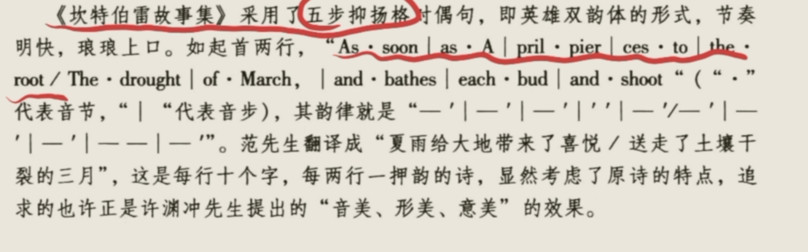

# The Middle Ages   (449-1066-1400)&#x20;

1. Anglo-Saxon Period 昂撒时期 449-1066
   1. Background 背景
      1. The English Conquest 盎格鲁-撒克逊征服
         1. 3 groups of **Teutonic**条顿人 people: **Angles, Saxons, Jutes** 盎格鲁人 撒克逊人 朱特人&#x20;
         2. They invaded Britain\*\* after Roman invasion\*\*在罗马人离开后打英国
         3. **England**, in **829**, was coming into being by **Angles** 829年 英格兰建立了
   2. Influence 影响
      1. 国家语言a new ethnic called **English** developed, and a single language called **Anglo-Saxon, or Old English.** 英国民族建立，一种语言 古英语建立
      2. 政体的转变The **Britons** experienced a transition from\*\* tribal society to feudalism\*\* because of the\*\* English Conquest.\*\* 英国从部落到封建，多亏了不列颠征服
      3. 信仰The \*\*Anglo-Saxons \*\*believes in **old mythology of Northern Europe**. Later, the Anglo-Saxons were **Christianized in the 7th century.**  昂撒人只相信北欧神话，后来7世纪相信基督
   3. Literary Features 文学特征
      1. 标志：The **settlement of Anglo-Saxons in England** marked the **beginning of English literature in 5th Century.** 昂撒人的定居象征着英国文学起点 : **5thC**
      2. 分裂：The literature of this period consists of t**wo divisions--pagan and Christian.**
         1. **Pagan** literature symbolizes **oral sagas** brought by the **Anglo-Saxons**, which was sung by the **minstrels** to the **chiefs and warriors** in praising of the \*\*old heroes’ deeds \*\*.  口头传说 昂撒人 游吟诗人 歌唱统领和战士们的英雄事迹
            1. The Old English regularly used **alliterations** and **rhymes**, at the same time, **metaphors and understatements** were also put into the poetry. 押头韵 韵律 暗喻 含蓄陈述
            2. **Beowulf** is the most widely spread early poem.贝奥武夫
         2. **Christian** literature **developed** by **preaching** **monks**. 传教僧侣
            1. The coming of **Christainity** brought a new language—**the Latin**, which exerted a great effect on **early English prose and poetry.** 拉丁语对英国的散文和诗歌影响深远
   4. 文学体裁&#x20;
      1. Epic
         1. also called heroic poetry
         2. a long **oral narrative** poetry about the **actions of gods and heroes.** 上帝和英雄的动作的口头长叙事诗
         3. Epic summarize and express the **nature or ideals** of **an entire nation** at **a significant  period of its history.** 一整个民族 在关键历史节点的事件 including\*\* heroic deeds, difficulties, disasters, foreign aggression\*\*英雄事迹an，困难，在哪呢，国外入侵
         4. 代表作**Beowulf** is the **greatest national epic** of the Anglo-Saxons. \*\*John Milton \*\*wrote some great epics: **Paradise Lost, Paradise Regained** 贝奥武夫 失乐园 复乐园
      2. Alliteration 押头韵
         1. &#x20;Alliteration is \*\*a traditional poetic device in English literature. \*\*传统修辞
         2. &#x20;a **repetition** of the\*\* initial sounds of several words \*\*in a **line or group**. 押头韵的重复
         3. 贝奥武夫&#x20;
         - An attendant stood by with a decorated pitcher, pouring bright helpings of mead. (494-497). 贝尔武夫
   5. Beowulf
      1. 地位：Beowulf is an Anglo-Saxon poem and **the national epic of the English people.** 国家诗歌
      2. 结构：The whole epic consists of **3182 lines** and is **divided into two parts with an interpolation 插入between the two**. 3182行，2部分和一个插入
      3. 异教徒和基督教：The whole song is essentially\*\* pagan in spirit and matter异教精神, \*\*while the **interpolation** is obviously made by a **Christain copier.** 但是是基督教抄写人插入了一部分
      4. 故事
         1. Beowulf tells the deeds of **Teutonic** hero **Beowulf** who fought against monsters **Grendel** and **his mother**, won the battle and protected the **King of the Danes**. During his reign over his homeland, he slew a **firedrake** to protect his people, but **mortally wounded and died**. Even after his death, beowulf’s **mound**坟墓 became a beacon for the **seafarers**. 讲述了贝奥武甫这位条顿英雄的英勇事迹。他与怪物格伦德尔和它的母亲战斗，取得了胜利，并保护了丹麦国王。他回家成为国王后，为了保护人民，杀死了火龙，却因伤势过重而死。死后，他的墓塚变成了灯塔，为航行于此的船员指明方向。
      5. Literary features 写作手法
         1. **alliteration** is the most obvious feature 押头韵是最显著的手法
         2. and also **metaphors** and **understatements** 暗喻和含蓄陈述
            1. 暗喻：sea - whale-path 海洋-鲸道
            2. 含蓄陈述
               1. Grendel's Death: After Beowulf defeats and kills Grendel, the poem describes the relief and happiness that the Danes experience. The text employs understatement to downplay the importance of Grendel's death to the Danes, stating that they "gaped with no sense / Of sorrow, felt no regret for his suffering"
               2. 格伦德尔之死：在贝奥武夫击败并杀死格伦德尔之后，这首诗描述了丹麦人所经历的解脱和幸福。文中轻描淡写地淡化了格伦德尔之死对丹麦人的重要性，称他们“毫无意义地瞪大了眼睛/悲伤，对他的痛苦没有遗憾”
2. Anglo-Norman Period 盎格鲁-诺曼时期 1066-1350
   1. Background 诺曼征服 Norman Conquest
      1. **Duke William** 威廉公爵 led by **French-speaking Norman**说法育的诺曼
      2. defeated the **English in 1066**, **Hastings** and **ruled** England 1066年打败英国 黑斯廷斯战役 统治英国
   2. Influence
      1. 政治set up a strong\*\* centralized government\*\*, instead of the loose union of Saxon **tribes**;中央政府代替了松散联盟
      2. 文化The bringing of **Roman civilization to England** 把罗曼文化带来英国
      3. 语言The birth of **new English language** and literature due to the\*\* integration with French vocabulary\*\* 和法国语言的融合产生了新的英语语言和文学
   3. literature feature 文学特征
      1. a combination of\*\* French and Anglo-Saxon elements\*\* 法国和昂撒民族的结合
         1. Matter of France 法国历史
         2. Matter of Grace and Rome 希腊罗马
         3. Matter of Britain 英国
   4. Romance 传奇文学
      1. 地位：the most popular **literary genre in feudal England**最流行的文学体裁在封建英国
      2. 体裁：\*\*long pieces **of work in** poem and prose \*\*诗歌和散文的长篇作品
      3. 主题 **：life and adventures** of noble heros 贵族英雄的人生和冒险
      4. 主要人物: knight 骑士 with\*\* noble blood\*\*贵族血统, good at **fighting**擅长打架 and **chivalry**骑士精神, represented by **courage, loyalty, generousness, honor**
      5. 主题

         The theme of loyalty to king and lord was repeatedly emphasized in romances, as loyalty was the corner stone of feudal morality. 对国王和统治者的忠诚是传奇中反复强调的主题，因为忠诚是封建道德的基石。
      6. 写作目标群体The romances had **nothing to do with the common people**. They were composed **for noble, of  noble.**
         传奇与平民无关，传奇是由贵族而作也是为贵族而写的。
      7. 3 types of Romance
         1. Britain
         2. France
         3. Rome
   5. 作品
      1. Sir Gawain and the Green Knight《高文爵士与绿衣骑士》
         A. Content (简要内容)
         The story can be divided into three parts: challenge of the Green Knight; Gawain’s quest for the Green Knight in the forest; the meeting of the two in the Green Chapel and the hero’s temptations.
         故事可以分成三部分：绿衣骑士的战书；高文在森林里对绿衣骑士的请求；两人在绿色教堂的见面，高文受到各种诱惑。B. Analysis of the Story (作品分析)
         Gawain is concerned with the rights and wrongs of conduct. It is a series of tests on loyalty, courage and chastity. Gawain’s concealment of the green gridle reveals that he values his own life more than his honesty. However, he ultmately confess and repent of his sin honorably; threreafter he voluntarily wears the girdle as a symbol of his sin. Though he survives the quest, Gawain recognizes the problematic nature of chivalry ideals for a person must above all remain conscious of his or her own mortality and weakness. The motif of the Green Knight’s head cutting might originated in ancient vegetation myth in which the beheading would have been a ritual death to ensure a rebirth in the following spring. There is a very clear structure in the story of Sir Gawain and the Green Knight.
         The poem is told with the purpose of portraying ideal character in action, with a preference for irony, suggestion and implication, and morality in which the humor merges with the morally seriousness.
         高文是人们行为是非判断的导向。故事讲述了一系列对忠诚、勇气及纯洁的考验。高文隐瞒自己获得了绿腰带，揭示了比起诚实，他更在乎自己的生命。然而他最终令人尊敬地坦白并悔过，自愿从此带上绿腰带作为罪过的象征。尽管逃过一死，高文认识到骑士精神的理想终究不现实，因为一个人必须要先清楚自己的缺点和必有一死。砍头的主题是源于古老的植物传说，树木要剪枝以确保在下一个春天的重生。《高文爵士与绿衣骑士》的故事结构非常清晰。
         这首诗目的在于刻画理想的角色，并且在阐述严肃道德问题时又不乏讽刺、暗指和幽默。
      2. ◆Le Morte D’Arthur《亚瑟王之死》
         Translated by Sir Thomas Malory from French, the legends of King Arthur are the foundation of Le Morte D’Arthur (first published in 1485). Malory selected the most interesting parts, such as the adventures of the Knights of the Round Table, the quest of the Holy Grail, the death of Arthur, and the dissolution of the fellowship of the Knights of the Round Table. Malory treated the legends in the spirit of medieval knighthood and chivalry, and used simple, idiomatic English prose and told the stories in a vivid manner.
         经托马斯·马洛里由法语译成，《亚瑟王之死》（1485年首次出版）是基于亚瑟王的一生的传奇。但是马洛里选择了其中最有趣的部分，例如圆桌武士的冒险，寻找圣杯，亚瑟之死，圆桌武士的志同道合的关系的消亡。马洛里的传奇体现了中世纪的骑士精神，并且是用简单、惯用的英语，讲述了栩栩如生的故事
3. Geoffrey Chaucer 杰弗里 乔叟
   1. 名誉
      1. Father of English Poetry 英国诗歌之父
      2. a great narrative poets 伟大的叙事诗人
      3. pioneer of humanism 人文主义先锋
      4. buried in \*\*Poets Corner of Westminster Abbey \*\*埋在了威斯敏特大教堂诗人角
   2. 影响，贡献
      1. 语言He know of Latin, French and Italian.  拉丁 法语 意大利
      2. &#x20;结交He had acquaintance with persons high and low classes in all walks of life,  which left great impressions upon his works and particularly upon his depiction of the English society of his time 他结交广泛且易与人深交，无论是贵族还是贫民。这有益于他的作品留下好印象和对英国社会的刻画。
      3. 3阶段 3 stages closely **related to his life experiences.** 和他的人生经历相关
         1. The first period consists of **works translated from French;** 翻译成法语的作品
         2. &#x20;the second consists of works **adapted** from the **Italian**, as Troilus and Criseyde. 改编自意大利语作品
         3. The third period includes **The Canterbury Tales, which is purely English.** 坎特博雷故事集的纯英语作品
      4. 对文艺复兴和语言影响Chaucer’s poetry **pave** **a path to the literature** of English Renaissance. 为文艺复兴铺路He chose the **metrical** form which laid the foundation of the\*\* English verse.\*\* 他的格律对英语韵脚基础Moreover, he greatly contributed to the **founding** of the\*\* English literary language,\*\* of which is base on the **London dialect**, fully used by the poet.
         乔叟的诗歌为英国文艺复兴的文学开辟了道路。他诗歌的格律体为英语韵脚韵律诗体奠定基础。此外，他充分使用的伦敦方言是英语文学语言的基础，因此乔叟又为英语文学语言的形成作出巨大贡献。
   3. The Canterbury Tales 坎特伯雷故事集
      1. 内容
         1. 30 pilgrims set off for the shrine of \*\*Saint Thomas Becket at Canterbury. \*\*30个朝圣者要去坎特伯雷朝圣
         2. When they met at the inn, they agreed that each should tell two tales on the way to Canterbury and two more on the way back.他们在一个酒馆 答应对方去的时候讲俩 回来讲俩
         3. &#x20;But instead of 120 tales, the text ends after \*\*24 tales, \*\*covering **all the major types of medieval literature**. The stories which the pilgrims tell are well **suited to their different characters**, ranging **from the knight, the monk, to the pardoner** etc. 但是最后只讲了24个 是中世纪的各种故事  但是每个故事都和它们的身份相符 从 骑士 僧侣 赎罪者等
      2. 影响
         1. &#x20;展现It shows the real life of Chaucer's age. 展现了当时真实的社会风貌
         2. 反对Chaucer opposes the\*\* dogma of asceticism \*\*preached by the Church, and believes **man’s right to earthly happiness.** 反对教堂的禁欲，相信人的权利，可以获得快乐
            1. 赞扬He supports his **humanism idea** that he praises man’s\*\* energy, intellect and love of life.\*\* 他的人文主义观点，她赞扬了 人的能量，智慧，和对生活的爱
         3. 批评His tales reveal and satirize **the evils of his time,** attack **degeneration of the noble**, the **corruption of the Church**.揭露并批判了时代的罪恶，批判了贵族和教会的堕落
      3. 主要故事
         1. “The Prologue” 总序:&#x20;
            1. The Prologue provides a **framework** for the tales. 为这个故事提供了框架All pilgrims includes all except **royal family and peasants**出了皇族和农民 包括了所有人n
         2. &#x20;“The Wife of Bath”巴斯夫人:&#x20;
            1. &#x20;She is the owner of a cloth factory,是一个衣服工厂的拥有者 lighthearted, merry, vulgar and talkative. 开朗，粗俗，善谈
            2. &#x20;She has married five husbands and she expects  more. 娶过5人，还希望更多
            3. Through these experiences, she has learned to control her husbands by using her body t**o provide for herself in a world where women had little independence or power**.通过这些体验，她学会用身体控制丈夫，从在这个妇女只有一点自由的世界供养自己
            4. We may see a vivid **picture** of **a woman of the middle class**, and **the life at home of that class in Chaucer’s time** 当时中产阶级妇女的形象和家庭生活
      4. 格式：Heroic couplet 英雄双韵体
         1. 传统形式： a **traditional** form for **English poetry**, commonly used **for epic and narrative poetry**传统形式，用在史诗和叙事诗中
         2. &#x20;结构：it refers to poems constructed from a sequence of \*\*rhyming pairs of iambic pentameter lines. \*\*诗歌构建于一系列的五步抑扬格的押韵对
         3. 作者 The use of the heroic couplet was first pioneered by\*\* Geoffrey Chaucer in The Canterbury Tales.\*\*
4. Ballads 大众歌谣
   1. Ballads的定义
      1. **oral narrative songs** **created and passed** by English people由英国人创造 代代相传的口语叙事歌
      2. 时间：created around from\*\* 1200 to 1700\*\*, and were **rarely published** before 18th century 1200-1700 创造，18世纪前很少初版\*\* Popular Ballad\*\* is the most popular literature in **15th Britain**大众民谣是15世纪英国最流行的文学
      3. 结构： 4\*\* lines in a stanza\*\*, the second and fourth rhymes 4行一节，2行和4行押韵
      4. types种类丰富: historical, legendary, fantastical, lyrical, humorous历史，传奇，幻想，抒情，幽默
      5. 举例：**The Robin Hood Ballads** are the most important. 罗宾汉系列是最重要的
   2. The Robin Hood Ballads罗宾汉民谣
      1. many versions of it 有很多版本
      2. 内容：the most popular is\*\* Robin Hood and his friends\*\* fights against **these oppressive forces**, such as **bishops or bacons**罗宾汉和伙伴们和压迫势力抗争，比如主教，男爵
      3. Robin Hood 人物分析
         1. a many-sides characters 多面人物
            1. Strong, brave and clever 强壮 勇敢 聪明
            2. kind and time-caring 善良 珍惜时间
            3. He has\*\* bright eyes, good jokes and a hearty laugh \*\*明亮的双眼，好消化，笑声爽朗
         2. He hates these **oppressors**, and loves\*\* people in poverty \*\*厌恶压迫者，喜欢穷人
   3. Get up and bar the door 起来，去关门
      1. 主题：
         1. a typical humorous ballad and presets a funny scene in home life. 幽默民谣，展现了家庭有趣生活
      2. 内容：
         1. &#x20;the wife and husband’s agreement that the one who began to speak first would get up and bar the door.主要是关于妻子和丈夫之间的一个约定：首先说话的人起来去关门。
         2. finally, robbers come, and husband spoke first, because robbers want to kiss his wife 最后贼来了，丈夫先说话了,因为贼想亲他老婆
