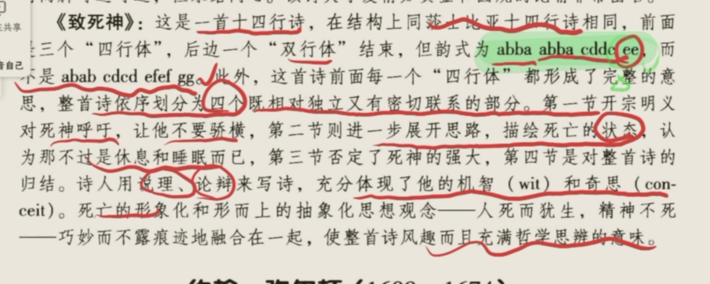

# The Period of Revolution and Restoration 资产阶级革命和王朝复辟时期 17thC

1. Background
   1. 政治：**Absolute monarchy** **limited** the development of **capitalism** in Britain君主专制限制了资产阶级的发展, and the **capitalists** could not **tolerate the domination of landlords and nobles **资本主义者无法忍受地主和贵族的主宰. The** conflict** between **feudalism and capitalism reached its peak 封建和资产的矛盾达到顶峰,** and a **revolution** broke out革命爆发
   2. 清教：**Puritans** were oppressed by **Absolute monarchy** and **religious tyranny** 清教徒被君主专制和宗教专制压制. Puritans advocated the **divine right of individuals清教徒宣扬个人神圣权利,** and fought against the\*\* king's cavaliers\*\*与国王的骑士斗争
   3. 生生死死 复复合合：\*\*Charles I \*\*dies in **1649** 查理斯一世1649年死了 **Cromwell** established the **Republic England** 克伦威尔建立了英格兰共和国, with **military dictatorship in 1653**在1653年建立了军事独裁 After he **died**, the **monarchy restored** in **1660** 1660年君主制度复辟
   4. 1688光荣革命：The **Glorious Revolution** in 1688 marked the **supremacy of parliament**, opened the \*\*modern Britain \*\*and won **political freedom**1688年光荣革命象征着议会至高无上，开启了现代英国，赢得了政治自由
2. Literary features 文学特征
   1. Literature in\*\* puritan era\*\*清教时期的文学&#x20;
      1. **chaotic** 混乱
      2. They gave up these **old ideas**, that are
         1. **government and religious** conventions政府和宗教传统
         2. The **chivalry** **standards** and\*\* illusory love romances\*\* disappeared 骑士精神和虚无的爱情传奇消失
   2. **Literature in Restoration era** 复辟时期文学
      1. witty but immoral and cynical 风趣但是不道德 愤世嫉俗
      2. Many **returned scholars **who had **exiled abroad** abandoned these** old ideas and puritanism**流亡回国的学者放弃旧的观念和清教思想,&#x20;
      3. and they were influenced by **French ideas**被法国思想影响
   3. 诗歌的地位
      1. **Poem** dominated the period 诗歌霸占了这个时期
      2. The most famous poet is **John Milton**  约翰尼尔顿
         1. with his Paradise lost 失乐园
         2. Paradise regained 复乐园
         3. Samson Agonistes 力士参孙- play 一个戏剧
      3. two another schools
         1. Metaphysical school 玄学派
            1. John Donne 约翰多恩
         2. Cavalier school 骑士派
            1. John Dryden 约翰德莱顿
3. John Donne 约翰多恩
   1. Metaphysical school 玄学派 的 symbol
      1. Metaphysical poems
         1. a type of poem in **17thC** 17世纪英国诗歌
         2. The **poems** **rebelled against** the  **conventional form** of the \*\*Elizabethan love poetry. \*\*用来反对伊丽莎白时期的传统的爱情诗歌
         3. Style-The metaphysical poetry is characterized by **wits, subtle argumentations, and conceits— an unusual simile or metaphor.**玄学派诗歌的特点**是机智、微妙的论证和奇喻**——一种不寻常的比喻或隐喻。
   2. 20世纪TS Eliot 为他平反
   3. a \*\*dean of St. Paul's church \*\*and the \*\*most famous missionary \*\*at his time圣保罗教堂的教长 当时最著名的传教士
   4. 2 categories of his poems 两类诗歌
      1. The youth love lyrics 青年爱情诗
         1. Songs and Sonnets 歌与十四行诗
      2. sacred verses 宗教诗歌
         1. Devotions and Emergent Occasions  突发事件的祷告
   5. Features 创作特点
      1. Donne is **a poet of peculiar conceits (也叫 elaborated metaphor, whimsy) and hyperboles (也叫exaggeration).** 奇喻和夸张是他最重要的修辞In his poetry, **sensuality** is blended with **philosophy, passion with intellect**.感官享受和哲学，激情，智慧混杂 Donne is **an analytical sensualist**. 他是一位感官分析者
         1. conceit
            1. Conceit is a **far-fetched simile or metaphor**牵强的比喻或比喻. The \*\*speaker/ writer compares two highly dissimilar things. \*\* 说话者比喻两个完全不相同的事物
            2. &#x20;John Donne likes to use it 约翰多恩愿意用它
               1. **gold and a compass** to describe the\*\* strength of love.\*\* 金子和圆规描述他们的爱
      2. His later poems are about **profound religious thoughts.** 他后来的诗歌关于深刻的宗教思想
      3. &#x20;His proses are  **complex and intellect**. They are monuments of spirits in  early 17thC 他的散文复杂且充满智慧 他们是早期17世纪精神丰碑
   6. A Valediction: Forbidding Mourning 离别辞：节哀
      1. abab imabic **Tetrameter**
      2. theme
         1. parting of 2 lovers 两个情侣的离别
         2. Donne tells **his lover not cry** because their love is more **refined**  than common people’s love. 他告诉他的爱人别哭，因为他们的爱情比正常人的爱情更升华
      3. He **directly** expressed the **ideal** of\*\* spiritual love \*\*他直接描述了精神上爱的理想
      4. applied **Conceits**运用奇思妙想的比喻
         1. **gold and a compass** to describe the\*\* strength of their spiritual love.\*\* 金子和圆规描述他们精神上的爱的力量
         2. 圆规: When one foot moves away from the other, the fixed foot will stay in one spot but lean in the direction of other foot 当一只脚远离另一只脚时，固定脚将停留在一个位置，但向另一只脚的方向倾斜
   7. Death Be Not Proud 死亡不要骄傲
      1. 选自
      2. sonnet with abba abba cddc ee
      3. 主题
         1. He ridicules and looks down to death 他嘲弄 看不起死亡
         2. People should not fear it, but accept it, because it can make us escape from real life 人们不应该怕他，而是接受它，因为他可以让人们逃脱现实社会
      4. He regards death as **rest and sleep**, and he can got a lot of **happiness** 他把死亡看做休息和睡觉，他可以在其中获得快乐
      5. Finally, he says\*\* death itself will die\*\* 死亡自己也会死

         
   8. Song 歌
      1. “Song” is a love lyric&#x20;
      2. 主题which mainly concerns the lack of constancy in women. 女性的不忠诚
      3. In this poem, Donne tells the impossibility of finding a true and fair woman. The tone of the poem is of gentle cynicism and mocking, for example, to meeting the true and fair woman is described as a pilgrimage.
         ，多恩认为不可能找到一个忠诚且美丽的女人。本诗使用调侃嘲弄的语气，例如将拜会一位忠诚且美丽的女子比作朝圣。
4. John Milton 约翰弥尔顿
   1. a wealthy **Puritan** family 富裕的清教家庭 清教徒
   2. 这个时期最重要的作家
   3. 3 periods of his career 创作的三个阶段
      1. early period
         1. read and wrote\*\* lyric poetry\*\* 写**抒情诗歌**
            On the Morning of Christ’s Nativity《在基督诞生的早上》
            L’Allegro and ⅡPenseroso《快乐的人》和《忧思的人》
            Comus《科马斯》
            **Lycidas《利西达斯》**— **写一位他的 drown Friend 溺水身亡的朋友**
      2. Middle period
         1. He served for\*\* bourgeois revolution\*\*, and wrote **pamphlets** 写**小册子**，服务于资产阶级革命
            Areopagitica《论出版自由》
            Defence of the English People《为英国人民而辩》
            Second Defence of the English People《为英国人民再辩》
      3. late period
         1. wrote epics 写**史诗**
            Paradise Lost《失乐园》
            Paradise Regained《复乐园》
            Samson Agonistes《力士参孙》
   4. Literary achievements 文学成就 ，写作特点
      1. 齐名**He and Shakespeare** are regarded as **two types of English poetry**他和莎士比亚被叫做英国诗歌的两种类型
      2. 作品He created the\*\* greatest epic\*\* in **English literature** 创造了英国文学最伟大的史诗&#x20;
      3. 风格
         1. 无韵体a **master** of\*\* blank verse\*\*, using it in **non-dramatic works firstly**无韵体大师，第一次把他用在非戏剧作品之中
            1. blank verse无韵体
               1. a type of **poems** that have **a regular meter, but no rhyme**有格律 没韵律的诗歌
               2. The most common blank verse is **iambic pentameter**最普遍的是五步抑扬格
               3. **Marlowe** is the\*\* first English author using blank verse\*\* 马洛是第一个用无韵体的
               4. The representatives of blank verse are **William Shakespeare**莎士比亚, who uses\*\* iambic pentameter in his plays\*\*在他的戏剧用五步抑扬格, and **John Milton**, whose **Paradise Lost** is  written in blank verse 弥尔顿，在他的失乐园用无韵体
         2. 文体a **great stylist**文体大师. He is famous for **his grand style**,他以宏大的风格著称 for his Study of **classics and Bible**归根与他对经典和圣经的研读
         3. Milton has always been admired for **his sublimity of thought and majesty of expression.** 他思想高深，表达宏伟
   5. Paradise lost 失乐园—第三个时期的作品
      1. His masterpiece 他的杰作
      2. **12-Book** epic 12章史诗
      3. blank verse 无韵体
      4. taken from\*\* Old Testament\*\*旧约&#x20;
      5. 主题
         1. the **rebellion** against **god** 对上帝的反叛 that to **justify** **the ways of god to men**,证明上帝对人类的方式 and **explain** the **conflict between god eternal foresight and free will** 解释上帝永恒的远见和自由意志
      6. 人物
         1. god 上帝
            1. a **selfish despot**自私的独裁者,&#x20;
            2. he seated on\*\* a throne **坐在王座上 and** silly angels\*\* sing about his **praises**  eternally 愚蠢的天使一直歌唱他的夸赞
         2. Satan and his followers
            1. the most striking character in the epic.  给人们留下最深刻印象的角色
            2. though **defeated** and suffering  **torments**,虽然战败，受到磨难he still sought revenge但是他还是想着复仇,&#x20;
            3. &#x20;Though **weaker** in force, he does not want to **grovel,** because he chooses **independence** 虽然力量薄弱，但是他不愿意向上帝卑躬屈膝，因为他选择独立
            4. The picture of God surrounded by his angels, who never think of expressing any opinions of their own, symbolizes\*\* the court of an absolute monarchy\*\*, while Satan and his followers, who freely discuss all thought , **symbolizes to a republican Parliament.** 上帝的情景象征着君主专制的宫殿，撒旦的自由讨论象征着民主议会
            5. 撒旦的具体分析

               Key: (1) In John Milton’s Paradis Lost, Satan, like a conquered and banished giant, remains obeyed and admired by those who follow him down to hell. He is firmer than the rest of the angels. It is he who, passing the guarded gates obstacle, makes man revolt against God.
               **(2) Satan is the spirit of questioning the authority of God. When he gets to the Garden of Eden, he believes in no reason why Adam and Eve should not taste the fruit of the Tree of Knowledge.**
               (3) Though defeated, Satan prevails, since he has won from God a third part of his angels, and almost all the sons of Adam. Though wounded, he triumphs, for the thunder which hits upon his head leaves his heart invincible. Though weaker in force, he remains superior in nobility, since he prefers independence to happy servility, and welcomes his defeat and his torments as a glory, a liberty, and a joy.&#x20;

               In conclusion, the finest thing in Paradise Lost is the description of hell, and Satan is the real hero of the poem.
               （此题主要从撒旦的英勇反抗来进行分析作答。）

               关键：（1）在约翰·弥尔顿的《失乐园》中，撒旦就像一个被征服和放逐的巨人，仍然受到那些跟随他下地狱的人的服从和钦佩。他比其他天使更加坚定。正是他越过守卫的大门障碍，使人类反抗上帝。 (2) 撒旦是质疑神的权威的灵。当他到达伊甸园时，他相信亚当和夏娃没有理由不尝尝知识树的果实。 (3) 虽然撒但被击败了，但它仍然获胜，因为它从上帝那里赢得了三分之一的天使，以及几乎所有亚当的子孙。尽管受了伤，他还是胜利了，因为击中他头顶的雷霆使他的心变得坚不可摧。虽然力量较弱，但他在高贵方面仍然优越，因为他更喜欢独立而不是幸福的奴役，并将他的失败和折磨视为荣耀、自由和欢乐。总之，《失乐园》最精彩的地方就是对地狱的描述，而撒旦才是这首诗真正的英雄。 （此题主要从撒旦的英勇统治来进行分析作答。）
         3. Adam and Eve 亚当和夏娃
            1. embody Milton’s belief in **the powers of man**. Their **craving for knowledge** adds a particular **significance** to their **characters**. 亚当和夏娃是弥尔顿对人类力量信仰的化身。他们对知识的渴望使其人物性格更具重要性。
      7. 内容
         1. the creation; the rebellion of Satan and his fellow-angels against God; their defeat and expulsion from Heaven to hell; the creation of the earth, Adam and Eve; the fallen angels in hell plotting against God; Satan’s temptation of Eve; and the banishment of Adam and Eve from Eden.
         2. 创世纪；撒旦和天使同伴反叛上帝；撒旦失败并被逐出天堂，坠入地狱；世界及亚当和夏娃的创造；地狱中的堕落天使阴谋反抗上帝；撒旦诱惑夏娃偷吃禁果；亚当和夏娃被逐出伊甸园。
   6. On His Deceased Wife 梦亡妻
      1. abba abba cdc cdc  Italian sonnet 意大利14行诗
      2. he memorize his **second wife who passed away when delivering a baby**怀念生小孩时候死的第二个老婆 凯瑟琳
      3. 和苏轼的《江城子》
         1. 十年生死两茫茫 相似
      4. 最后两行的 白天带回了我的黑夜

         The paradox in the last line poignantly and accurately expresses Milton's feeling
         of pain. Daylight signifies brightness and hope, but for him the brightness
         of day brings back most painfully his loss, both of his eyesight and of his wife.&#x20;

         Therefore, daytime represents the darkest time of his life, because he is mentally conscious and remembers his disasters. At night, when he is asleep he regains his vision and what he has lost in daylight.

         最后一行的悖论尖锐而准确地表达了弥尔顿的痛苦感受。白昼象征着光明和希望，但对他来说，白昼的光明最痛苦地使他重新失去了视力和妻子。因此，白天代表了他一生中最黑暗的时期，因为他有精神意识，记得他的灾难。到了晚上，当他睡着的时候，他恢复了视力，恢复了在白天失去的东西。
      5. ALLUSION 希腊典故
         1. 被送回人间，像当初阿尔克提斯被朱比特之子从死亡手里抢回，\*\* Brought to me like Alcestis from grave\*\*
         2. She appeared to him like Alcestis, the
            princess in Greek myth who loved her husband(Admetus), and who
            even died in his place According to legend,Heracles (Jove's great son’) brought Alcestis back from Hades and she was younger and more beautiful than
            1. 在他看来，她就像希腊神话中的公主阿尔克提斯，她爱她的丈夫(阿德墨图斯)，甚至为他而死。根据传说，赫拉克勒斯(朱庇特的伟大儿子)带来了比以往任何时候都更美丽的东西。阿尔塞提斯从哈迪斯那里回来，而且她更年轻
   7. On His Blindness 失明述怀
      1. ABBAABBA CDECDE Italian Sonnet 意大利14行诗
      2. 后期他因为给资产阶级政权创作失明了
      3. there is a **contrast** between **the first eight lines and the last six lines**前八行和后六行进行了转折
      4. 内容
         1. John Milton’s **pains** **of blindness and complaints** towards God in first 8 lines弥尔顿失明的痛苦和对上帝的抱怨
         2. &#x20;change to **peace by replying the Patience**. 转变成了向patience回复时候的平静
         3. 主题： Realizing one’s strength, God’s obedience, and spirituality are the major themes of the poems. 意识到自己的力量、上帝的顺服和灵性是诗歌的主题。

### Characteristics:

**Warning 等待也是对上帝的服务，默默的服务上帝** **from complaining to patient waiting and silent attendance**

**(Italian Sonnet) 前面八句 后面六句**（形式）

**1st person narration**

**Dialog with patience and unshakeable faith in god**

1. John Bunyan 约翰 班杨
   1. **Jailed for 12 years **for** breaking the law **that **preaches** without the permission of** the Established church** 触犯法律，未经英国国教允许下布道，关了12年
   2. **The Pilgrim's Progress** made him the **most popular writer**天路历程让他成为最受欢迎的作家
   3. His style
      1. He mainly writes **proses**主要写了散文
         1. which are simple and vivid 简单生动
      2. He uses\*\* daily expressions\*\* that make his prose **natural and power**他的日常用语让他的散文自然有力
      3. The **detail**s of \*\*ordinary people's lives \*\*make his work **modernity** 平常人中的生活的细节让他的文章更有现代性
   4. **The Pilgrim's Progress**
      1. 题材 allegory 寓言
         1. **Allegory** is a kind of art in which\*\* a deeper meaning  underlies the superficial\*\* **meaning** or the **representation** of **one meaning by another way**. 一种深层意思在浅层意思之下，一个意义通过另一种表达方式表达的艺术
         2. It is often referred to **fiction** in which the\*\* author intends characters and their actions to be understood\*\* except their **surface appearances and meanings**, and the implied meanings involve \*\*moral or spiritual aspects \*\*在小说中，除了他们表面的外观和意义之外的，作者的期待被理解的任务和行为 深度的意义包括道德和精神方面
         3. \*\* John Bunyan’s The Pilgrim’s Progress\*\*, **Melville's Moby Dick** and \*\*Dante’s The Divine Comedy \*\*are typical allegories.约翰·班扬（John Bunyan）的《天路进程》（The Pilgrim's Progress）、梅尔维尔（Melville）的《白鲸》（Moby Dick）和但丁（Dante）的《神曲》（The Divine Comedy）都是典型的寓言。
      2. Content 内容
         1. an old, medieval religious allegory 古老的中世纪宗教小说
         2. It appears in **author's dream**他出现了作者的梦中&#x20;
            1. He **saw and told** a man called **Christian** to\*\* Holy City \*\*他看见了并讲述了一个叫基督徒的男人去Holy City
            2. **10 stages** of the process有10个阶段
               1. showing the difficulties and successes in Christian life 展现了基督徒生活的困难和成功
               2. Every **test** is a **person** 每个测试都是一个人物
      3. connection with that era 和那个时代的联系
         1. Although it is an **allegory**, **The characters** is like **real characters** 虽然是寓言，里面的角色和那个时代的角色相似
         2. The **scene** is the **real scene in England**场景来自英国真实场景
         3. The language is the\*\* representation of language of his time\*\*语言也是他那个时代的语言的体现
         4. Celestial city 天国和时代的关系
            1. &#x20;an \*\*ideal happy society \*\*dreamed by **a poor tinker** in the **17th century**, though under **a veil of religious mist.**
            2. 书中的天国是17世纪一位穷苦的补锅匠对理想幸福社会的幻想，尽管这个幻想掩藏在宗教外衣下面。
         5. 最著名的情节Vanity Fair 和时代的关系
            1. Bunyan \*\*hates \*\* both the **king and his government** deeply. 他深刻痛恨国王和政府
            2. He **satirize** the **state trails of Charles II and James II**, for **preliminary** forms like **hanging and drawing** 他讽刺查理斯二世和詹姆斯二世的国家法庭，因为他们初步的酷刑比如吊刑和绘画刑
            3. 内容——Faithful 里面的人物

               Judge: Thou runagate, heretic, and traitor, hast thou heard what these honest gentlemen have witnessed against thee?
               **Faithful**: May I speak a few words in my own defense?
               Judge: Sirrah, sirrah! Thou deservest to live no longer but to be slain immediately upon the place；yet, that all men may see our gentleness towards thee, let us hear what thou, vile runagate, hast to say.

The fair sells everything in the world.

Truth, but not sell

• The most significant aspect is his **satire**. He
satirizes his society which is full of vices that
violate the teachings of the Christian religion.
• His style is simple and lively. Everyday idiomatic
expression and biblical language enables him to
narrate his story and reveal his ideas directly and
in a straight forward way.

• •Set a example for all the Christians

• Every one has to pass this fair, which means
every one is faced with the lure of the goods sold
in the fair.
