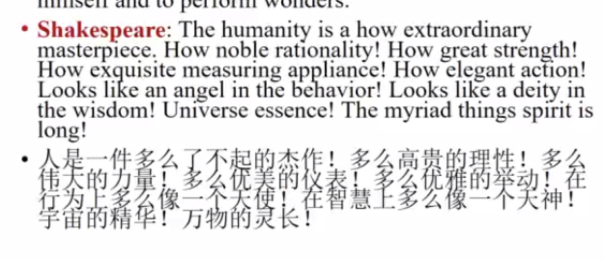

# The Renaissance Period 16-17th in England

Renaissance means **rebirth**, which reintroduces the **heritage** of **ancient Greece and Rome** into **western europe**.

start in **14 thC in Italy**, and the **essence** is **humanism**, which had been characteristic of **14th-15th centuries** into the era of **humanism and Reformation.**

**mainstream** genre is **drama and poetry,** with **Shakesphere** being the **leading dramaist.**

- 雅典学派 1510-1511

  The School of Athens 雅典学派, the **golden time of human thoughts and arts in history**, signifying the **rebirth of human reason, esp. pursuit of knowledge and truth**

# humanism

Humanism emphasizes the **dignity of human beings** and **importance of present life**

belief: **man was the center of the universe**, 人不仅可以 **enjoy the beauty of present life**, but had the ability to **perfect himself** and **perform wonder**s

- 莎士比亚对humanism的描述

  
- The Crusades 11thC-13thC

  went on about\*\* 200 years\*\*, brought the **east contact with the west**, helped the \*\*break down \*\*feudalism, their **desire for wealth and power overshadowed** the **religious ideals**, by **13thC**, **university** have spread all over Europe, renewing people's learning and invention

# Sonnet

Sonnet is one of the most\*\* conventional and influential forms\*\* of poetry in Europe.

consisting **14 lines**, in **iambic pentameter**,restricted to **a definite rhyme scheme** 定韵方案

**Shakespeare**: **abab cdcd efef gg**

# Marlo—The Passionate shepherd to his love

Love poerty **aabb ccdd** rhyme scheme

Pastoral tradition and pure passion for his love

harmony between man and nature.

# Metaphysical poetry 玄学派

#### the work of 17th -century poets under the influence of John Donne

With a rebellious spirit, the metaphysical poets tried to\*\* break away from the conventional fashion of the Elizabethan love poetry.\*\* *打破 伊丽莎白时代的conventional fashion*

A school of highly intellectual poetry marked by **bold and ingenious conceits (奇喻）**，**incongruous （不一致的）imager不一致的意向， complexity of thought**思想复杂, **frequent use of paradox**悖论, and often **by deliberate harshness or rigidity （僵硬）of expression故意的表现僵化.**

The **main themes** of the metaphysical poets are **love, death, and religion**. 爱情 死亡 宗教According to them, all things in the universe, no matter how **dissimilar they are to each other, are closely unified in God**. 无论多么不同，一切都与god达成统一The chief representative of this school was **John Donne.**
