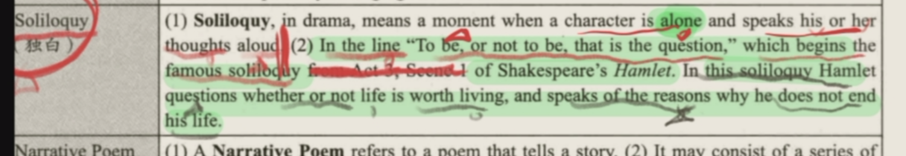

# The Renaissance 文艺复兴时期  (16-17th century)

1. Renaissance——drama 是主题
   1. 别名Renaissance means **rebirth** 重生
   2. It reintroduce cultural heritage of **Greece and Rome into Western Europe**把希腊罗马的文化重新介绍给西欧
   3. 本质The **essence** of the Renaissance is **Humanism**.人文主义是本质
   4. The \*\*rise of bourgeois资产阶级的兴起 **and formation of **Britain**英国的建立contributed to a** flourishing of national culture \*\*known as the **Renaissance**.贡献了国家文化的旺盛 叫做 文艺复兴
   5. Humanists promoted\*\* learning classics人文主义者要求学习传统 \*\*and strived for the **emancipation**of human from **medieval obscurantism.** 推动人们在中世纪的蒙昧主义中解放
   6. major works 主要作品
      1. Elizabethan drama 伊丽莎白戏剧
      2. &#x20;William Shakespeare 是最伟大的剧作家
2. Humanism
   1. 文艺复兴的essence
   2. It emphasizes the \*\*dignity of human \*\*and the **importance of the present life**. 强调人类尊严和现实生活
      1. They believed **man was the center of the universe** 人是宇宙中心
      2. men have the right to **enjoy the beauty of the present life**人可以享受现实世界, but had the ability to\*\* perfect himself and to perform wonders.\*\* 也可以完善自己 表现更wonders
   3. 代表人物Thomas More 托马斯 摩尔
      1. the **greatest humanists**最伟大的人文主义者
      2. his work is **Utopia**作品：乌托邦
3. Historical Background 历史背景
   1. 转变a transition from\*\* feudalism to capitalism\*\*封建向资本的转化
      1. 新阶级The \*\*new nobles and capitalists \*\*came into being to **support monarchy**新贵族和资产阶级支持君主统治
   2. 政治 **君主专制At the beginning of 16th C**,\*\* absolute monarchy was **established, and it reached its **peak** during** the reign of Queen Elizabeth I\*\* 16世纪初，绝对君主专制建立，伊丽莎白一世女王达到巅峰
   3. 军事 England **defeated** **Spain** (**Invincible Armanda**), and ruled the **world trade on the sea**英国打败了西班牙无敌舰队，称霸世界海上贸易
   4. 宗教\*\*Henry VII \*\*broke the relationship with **pope**亨利八世与教皇闹掰, and established the **Church of England**建立英国国教, supporting the **secular and religious power**支持世俗和宗教权利
   5. 下层上层矛盾 The **relationship** between common people and ruling class **got worse**. But A lot of **uprisings** were **suppressed**起义被压制
   6. 总结：文学上
      1. 阶级的兴起 政治的变化The \*\*rise of bourgeois资产阶级的兴起 **and formation of **Britain**英国的建立contributed to a** flourishing of national culture \*\*known as the **Renaissance**.贡献了国家文化的旺盛 叫做 文艺复兴
      2. Humanists promoted\*\* learning classics人文主义者要求学习传统 \*\*and strived for the **emancipation**of human from **medieval obscurantism.** 推动人们在中世纪的蒙昧主义中解放
4. Christopher Marlowe 克里斯托弗 马洛
   1. He is the most gifted **University Wits**.大学学者最聪明的
   2. blank verse 的发明人
   3. 作品 Tamburlaine 帖木儿大帝
5. **William Shakespeare 威廉 莎士比亚**
   1. 轶事
      1. 演Henry VIII 剧院失火 1613 莎士比亚retire
      2.
   2. 总评
      1. poet/  playwriter 诗人 剧作家
      2. The **greatest** of **all English writers** 最伟大的英国作家
      3. He is a **rare genius of human** who is the **landmark in worldwide culture**少见的天才，世界文化的标杆
      4. His works are **landmarks** in the history 作品也是标杆
         1. He is\*\* one of the first founders of realism \*\*现实主义的创始人
         2. He is skilled in\*\* using realistic portrayal \*\*of **human characters and relations**擅长用现实主义手法描述角色和角色间的关系
      5. Karl Marx 卡尔 马克思
         1. The **2 greatest dramatic geniuses** the world has ever known 世界上最伟大的 2 位戏剧天才
   3. 创作
      1. 37 plays 37剧作品
         1. 包括 histories 历史剧，comedies 戏剧，tragedies 悲剧，romances 传奇
      2. 154 **sonnets** 154 14行诗
      3. 2 l**ong poems** and other poems 2 个长诗和其他诗歌
         1. **Venus and Adonis** in 1593 维纳斯和阿多尼斯
         2. \*\* The Rape of Lucrece\*\* in 1594. 路克里斯受辱记
      4. 四大喜剧
         1. \*\*A Midsummer Night's Dream; \*\*仲夏夜之梦
         2. \*\*The Merchant of Venice 威尼斯商人 \*\*
         3. **As You Like it** 皆大欢喜
         4. **Twelfth Night** 第十二夜
      5. 四大悲剧
         1. \*\*Hamlet, \*\*哈姆雷特
         2. \*\*Othello, \*\*奥赛罗
         3. \*\*King Lear, \*\*李尔王
         4. **Macbeth**.麦克白
   4. **Hamlet 哈姆雷特**&#x20;
      1. 名誉
         1. a **tragedy** 悲剧
         2. The **summit** of Shakespeare's work 莎士比亚作品的巅峰
         3. Although the content is Danish, the fact is from **England**内容是丹麦的，实际是英国的
            1. The whole story is **infiltrated** with\*\* the spirit of Shakespeare's time\*\*整个故事都渗透着莎士比亚时代的精神
         4. It is the profoundest **expression of his humanism and criticism of his time**是对人文主义最深刻的表达，和对他的时代的最深刻的批判
         5. Renaissance **第二阶段的**代表人物 第一阶段是University wits 大学才子
      2. Tragedy
         1. 总数： a story that presents\*\* brave men \*\*who **confront strong forces in or outside** **themselves** with a **dignity** 一个勇敢的人以尊严面对自己内外强大力量的故事
         2. 下降：Tragedies narrates men's **downfall**; they usually begin **high and end low**. 叙述人的下降，起的高，落得低
         3. 精神：It reveals the **width and depth** of the **human spirit **in the face of** failure, and  death.** 揭露了人类精神的宽度和深度，当面对失败，死亡的时候
         4. 举例：Shakespeare is known for his tragedies, including Macbeth, King Lear, Othello and Hamlet.
      3. 故事情节 content
         1. 哈姆雷特人物介绍**Hamlet** is the **prince** of Denmark, and a student at the **University of Wittenberg**.丹麦王子 大学学生
         2. At the beginning of the play, Hamlet’s father,\*\* King Hamlet\*\*, has recently died, and his mother, Queen **Gertrude**, has remarried the new king, Hamlet’s uncle **Claudius**.  他爸，King哈姆雷特 死了 他妈 Queen格特鲁德 和他叔叔克劳迪斯 结婚了
         3. Hamlet is **melancholy, bitter, cynical and full of hatred** for his uncle and disgust at his mother for marrying him. 哈姆雷特多愁善感……恨他舅舅，恶心他妈
         4. When the **ghost of Hamlet’s father appears** and claims to have been murdered by **Claudius**, Hamlet \*\*decides to revenge. \*\*他爸的鬼魂 出现 告诉他被他舅舅杀了哈姆雷特决定去复仇
         5. He kills **Polonius** **mistakenly**, father of **Ophelia**, and **Ophelia** is lover of **Hamlet**. She **dies** for his father’s death.他误杀了波隆尼乌斯，波隆尼乌斯是欧菲利亚的爸爸，欧菲利亚是哈姆雷特的女朋友，最后欧菲利亚因为父亲的死也死了
         6. **Laertes**, Ophelia's brother hates **Hamlet**. In the fight between **Laertes and Hamlet**, **Laertes** wounds Hamlet and himself **by a poisoned weapon**, which is made by **Claudius**. Before Hamlet's death, **Hamlet stabs Claudius** and **her mother** drinks a poisoned **cup of wine for Hamlet**, dies. 欧菲利亚的哥哥雷尔提斯恨哈姆雷特 ，在他们俩打仗中，雷尔提斯用克劳迪斯制造的有毒的武器伤到了哈利波特。在哈利波特临死之前，他也杀了克劳迪斯，他妈妈格特鲁德喝了准备给哈姆雷特的毒酒，也死了
      4. Analysis of Hamlet哈姆雷特的人物分析
         1. 优点
            1. 优点1智慧Hamlet is a man of\*\* genius, highly educated, a man of far-reaching perception and wit\*\*. 是一个天才，收到过高级教育，有远见，聪明
            2. 优点2勇敢Though a scholar, he is also **fearless and impetuous in action.** 虽然是一个学者，但是他仍然无所畏惧，做事敏捷
            3. 优点3人文主义He is a **humanist**,&#x20;
               1. He is free from medieval **prejudices and superstitions**. 自由于中世纪的偏见和迷信&#x20;
               2. He cares **human** and shows **contempt for rank and wealth. 他关心人类，蔑视地位和财富。**
               3. He loves **good** and hates **evil**. 喜欢善良 不喜欢写
               4. He  **observe**s **men's manners**. 他紧密观察出人的行为
               5. He easily **sees through people**.他可以看透人
         2. 缺点
            1. The \*\*fatal feature \*\*of Hamlet’s character is **melancholy**.最缺显的就是多愁善感
            2. It is more important for him to **expose the evil **worldwide and to** build a just society**因为更重要的是揭示世界的邪恶，建立正义的社会
            3. His **responsibility** extends to **a radical transformation** of society. 他的责任上升到改造社会
            4. This is the cause of Hamlet’s **melancholy and procrastination** 这就是他多愁善感和拖延症的原因
      5. 名句
         1. To be or not to be— that is a question. 生存还是毁灭，这是一个问题
            1. Hamlet **hesitates** whether\*\* he should revenge for his father\*\*, when he faces the\*\* dilemma of action and mind.\*\* 当哈姆雷特面对行动和思想的困境时，他犹豫他是否就他爸
            2. If he revenge, he may be died.如果他救了，他可能会死
            3. If he doesn't,  he may continue living, but he hates his uncle for life如果他没就，他会活着，但是他会恨他叔叔一辈子
         2. Denmark is a prison 丹麦是监狱
         3. A famous **Soliloquy** 独白
            1. It means a moment when\*\* a character is alone\*\* and **speak the thought** around.一个角色独自一起，喊出自己的思想
            2. 哈姆雷特的To be or not to be— that is a question. 就是著名的
               1. He asks whether \*\*his life is worth living \*\*他询问他的人生是否值得活着
               2. and the **reasons** why he does not **end his life**和他不终结他的生命的原因
                  
   5. **The Merchant of Venice 威尼斯商人**
      1. 剧情

         **Bassanio** asks his  friend **Antonio** for some money in order to win a beautiful wealthy woman **Portia** so that he can **pay his debts** and restore his fortune.巴塞尼奥问朋友安东尼奥有没有钱，为了追求一个美丽的女孩鲍西亚，从而偿还债务，变得富裕

         However, **Antonio** has **no money**, but has to borrow three thousand ducats from **Shylock**, a wealthy **Jewish** man, who hates **Antonio** for his **offering interest-free loans**.但是安东尼奥也没钱，他要从犹太人夏洛克手中借钱。夏洛特很讨厌安东尼奥，因为他借别人钱没利息

         **Antonio** accepts that if he were unable to return the loan, Shylock would be entitled to **a pound of his own flesh.** In Belmont, **Bassanio** chooses the correct lead **casket** and wins Portia’s love. After they hear that **Antonio** cannot pay the debt, **Bassanio** returns to try to save Antonio.
         **Shylock** insists to his idea and **a trial** is called. 安东尼奥答应了如果他换不了钱，那就割下他的一pound flesh 巴塞尼奥赢得了鲍西亚的爱 但是当他们听到了安东尼奥换不了贷款，巴塞尼奥去尝试救安东尼奥 夏洛克坚持自己的观点，最后法庭开庭了

         Disguised as a  lawyer, Portia checks Shylock by reminding him that he must do so **without** bleed. 假扮成律师的鲍西亚说夏洛克需要割掉他的肉，但是不流一滴血

         Then Portia claims that he is guilty of conspiring against the life of a Venetian citizen. Finally the duke spares Shylock’s life and take a fine instead of Shylock’s property. Antonio also forgoes his half of Shylock’s wealth on two conditions: first, Shylock must convert to Christianity, and second, he must will the entirety of his estate to Lorenzo and Jessica upon his death. Shylock agrees and takes his leave. Then **Portia** and **Nerissa** (**Gratiano**) reconcile with their husbands, and Antonio’s ships come back safely.  她又声称夏洛克因企图谋害一个威尼斯公民的生命而有罪。最终公爵赦免了夏洛克，并处罚金，而非没收财产。安东尼奥也愿放弃夏洛克的一半财产，只要他转信基督教，并在死后将全部财产给洛伦佐和杰西卡。夏洛克同意并离开了。之后鲍西亚和娜丽莎跟各自的丈夫和解，安东尼奥的船也平安返回。
      2. 人物分析
         1. Portia 鲍西亚
            1. **Portia** is one of **Shakespeare’s ideal women**
            2. beautiful, cultured, courteous and deal with emergency. 鲍西亚，莎士比亚理想型女人，美丽，有文化，有礼貌，可以解决危急时刻
         2. Shylock 夏洛克
            1. The image of **Shylock** is also very\*\* many-faced\*\*. 夏洛克形象也很丰富
            2. Besides being an\*\* greedy money-lender\*\*, he is a **Jew** who\*\* is proud of his religion\*\*除了是一个贪婪地借钱人，他也是一个为自己宗教骄傲的犹太人.
            3. &#x20;The **bond** is a aspect of **resisting Antonio's arroganc**e. 合同是反抗安东尼无礼的一方面
            4. He **protest** against **racial discrimination**他反对种族歧视）
      3. 主题
         1. Traditionally, It songs the relationship between **Antonio and Bassanio**, the beauty and wit of **Portia** and criticizes \*\*greed and brutality \*\*of Jew, Shylock 歌颂安东尼奥和巴萨尼奥的友谊，鲍西亚的美丽和智慧，和夏洛克的贪婪和残忍
         2. Nowadays,  people believes that it satirizes the **Christian's hypocrisy**批判了基督教的虚伪
            1. their **false standards**, 他们错误的标准
            2. their \*\*cunning ways \*\*of pursuing **material** 他们对物质的狡猾追求
            3. and their\*\* bias against Jews\*\* (**racial discrimination**) 他们对犹太人的偏见(种族歧视)
         3. 一磅肉的典故来自这里
   6. Sonnet
      1. 定义
         1. A lyric poem consisting of **a single stanza **of** 14 iambic pentamete**r by **a complex rhyme scheme** 一首抒情诗，由14个五步抑扬格的节组成，采用复杂的押韵方案
            1. 2 kinds of sonnets
               1. Italian sonnet 意大利14行诗
                  1. 2 parts
                     1. an octave (8 lines)
                        1. abbaabba
                     2. with a sestet (6 lines)
                        1. cdecde
                     3. or some variation 一些变种
                        1. cdccdc e变成c
               2. Shakespearean sonnet 莎士比亚14行诗
                  1. 3 **quatrains** and a concluding **couplet** 3首四行诗和一副结尾对联
                  2. abab cdcd efef gg
                  3. 莎士比亚写了**154首sonnet**
      2. Shakespearean sonnet 莎士比亚十四行诗
         1. 3 groups
            1. number 1-17 are **variations** on one **theme**.一个主题的变体
               1. A handsome young man is being\*\* persuaded to marry\*\* and **reproduce a child** who will \*\*inherit his beauty \*\*future, though his **beauty** will **lose** it as he grows old;   一个帅男人被劝结婚，生孩子，孩子可以继承他的美丽。随着变老，他的美丽还会流失
            2. 18-126 has the same **theme**&#x20;
               1. The poet enjoys **his friendship** and  promises to **be immortal** on the young man by the poems he writes诗人非常享受他的友情 承诺用诗歌描述年轻男人的永生
            3. 127-154
               1. They about\*\* a married woman\*\* with dark hair and skin, The poet **loves her**, though **well aware of her faults**.其外也写了结婚女性，黑头发黑皮肤，尽管意识到不足，诗人还是爱她
            4. In these sonnets, Shakespeare exalted **friendship and love**,\*\* youth and beauty\*\*, 在这些十四行诗中，莎士比亚崇尚友谊和爱情，歌颂青春和美丽
               1. The poems must have been **created on different situations**, then they were expressions of vastly different moods and thoughts of different moments and their artistic worth was not of the same level.但由于众多作品一定是在不同的场合创作的，因此很自然地，它们是不同时刻截然不同的情绪和思想的表达，它们的艺术价值并不相同。
         2. Sonnet 18

            Shall I compare thee to a summer’s day? &#x20;

            Thou art more lovely and more **temperate**

            或许我可用夏日把你来比方，

            但你比夏日更可爱也更温良

            Some time too hot \*\*the eye of heaven \*\*shines 天堂之眼指的是sun 太阳
            1. one of Shakespeare's **most beautiful **[**sonnets**](http://sonnets.In "sonnets")**.** 最美丽的14行诗
            2. \*\* 主题：A nice summer's day\*\* is usually **transient**, but the **beauty in poetry** is forever. 夏日短暂，诗歌之美永恒
               1. Shakespeare believes in the permanence of poetry. 因此，莎士比亚相信诗歌的永恒性
            3. The rhyme of the poem is abab cdcd efef gg. 格律
            4. In the poem he has a **profound thought** on the \*\*destructive power of time and the eternal beauty of poetry \*\*to **the one he loves**.  在这首诗中，他对时间的破坏力和诗歌给他所爱的人带来的永恒之美进行了深刻的思考。
         3. Sonnet 29

            When, in disgrace with fortune and men’s eyes,

            I all alone be weep my outcast state

            当我受尽命运和人们的白眼，  &#x20;
            暗暗地哀悼自己的身世飘零
6. **Francis Bacon 弗朗西斯 培根**
   1. 评价
      1. **“the wisest, brightest, meanest of mankind”** 最聪明、最出色、最卑鄙的人 by **Alexander Pope**蒲柏
      2. The founder of **English materialist philosophy.** 英国唯物主义哲学创始人
      3. The founder of **modern science** in England.英国现代科学创始人
      4. The **first** English **essayist**. 第一个英国散文家
   2. works
      1. Philosophical哲学
         1. **Advancement of Learning 学术的进展**
         2. Novum Organum 新工具
         3. De Augmentis Scientiarum 论学术价值及发展
      2. Literary文学
         1. **Essay 随笔**
            1. **Of Studies 论读书**
            2. **Of Truth 论真理**
      3. Professional专业
         1. **Maxims of Law 法律箴言- longest and important 最长 最重要**
         2. Reading on the Status of Uses谈使用法则
      4. 他的essay最popular 他写了58 个散文 His essays are quoted in **textbooks** as \*\*Shakespeare's plays \*\*他的散文像莎士比亚的戏剧一样写入教科书中
   3. His style
      1. Bacon’s essays have his **own style**. Bacon’s chief idea is to \*\*express his thought with few words clearly \*\*它有着自己的style 他的主要观点就是清晰地用几个词表达自己的思想
      2. His sentences are\*\* short, pointed, incisive, and often of balanced structure.\*\*  His essays are \*\*well-arranged \*\* 他的句子短小，结构工整，
      3. He liked to use  **allusions** In Bible, **metaphors and cadence.**  圣经的用典，暗喻，抑扬顿挫
      4. Generally speaking, his literary style has\*\* three qualities:\*\*
         1. &#x20;brevity简练
         2. compactness  紧凑
         3. and forcefulness. 有力
   4. Of Truth 论真理
      1. 开头analyzes the **reason** why people **lie** 分析认为为什么说谎
      2. Truth is the\*\* superior virtue\*\* of human 真理是人类最高的美德
      3. 结尾 Telling lies is evil 说谎是邪恶的
         1. 引用了**Montaigne** 的话 蒙田
         2. If it be well weighed, to say that a man lieth is as much as to say that he is brave towards God and a coward towards men.仔细考虑起来，要是说某人说谎就等于说他对上帝很大胆，对世人很怯懦”
   5. Of Studies 论读书
      1. talk about the\*\* aim and function\*\* of studies 学习的目的和功效
      2. People have different **views and methods** towards study 人们对学习有着不同的观点和方式
      3. 手法
         1. parallelism 排比
         2. concise Language 简练的语言
         3. full of wisdom 充满智慧
7. Spenserian stanza 斯宾塞诗节
   1. the creation of **Edmund Spenser** 埃德蒙德 斯宾塞创作
   2. a stanza of 9 lines 一个诗节有9行
      1. the **first eight lines** in **iambic pentameter** 前八行 五步抑扬格
      2. the **last** line in **iambic hexameter** 第九行 六步抑扬格
      3. Rhyming **ababbcbcc**
      4. 代表作  The Faerie Queene 仙后

世界上最伟大的
