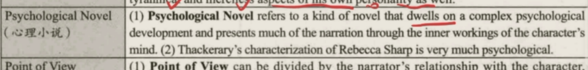
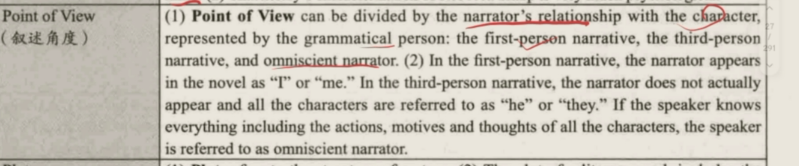
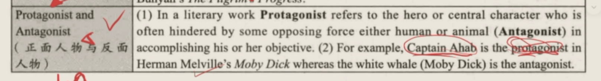

# The Victorian Age 1832-1902

1. Historical Background 历史背景&#x20;
   1. The period represents the **Queen Victoria's reign**, 伊丽莎白女王的统治
      1. &#x20;from the **passing of Reform Bill 1832 to the close at the end of Boer War** 1902 从1832《改革法案》到1902布尔战争结束
   2. 政治
      1. **Democracy** was the **order** 民主成为了秩序
      2. **The House of Common **ruled the England 下议院统治英国
      3. **The suffrage **was developed选举权在发展
      4. The **reformed parliament gains achievement 议会获得进步 **including** emancipation of slaves in British dominations, colonial administrations, religious tolerance**... 解放奴隶，殖民地，宗教容忍
   3. 社会矛盾
      1. The main social conflict is **labor-capital conflict** 主要矛盾是劳工资本矛盾
         1. As the** working class grew stronger**, the **confidence increased** 工人阶级壮大，他们自信心增长
         2. But their **living condition **worsened 但是他们的生活状况恶化
         3. The** Chartist Movement** broke out** from 1832 to 1850**s 1832-1850s
            1. &#x20;宪章运动爆发
2. Literature style 文学风格
   1. 宪章运动**Chartist Movement** &#x20;
      1. **1832 to 1850**s&#x20;
      2. **Chartist Movement**  is for **social justice and improve lives** 为了社会公正 改善生活
         1. 性质“the first broad, really mass, politically formed, proletarian revolutionary movement.” in England第一个广泛的、真正群众参与的、有政治组织形式的无产阶级革命运动。
         2. 包括 suffrage, annual parliaments 等 选举权 年度一会
         3. showed the **strength of working class** 展现了工人阶级的力量
      3. new** literature theme** 文学主题
         1. the** proleteriat's struggle for fights** 无产阶级的权力斗争
      4. All **important events of the Chartist Movement**, especially the **class conflicts** can also **be found in the novels of critical realists** like **Dickens, Charlotte Brontë **所有宪章运动的重要场景，尤其是阶级矛盾，可以在批判现实主义作家中找到 狄更森&#x20;
      5. Ernest Jones 代表作家
   2. 批判现实主义**Critical realism**
      1. 1840-1850s
      2. theme 主题
         1. reveals that **the rule of cash corrupts human nature** 揭示了金钱腐蚀人类
         2. **criticizes** the **capitalist society **and **sympathize** for **people**批判资本主义 同情劳动者
         3. But these writers **does not have ideas to eliminate the social evil,** and they strive for** reform rather than revolution **他们没有办法消除社会邪恶实力，他们追求的是革命而不是改革
         4. At last, they **compromise** 最后他们妥协了
      3. 狄更森 萨克雷
   3. More and more women writers **appeared** 越来越多女作家出现 **Brontë Sisters, and George Eliot. **勃朗特姐妹 乔治艾略特
   4. The English novel began to** prosper in the 19th Century** 19世纪繁荣
   5. The second half of the 19th century produced a number of outstanding poets such as** Alfred Tennyson and Robert Browning**19世纪后半叶出现了一批杰出的诗人，包括阿尔弗雷德·丁尼生，罗伯特·勃朗宁
3. Charle Dicksons查尔斯 狄金森
   1. 作品&#x20;

      
   2. 埋在了Westminster Abbey
   3. features
      1. 写作风格
         1. his vivid** characters and exhaustive depiction of social classes, customs and values **are memorable 生动非凡的人物，对社会阶级、习俗、价值观详尽无遗的描述让人印象深刻
         2. Humorous and ironic幽默，讽刺 to England
            1. **Mr. Micawber** in David Copperfield is one of the most famous humorous characters in world literature. Satire is often employed by Dickens to achieve the effect of irony, as in the pen-portrait of Mr. Pecksniff, the hypocrite.《大卫·科波菲尔》中的米考伯是世界文学中出了名的喜剧人物，另一代表人物是具有讽刺意味的伪君子佩克斯列夫。
      2. 小说结构 structure
         1. the **main plot **is often interwoven with **more than one sub-plots **so that it can introduce interesting **minor characters as well as a broader view of contemporary life**&#x20;
         2. 通常是主要剧情穿插着几个次要线索。这样既能介绍更多的有趣的次要人物，还能描述更广的生活场景。
   4. Oliver Twist雾都孤儿
      1. theme 主题
         1. criticizes the **dehumanizing workhouse system **and the **dark lower class life by the capitalist society.** 批判黑暗的济贫院制度和资本主义下的黑暗的下层生活
         2. Dicksons make readers **sympathize the lower class people**狄更斯让读者对下层人民生活产生怜悯
      2. 内容
         1. Oliver Twist tells the story of **an ****orphan**** boy**, whose adventures provide a description **of the underclass of London**. Oliver Twist is of unknown **parents**. He was born in a** workhouse and brought up under cruel conditions**. After serving an unhappy apprenticeship to an undertaker, he runs away to London, where he falls into the hands of a gang of thieves. After his many adventures, **Oliver is rescued and adopted by Mr. Brownlow.**
         2. 《雾都孤儿》讲述了一个孤儿奥利弗·特维斯特的故事，他的生活经历反映了伦敦下层社会的生活。奥利弗出生在济贫院，不知道自己的父母是谁。在棺材店过了一段非常不幸的学徒生活后，他逃到伦敦，落入一群贼的手里。经历了一系列的冒险后，奥利弗被从贼窝里救出来，并被布朗罗先生收养。
      3. 情节的缺陷
         1. the **improbability** of the **plot** and the **incredibility** of some **characters**. 人物和情节的不可靠性
         2. 情节
            1. Toward the end of the novel, the plot gets to be very **intricate and the reader is simply mystified.**
         3. &#x20;人物
            1. At critical moments, Oliver has been once and again saved by kind gentle folk who proves to be his kin at last.
            2. &#x20;Fagin and Bill Sikes are too inhuman to be true,&#x20;
            3. while the rich Mr. Brownlow is simply pictured as benevolent and good.
         4. 小说结尾处，情节过于复杂，读者容易误解。而奥利弗在关键时刻总能得到贵人相助，这些贵人最后又经证实是他的亲属。费根和赛克斯太过凶残，好人布朗罗先生又只是单一的好心。
   5. The Pickwick Papers《匹克威克外传》 第一部作品
      1. This is the work that first made Dickens famous as a popular writer of novels. The story evolves round the adventures of **Mr. Pickwick**, a **retired well-to-do merchant and a somewhat eccentric old fellow** who is** the founder and chairman of the Pickwick Club.**
         Written in the **picaresque form of Don Quixote**, the novel provides **a panoramic view of the English society and affords the reader a whole gallery of vivid portraits of the petty-bourgeoisie**. Though here the author** attacks the ugly side of the political system of the time**, it is full of the gaiety and** happy laughter** of a youth. The whole thing is extremely interesting, funny and vividly real with its comic episodes.
         该书是狄更斯的成名作。小说围绕匹克威克先生的一系列冒险展开。匹克威克是一位富有的退休商人，同时也是一个奇怪的匹克威克俱乐部的创始人和主席。
         故事以类似堂·吉诃德的冒险故事形式写成。书中描绘了英国社会的全景，给读者呈现了各种各样的小资产阶级人物形象。虽然作者攻击了当时政治制度丑陋的一面，故事仍然充满了年轻人的欢乐的笑声。整个故事包含的滑稽情节非常有趣、滑稽、形象真实。
   6. Great Expectations 远大前程

      It focuses on the life experiences of Pip, a poor village boy from his early childhood, through young manhood and a brief summary of middle age. Estella is the heroine and the girl Pip loves, but she is at first eager to get into the higher society, and is very proud and cold to Pip, due to his lower social position. Irritated by this, Pip determines to become a gentleman and he gets financial aid from a secret donator Magwitch, who turns out to be the convict and dies in the prison. Then Pip loses the money to support him. After more experiences, both Pip and Estella become mature.
      小说围绕主人公匹普的人生经历（童年、青年、中年）展开。埃斯特拉是书中的女主人公，也是匹普喜欢的女孩，她一心想要进入上流社会，因此根本瞧不起匹普，这使得他很受伤害，这时有一位神秘的捐助者马格维奇使匹普进入了上层社会。但是马格维奇是个罪犯，最后死在监狱里，匹普的远大前程之梦破灭，最后经历过更多事情后，他和埃斯特拉都变得成熟了
   7. The Old Curiosity Shop《老古玩店》
      1. It is a story of the sufferings and hardships of an old man and his granddaughter, Nell, who live and keep an old curiosity shop in London. Driven by poverty and misery, the grandfather and Nell flee to the Midlands of England and live as beggars. Ill fortune pursues them and they perish far away from home.
         这篇小说讲述了外祖父和他的外孙女内尔两人的遭遇和艰难。祖孙二人以一家古玩店为生，但是在苦难和贫困的驱使下，两人逃往英格兰中部地区，靠乞讨为生。但是坏运气依然跟随他们，他们死在远离家乡的地方。
   8. **David Copperfield** is about the **debtor's prison.** 关于欠债者的监狱
      1. **autobiographical**半自传体的小说，它的成就超过了狄更斯所有其他作品，被狄更斯称为他“心中最宠爱的孩子”
      2. Of All my books, I like this the best 他最喜欢的
   9. **Dombey and Son** exposes the money-worship that dominates people's life, corrupts the young and brings tragedy to Mr. Dombey's family. 董贝父子揭示了金钱至上的社会摧毁了董贝的家庭
      1. 主题：The pride of wealth 金钱的骄傲
      2. 《董贝父子》描写了董贝父子公司的盛衰史。董贝是个贪得无厌的大资本家，妻子儿女都成了他追逐利润的工具和摆设。公司经理卡克尔是个奸诈小人，骗取了董贝的信任后又一手造成了他的破产。在现实的教训中，董贝的思想发生了转变。最后，虽然他已无法重整家业，却成全了真正的家庭幸福。
   10. **Bleak House** attacks the** legal system and practices** that aim at **devouring every penny of the clients** 荒凉山庄批判了想吞噬每一个客户的钱的法律系统
   11. **Hard Times** lashes the **Utilitarian principle **that rules over the **English education system** and **destroys children's hearts and minds**艰难时世反映了功利之上的英国教育系统，摧残了孩子的心灵
   12. **Great Expectations and Our Mutual Friends **expose the ** social environment** which **brings moral degeneration and destruct onto people.**《远大前程》和《我们共同的朋友》揭露了给人们带来道德堕落和破坏的社会环境。
   13. A Tale of Two Cities 双城记
       1. 莫奈特医生的命运与法国大革命息息相关。正是法国大革命爆发，巴士底狱被革命者攻陷，莫奈特医生才重新获得自由。
       2. 伦敦 巴黎
4. William Makepeace Thackeray 威廉·梅克比斯·萨克雷
   1. feature&#x20;
      1. 擅长使用**allusion 引用**
         1. reference to a **person, a place, an event, or a literary work** that **a writer expects the reader to recognize and respond to** 作家希望读者识别和回应的人、地点、事件或文学作品
         2. 来源 resources
            1. history, geography, literature, religion 历史 地理 文学 宗教
         3. 举例
            1. **Thackerary's Vanity Fair serves as a literary example. **The name of the novel is borrowed from the famous scene in **John Bunyan's The Pilgrim ' Progress.** 萨克雷的天路历程
   2. **The Book of Snobs** made his reputation as a social satirist
      1. 势力者集让它成为一个社会讽刺家
      2. 势利者集用讽刺的口吻描写了英国统治阶级不同的阶层。
   3. Vanity Fair: A Novel without a Hero 名利场
      1. 主题
         1. exposes the vice of his society 揭露了社会的
            1. **hypocrisy, moral-degeneration and money and status worship**虚伪 道德退化 金钱权利至上
         2. 主题的意义
            1. This great novel is **a brilliant study in duplicity and hypocrisy in the early 19thC, **and a mirror with which to **view our present.**这部小说极好地研究了十九世纪初的奸诈和虚伪，也是审视当今社会的明镜。
      2. 标题的意义
         1. 副标题
            1. the writer’s intention **was not to portray individuals**, but the** bourgeois and aristocratic society as a whole**.  作者没有打算描写个人，而是描写整个资产阶级和贵族社会。
            2. &#x20;It is also possible to **interprete** the subtitle as meaning that **there are only heroines but no heroes.** 整部小说只有女英雄 没有英雄
               1. **即Rebecca Sharp**
         2. 主标题
            1. borrowed from **John Bunyan’s The Pilgrim Progress **引用班杨天路历程
            2. "**vanity fair**” means a fair where all kinds of **vanity** are sold, such as **houses, lands, honors, preferment, titles, lusts, pleasures and delights of all sorts**卖一些名利东西
      3. 内容

         The plot is built around the **fates of Amelia Sedley and Rebecca (Becky) Sharp**.&#x20;

         主要人物：**Rebecca Sharp** is an **orphan**. and **Amelia Sedley** is the daughter of a wealthy **London merchant**

         **Becky** is determined to **worm her way into upper society.** And so **she does by varieties of immoral means. Finally she lives a life like a grand lady. **

         While Amelia, who also experiences ups and downs in her life, marries **Dobbin** who has given her his lifelong love, to reward him.
         书中故事是围绕艾米丽亚·赛特笠和利蓓加·夏泼（又叫贝基）展开的。贝基一心想要跻身上流社会,后来通过一些拙劣的手段她达到了这个目的，像贵妇一样地生活着。而艾米丽亚也在经历过了人生的跌宕起伏后，出于感激，嫁给了爱了她一生的多宾。
      4. 人物分析
         1. Becky的人生目标：**Becky Sharp** is a classic example of the money-worship . Her only aspiration in life is to** gain wealth and status .**蓓加·夏泼是获取钱财的一个典型代表。她生命中惟一的愿望就是获得财富和地位。
            1. As her name suggests, Becky Sharp is determined to **carve out a place for herself in Vanity Fai**r. She succeeds in establishing her  Vanity Fair at the cost of the lives **of two men and the alienation of all her friends and family**. But she enjoys the battle. 名字让她在名利场追逐地位，她已经在名利场建立地位（2个男人的生命为代价 和他的朋友和家人）
            2. Sharp is **charming and pretty**, 脸美丽
            3. but she is **ambitious**. Driven by her ambition.she has **become a merciless social climber** 志向 让它成为无情的社会地位攀升机器
            4. 从Becky这个人引申到全社会 Becky Sharp is not  an exception. **Everyone** wishes **to gain something in the Vanity Fair** and acts almost in the same manner as Becky.利蓓不是一个特殊的人物，她是那个时代的典型代表：每个人都希望在名利场中得到些什么。书中几乎没有正面人物
5. George Eliot 乔治 艾略特
   1. **英国心理小说的先驱**
   2. &#x20;D. H. Lawrence called her “**started putting all the actions inside”.** 劳伦斯称赞她为第一位“探究所有行为的内心活动”的小说家。
   3. feature&#x20;
      1. 作品风格
         1. pay attention to the **protagonist’s moral status **, thus more or less didactic. 关注主人公的道德立场，有些说教
      2. 主题
         1. She is good at showing** psychological development of characters, **描绘人物心理描写
         2. and  **depicting country scenes** and **lives of common rural people.** 描绘乡村美景和农村生活
      3. 缺陷 defects
         1. she shifted the center of the novel from **the social problems to the problems of religion and morality** 从社会问题转移到宗教道德问题
         2. She believes the** single humanity the love can solve the evil of capitalism** 单纯的爱和人性可以解决资本主义的罪恶
   4. Adam Bede《亚当·贝德》
      1. Adam Bede is a village carpenter, an upright and industrious young man who falls in love with Hetty Sorrel. But Hetty’s vanity makes her aspire to a higher social position through marriage with a young squire, Arthur Donnithorne, who is light-minded and selfish. Having deluded and seduced Hetty, Arthur breaks up with her. The heart-broken Hetty presently consents to marry Adam. But before the marriage, Hetty discovers that she is pregnant. She flies from her home and looks for Arthur. Failing to find him, she leaves her new-born child in wood and later returns to find it dead. Hetty is soon arrested and convicted of child murder. In prison she is visited and preached by a young preacher, Dinah Morris who Adam finally marries. In the last moment before Hetty’s execution, she is pardoned and exiled.
         亚当·贝德是个乡村木匠，一个正直且勤奋的年轻人。他爱上了海蒂·苏洛，一位美丽但是虚荣心强的女人。她一心想着通过婚姻提升自己的社会地位，因此她想嫁给年轻乡绅亚瑟·唐尼桑恩，一个轻浮、自私的人。在引诱了海蒂之后，亚瑟结束了与海蒂之间的关系。心碎的海蒂同意嫁给爱着她的亚当，但就在婚礼前夕，她发现自己怀孕了，于是海蒂前去寻找亚瑟，结果徒劳，她将刚出生的孩子放在树林里，再回来时孩子已经死了。因此海蒂被判谋杀孩子罪名，在监狱时，黛娜·莫里斯前来看望并为她布道。在行刑前，海蒂被赦免，判以流放。
      2. 主旨

         a novel of moral conflicts, showing the conflict of personal desires with moral duty. The two pairs of lovers, Arthur and Hetty on the one hand, and Adam and Dinah on the other hand, are described in contrast to each other. The former couple is shown to be always thinking of their own interests without any consideration of others, while the latter pair is endowed with high moral principles. The theme of social inequality is blended in the book with the moralization typical of Eliot.
         《亚当·贝德》这部小说充满了道德冲突，展现了个人欲望和道德义务之间的碰撞。小说中的两对爱侣——亚瑟和海蒂，亚当和黛娜——形成鲜明对比。前两人只顾自己利益，不管别人死活，后两人却拥有高尚的道德情操。书中也将典型的艾略特式的道德教导和社会不公糅合在一起。
   5. Silas Marner《织工马南》

      The novel tells the story of a weaver, Silas Marner, who has taken refuge in an isolated hut. One day Silas adopts a motherless little girl, Eppie who wanders to his door. Godfrey Cass harbours a secret. He is married to, but estranged from Molly, an opium-addicted woman of low birth. This secret threatens to destroy Godfrey’s relationship with Nancy, a young woman of more appropriate social and moral standing. On a winter’s night, Molly dies in the snow when she tries to prove that she is Godfrey’s wife. Her child is the little girl Silas picks up and names Eppie. Sixteen years pass, and Eppie grows up to be the pride of the town and to have a very strong bond with Silas. After Godfrey confesses to Nancy that Eppie is his child, the childless couple go to Silas and reveal this to him, asking that Silas give Eppie up to their care. However, Eppie cannot forsake Silas. In the end, Eppie marries a local boy, Aaron, and they happily live with Silas.
      小说讲述了一位纺织工赛拉斯·马南的故事。有一天马南收养了一个来到了他家门前的小女孩，并起名为爱贝。戈弗雷怀有一个威胁到他与一个出身教养都很好的年轻女子南希的恋情的秘密：他娶了一个出身低下且吸食鸦片的女人，莫利。但是现在两人已经没有感情。莫利在抱着孩子寻找戈弗雷的路上冻死在雪地里。孩子就是被马南收养的爱贝。16年过去了，爱贝出落成全镇人都感到骄傲的婷婷少女。她跟马南也有了非常深厚的感情，戈弗雷向妻子南希坦白交代之前的往事，没有子嗣的戈弗雷夫妇前往马南家想要回爱贝，但是爱贝不会丢下养育自己的马南，她嫁给当地一位小伙后，夫妻二人跟马南幸福地生活着。
6. The Brontë Sisters&#x20;
   1. 老二 Emily 先死的 老三Anne 第二死的 老大Charlotte最晚死的
   2. 除了大姐都没结婚
   3. Charlotte Brontë 老大 夏洛特勃朗特&#x20;
      1. 风格
         1. from** individual point of view**, and **put her feeling to her characters** 个人的角度，为角色注入个人情感
         2. she likes to write about  **a world of life and experience of characters**. 她喜欢创作一个角色的生活和经历的世界
         3. She loves **nature** and she looks down to **the ambition and success** 热爱自然 瞧不起一切的志向和成功
            1. she believes only in** hard work, self discipline and high intelligence.** 因为她只相信努力工作、自制和非凡的才华。
      2. 角色
         1. All her **heroines **(no men as main characters) does not have  **traditional values** who are** lonely and neglected and struggling for love** 她的女主角们（没有男主角）没有传统习俗，孤单 被忽视，为爱奋斗
            1. Their joy are from **sacrifice of some human weakness overcome** 他们的快乐来自于对人性弱点的牺牲
            2. 被忽视 渴望爱
      3. Jane Eyre
         1. 角色
            1. **Jane Eyre**&#x20;
               1. Jane Eyre is an **orphan** child with a fiery **spirit and a longing to love and be loved**, a **poor, plain, little governess **who dares to love her master, a man superior to her in many ways, and even is brave enough to declare to the man her love for him 简·爱是一个精神火热、渴望爱和被爱的孤儿，一个贫穷、平凡、胆敢爱主人的小家庭女教师，一个在很多方面都比她优秀的男人，甚至勇敢地向男人宣布她对他的爱.
               2. Charlotte shapes a new woman image with **independence and self-dignity** 夏洛特塑造了独立 有尊严的女性形象
               3. The **success** of the novel also attributes to the **governess Jane Eyre** 成功的来源也来自女教师：简爱
            2. 乡绅 squire
               1. Charlotte has her description of the English country squire. She compares them to the uncultivated and narrow-minded Philistines.&#x20;
               2. But **Rochester **is an exception. 夏洛特对英国乡绅有描述，她把他们比作没教养、思想狭隘的庸俗之人。但罗切斯特是个例外。
         2. 名誉
            1. a typical work of **feminist writing** that **reflects the experience and defends the interest of female.** 该书被认为是“反映女性经历、保护女性权益”的女权主义作品的代表作
         3. 主题
            1. the passionate **love between Jane Eyre and Rochester **
            2. Criticism of the **bourgeois system of education**. The Lowood school is the **embodiment of the bourgeois principles of education**, the aim of which is to **bring up obedient slaves for the rich.** 对资产阶级教育系统的批评。洛伍德学校是资产阶级教育原则的化身，它的目的就是为有钱人培养温顺的奴隶。
            3. 女性地位 Jane Eyre, believes that **women should have equal rights with men.** 简·爱坚持女性应获得同男性一样的权利。
               1. The novel songs of the **woman's struggle for basic rights and equality of human being** 小说歌颂了女性对基本权益追求和人性的平等
   4. Emily Brontë 老二
      1. 她的唯一作品
      2. Wuthering Heights 呼啸山庄
         1. **Wuthering **is Yorkshire dialect for“**weathering**. 呼啸是方言
         2. 手法&#x20;
            1. 心理描写
               1. The power of the novel comes mainly from the **psychological complexities** of** the two major characters.** 小说中的爱是悲剧性的、病态的、毁灭性的。小说的魅力来自对两个主人公的复杂心理的描写。
               2. Emily Brontë' s **psychological descriptions are deep** 艾米莉勃朗特的心理描写很深邃
                  1. She can dive into **the deepest of the human soul** 她可以直击人类心灵最深处
            2. flashback倒叙
               1. Flashback refers to an event which took **place prior to the beginning of a **story or play.  闪回是指在故事或戏剧开始之前发生的事件。
               2. Flashback is used in Emily Bronte's Wuthering Heights 呼啸山庄

         3. 主题
            1. Love in the novel is** tragic, morbid and devastating.** 小说中的爱是悲剧性的、病态的、毁灭性的
            2. the novel attacks on the **capitalist marriage system under **which the pure love between the **hero and heroine** is destroyed by **class prejudice **founded **on wealth** 小说猛烈地抨击了资产阶级的婚姻制度，在这种制度下，男女主人公之间纯真的爱情被建立在财富基础之上的社会偏见所毁灭。
         4. &#x20;内容
            1. &#x20;the morbid love between Catherine and Heathcliff 凯瑟琳和希斯克利夫之间病态的爱
            2. the story is about two families Earnshaw family and the Linton family, and an intruding stranger, Heathcliff, an orphan adopted by Mr.Earnshaw. 故事讲述了两个家庭厄恩肖家庭和林顿家庭，以及一个闯入的陌生人，希斯克利夫，一个被厄恩肖收养的孤儿
         5. 不重要In some critics’ mind, the novel resembles one of the Gothic romances of the latter part of the 18th century, with its atmosphere of horror on the lonely moor remote from the outside world, and its melodramatic effects and fantastic motifs. 由于故事发生在远离外部世界的荒原，拥有恐怖的气氛，戏剧化的夸张效果以及奇异的主题，这部小说看起来很像18世纪后半期的哥特式小说。
7. Thomas Hood 托马斯 胡德
   1. The Song of the shirt 衬衫之歌
   2. 幽默 社会不公 同情遭遇 但是没有劝他们反抗
8. Alfred Tennyson 阿尔弗莱德 丁尼生
   1. Poet Laureate 桂冠诗人
   2. bury in Westminster Abbey 埋在了威斯敏斯特教堂&#x20;
   3. features
      1. 风格
         1. Tennyson is both a poet of **reflection** and a poet of the **people**. 一个喜欢反思 写人民群众的诗人
      2. 主题
         1. His poems deal with a breadth of issues including s**ocial and political concern, natural and psychological landscape, scientific matters, historical and mythological past.** 他的诗歌涉及题材范围极广，包括社会和政治问题、自然和心理环境、科学问题、过去的历史和神话。
   4. Ulysses《尤利西斯》
      The figure of Ulysses in this poem originates from the ancient hero of Homer’s Odyssey and the hero of Dante’s Inferno. “Ulysses” is mainly about the desire to reach beyond the limits of one’s field of vision and the mundane details of everyday life.
      本诗中尤利西斯这一形象来源于荷马史诗中《奥德赛》的主人公尤利西斯在但丁《神曲》中的形象。《尤利西斯》主要是关于超越自己视野的界限和平凡的日常生活。
   5. Break, Break, Break《溅吧，溅吧，溅吧》
      1. 主题
         1. in memory of his **close friend Hallam**, who died of a **stroke** 吊念他中风而死的密友
         2. Tennyson’s **love** for Hallam and **grief** at his death 对他的爱和对他死的悲伤
      2. Imagery 意象
         1. life- **fisherman boy and his sister** （玩耍）and **sailor**（歌唱）
            1. 生命象征着渔家男孩和他的姐姐
            2. 还有水手
         2. death- stately ships go on
            1. 船舶驶入海洋
         3. break
            1. Onomatopoeia, which represents the sound of the water hitting the stone.  水拍打石头的声音
            2. “break” has the meaning of “destroy”. 毁灭的意思
   6. Crossing the Bar 过沙洲

      Crossing the Bar” is written when the poet is at an old age in 1889. At the poet’s request, this poem appears as the** final poem **in all collections of his work. In this poem, Tennyson compares** his death to a voyage of putting out to the sea.**
      《过沙洲》写于1889年丁尼生晚年的时候。应诗人的要求，本诗作为他作品选集的最后一首诗。诗中诗人把死亡比喻成出海远行。

      暗指诗人在经历了人生的风霜后，平静地迎接死亡的来临，毫无恐惧和哀伤。
9. Robert Browning 罗伯特勃朗宁
   1. features
      1. Dramatic monologue
         1. refers to the occurrence of** a single speaker saying something to a silent audience**. 一个说话者对沉默的观众讲话
            1. **My Last Duchess** is a typical example in which the duke, speaking t**o a non-responding audience**, reveals not only the reasons for his **disapproval of the behavior of his former wife**, but some **tyrannical and merciless aspects of his own personality **as well 我的伯爵夫人中的伯爵对着不回应的观众说话，反映出了他对前期的不满和他的残暴和无情
         2. especially his use of diction, rhythm and symbol, influencing major poets of the 20th century such as Ezra Pound, T. S. Eliot and Robert Frost.特别是措辞、韵律、象征影响了20世纪的主要诗人，包括庞德、艾略特和弗罗斯特
      2. The fascination of his poetry owes to his strong portrayal of characters and wealth of **details** and ** inner world.** 对人物的细节描写 和内心世界描写 brought to the Victorian poetry some** psychological element **给予了维多利亚时期是诗歌心理元素
      3. 缺陷 不重要
         1. His poems are often difficult to understand. Connectives are often omitted; inverted phrases and clustered ideas are introduced abruptly. 他的诗歌很难读懂：连词被省略；次序颠倒的短语和跳跃的思维都会突然出现在诗歌里面。
      4. &#x20;主题In his poetry, Browning explores the relationship between **morality and art **through historical settings like the Italian Renaissance. 谈久了意大利文艺复兴时期的历史背景 探讨道德和艺术的关系
   2. The Ring and the Book《指环与书》书——🩷
      This is a poetical drama of 20,000 lines, including 12 books or 12 long dramatic monologues. The author makes each of the personages tell the story in succession. The subject matter is taken from a small book, picked up by Browning at a second-hand bookstall, telling the trial of a murder in Rome in 1689.
      Count Guido, a wicked nobleman, married Pompilia, an innocent girl, for the purpose of getting her wealth. But he soon found that she was only an adopted child of her parents. Guido determined to get rid of her by way of treating her extremely badly. With the help of a good priest, Pompilia returned to her foster-parents. Guido killed her under the excuse that she had committed adultery with the priest. Then the murderer was arrested and condemned to death.
      该书是两万行的诗剧，包括12部或者说12篇长的戏剧独白。作者让书中的人物依次讲述故事。故事取材于布朗宁在小书摊上购买的一本小书，讲述了发生在1689年罗马的一次谋杀审判。
      邪恶的贵族伯爵圭迪娶了天真的少女蓬皮丽娅，以图其钱财。但他很快发现她只是父母的养女，于是决心摆脱她。他虐待她，使她的生活不堪忍受。在一位好心教士的帮助下，蓬皮丽娅逃回到养父母家。圭迪借蓬皮丽娅与教士通奸之名杀死了她。后来谋杀者被捕并被判处死刑。&#x20;
   3. My Last Duchess《我已故的公爵夫人》
      1. My Last Duchess” is a poem in form of dramatic monologue. 用戏剧独白的作品
      2. 内容
         1. This poem is based on a historical event involving Alfonso, the Duke of Ferrara, who lived in the 16th century. The Duke is the speaker of the poem, and tells us he is entertaining an emissary who has come to negotiate the Duke’s marriage to the daughter of another powerful family. As he shows the visitor through his palace, he stops before a portrait of the late Duchess, apparently a young and lovely girl. The Duke begins reminiscing about the portrait, then about the Duchess herself. His musings give way to a diatribe on her disgraceful behavior. 是根据文艺复兴时期意大利的费拉拉公爵阿方索二世的一个真实故事创作的。诗中的叙述者是公爵。公爵夫人刚刚去世，随即有人上门提亲，媒人来到时，公爵带媒人参观自己的艺术品，并在公爵夫人的画像前停了下来，开始对已故前妻大加贬斥，然而读者从她的口中得到的却是友善而又开朗的公爵夫人形象
         2. As his monologue continues, the reader realizes with ever-more chilling certainty that the Duke in fact caused the Duchess’s early demise. 他的独白继续，读者也意识到一定是**伯爵导致了伯爵夫人的死**
         3. 公爵性格
            1. narrow-mindedness, tyranny, cruelty and hypocrisy.心胸狭窄，专横霸道，残忍和虚伪。
   4. Home-thoughts, from Abroad《海外思乡》
      This poem, written in 1845 while Browning was on a visit to northern Italy, is famous for the strong homesickness.
      本诗为1845年勃朗宁去往意大利北部时所写，以浓郁的思乡情调著称。
10. Elizabeth Barrett Browning  (伊丽莎白·巴雷特•勃朗宁)&#x20;
    1. 罗伯特勃朗宁的老婆
    2. features
       1. Her technique is uncertain 他的技巧不固定
       2. 主题Her poems show** sympathy with high things**, the elevation of** her moods of personal emotion**, and the **distinction of her utterance** at its best. Her trait is that of **intimate and personal feeling.** 她的诗表达了对崇高事业的赞同，她高昂热烈的个人情感，以及最佳的独特表述。她的特征就是对亲密的个人的感情的抒发。
    3. Sonnets from the Portuguese《葡萄牙十四行诗集》
       It is a collection of forty-four love sonnets written for her, then, future husband Robert Browning. The content and tone of the sonnets change as her relationship with Browning relationship progressed. In the earlier sonnets she expresses her doubt and fear about beginning a relationship with Browning. As the relationship progressed she was able to overcome her anxieties, and eventually, they took a more accepting and passionate tone. It is generally considered as one of the most** widely known collections of love lyrics in English. **Admirers have compared her imagery to Shakespeare and her use of Italian form to Petrarch.
       这本诗集由44首情诗组成，是伊丽莎白写给他的未婚夫罗伯特·勃朗宁的。诗歌的内容和语气随着她和勃朗宁关系的进展而变化。**早期的诗歌表达了她对和勃朗宁展开关系的迟疑和惧怕。随着两人关系加深，她渐渐克服焦虑，最终认可并激情洋溢。**这本诗集被普遍认为是最广为人知的抒情诗歌集之一。仰慕者还将她的意象跟莎士比亚做比较，将她运用意大利诗歌形式的技艺与彼特拉克相提并论。

